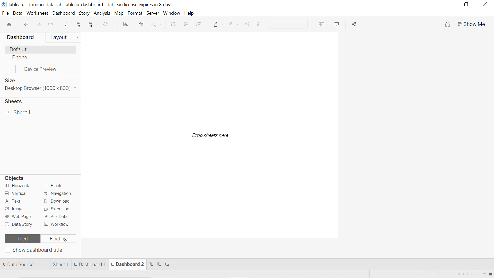
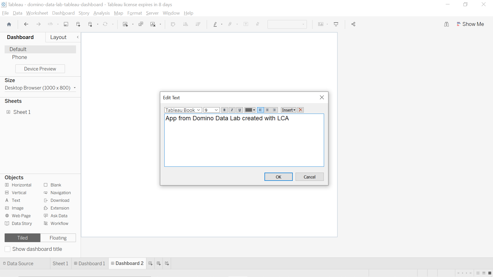
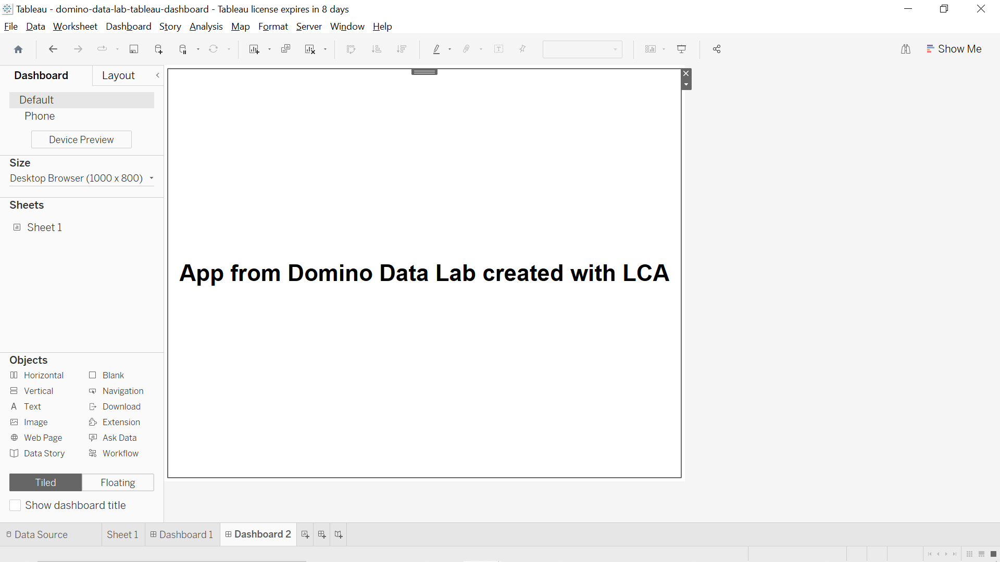
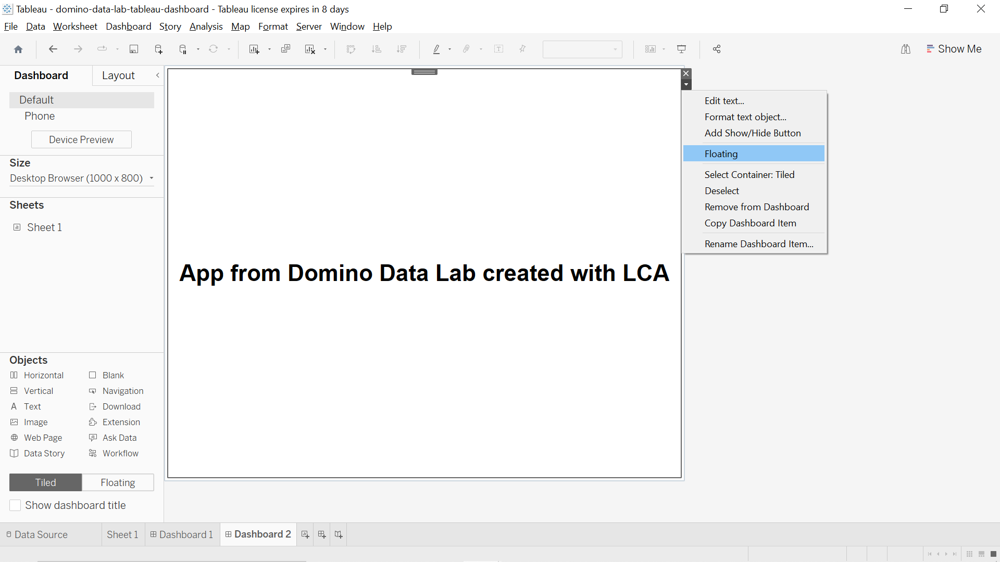
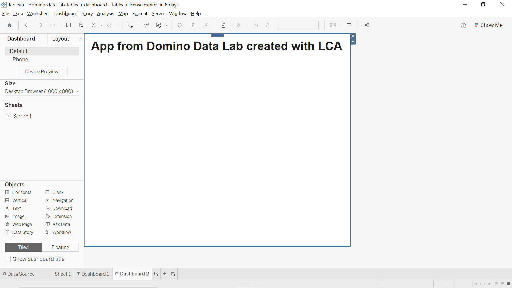
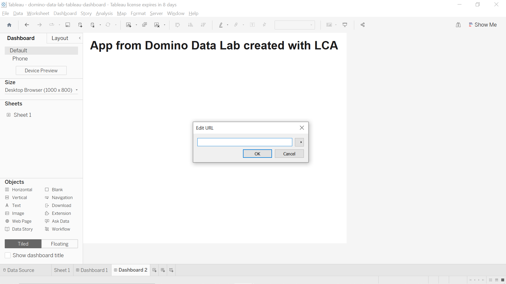
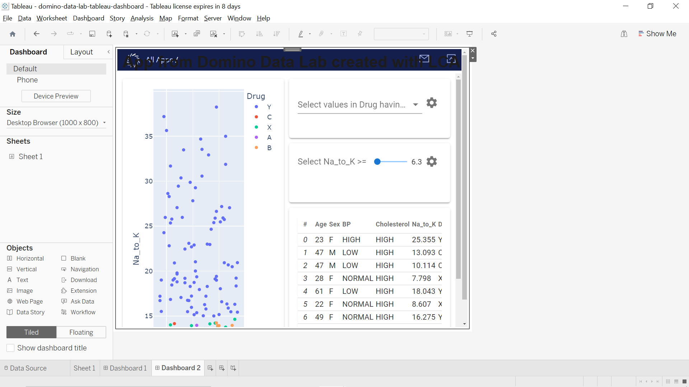
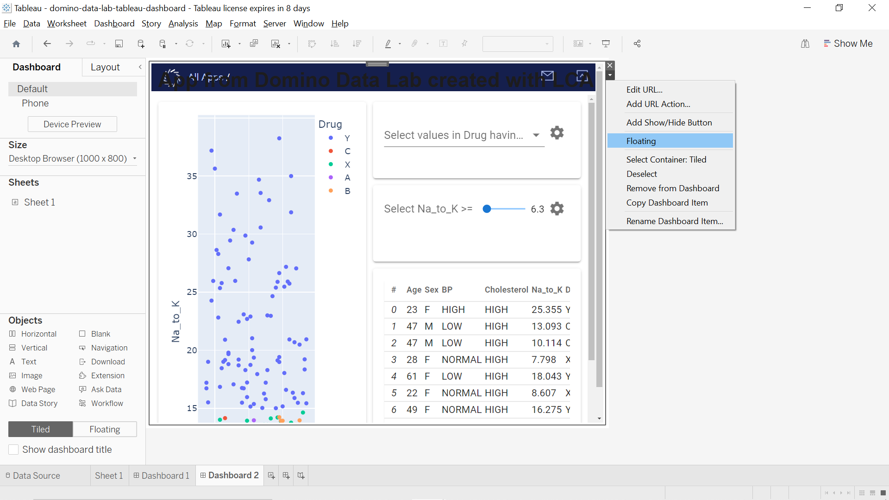
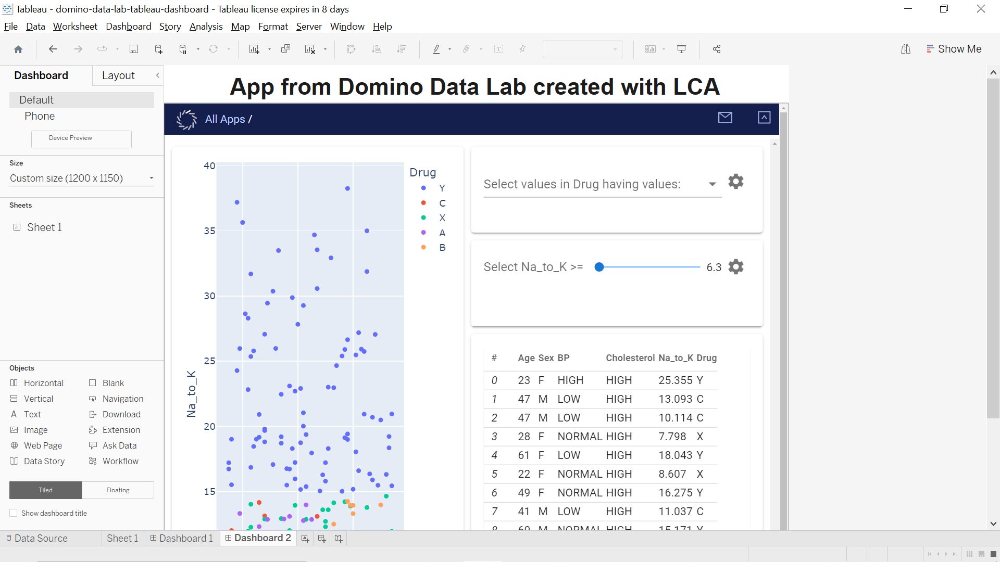

# Embed an App in a Tableau Dashboard

Once deployed, an app is effectively just a web page. This means that it can be embedded anywhere you can put an `<iframe>`. So you can pop it into any other web page. You can also embed it in a Tableau dashboard. Let's see how that is done.

Start with a blank dashboard.

Add some content to the dashboard. In this case we'll keep it super simple. Add a _Text_ object to the dashboard. Choose appropriate font shape and size.

By default the text will occupy the whole dashboard.

Click the :fontawesome-solid-caret-down: on the right and select _Floating_.

Resize and move the text.

Add a _Web Page_ object to the dashboard. Paste the URL for the app. 🚨 The app must be publicly accessible. Test this by trying to open the URL in an incognito browser window.

The app will be added to the dashboard. Again, the app will occupy the whole dashboard by default.

Click the :fontawesome-solid-caret-down: on the right and select _Floating_.

Resize and move the app to the desired location.

