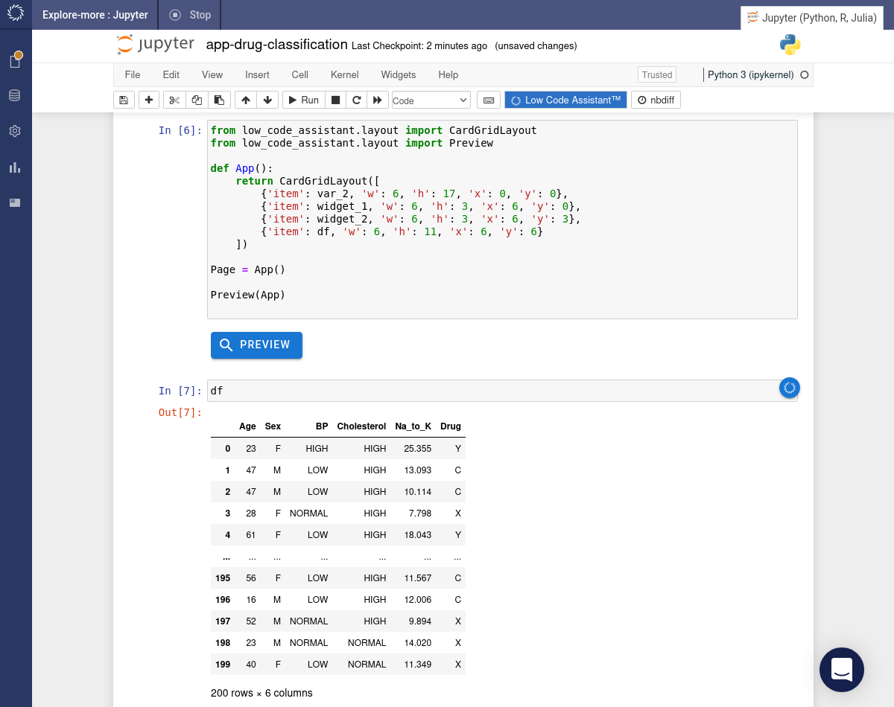
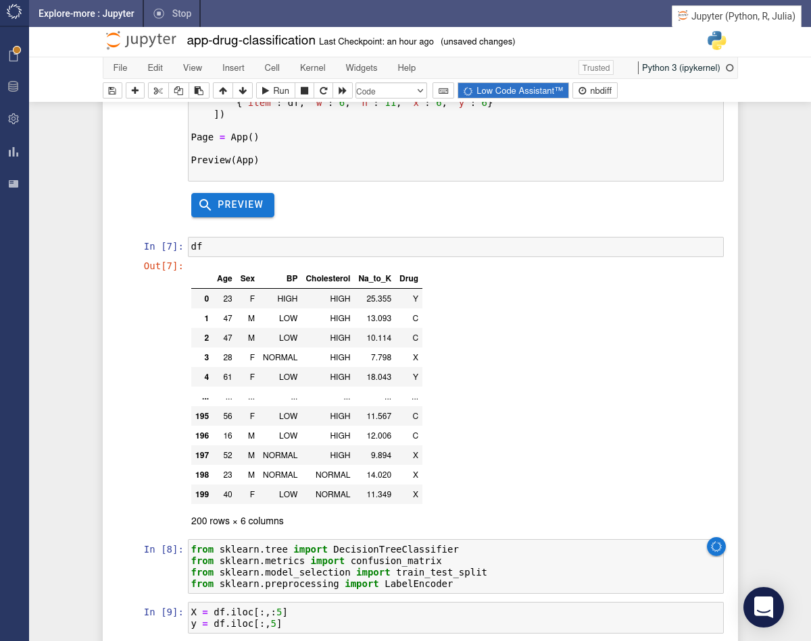
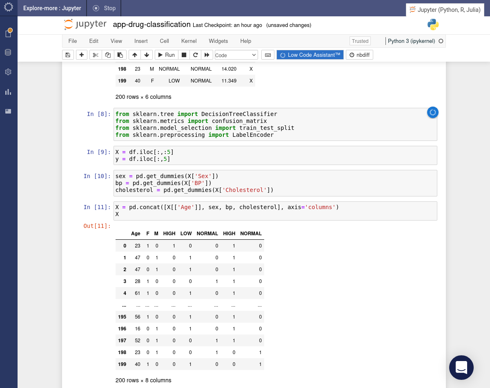
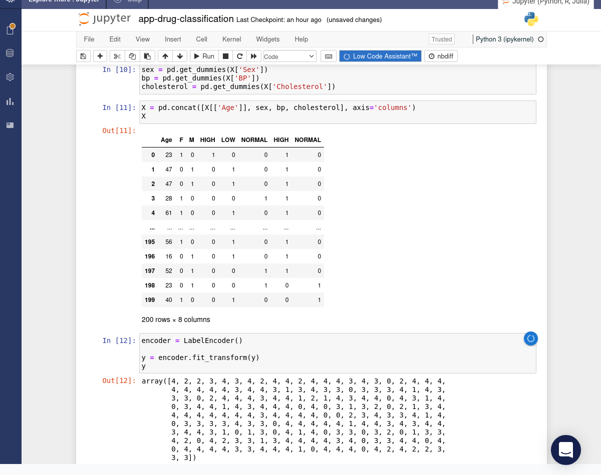
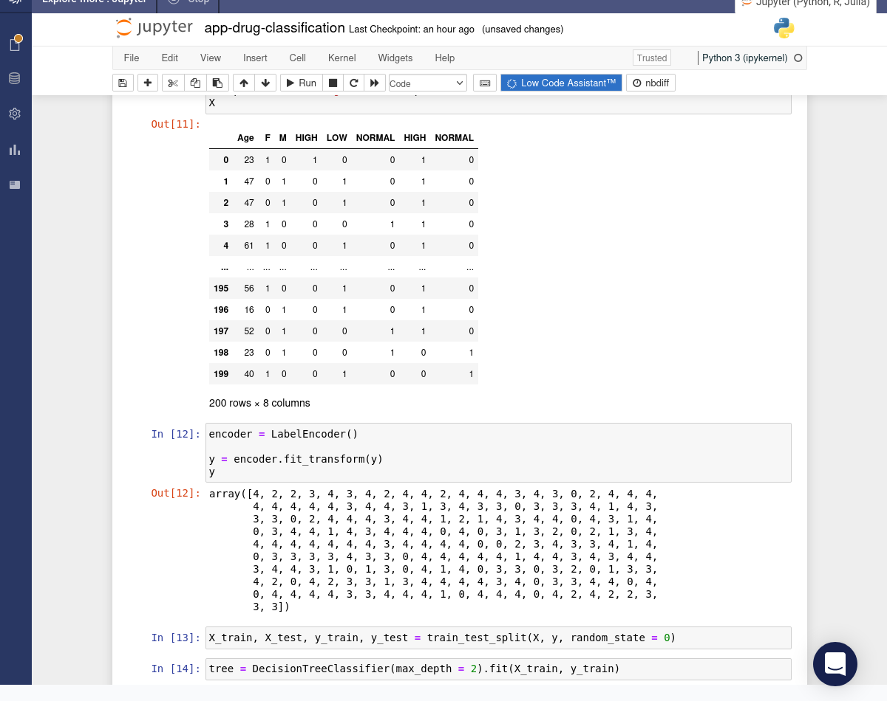
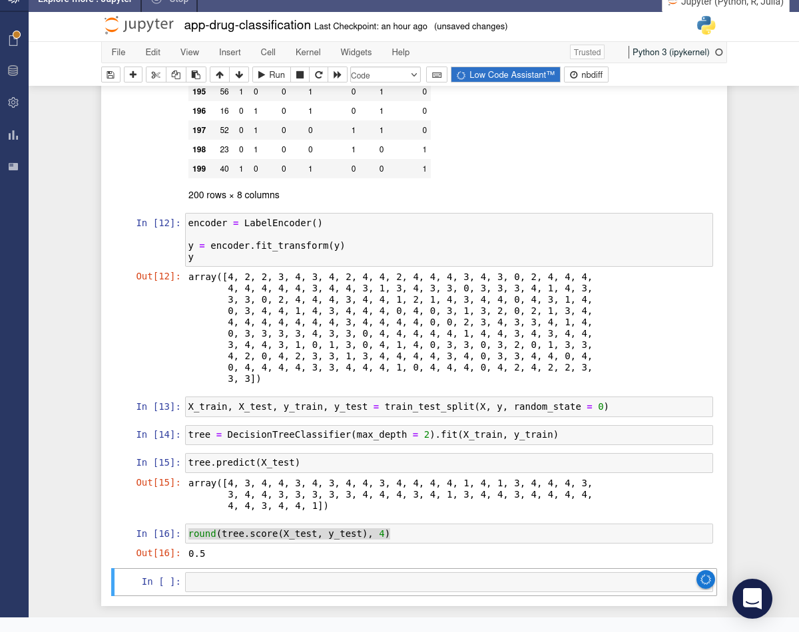

# Drug Classification App


## Background

This tutorial will show you how to build a simple app using drug classification data. The app will allow you to interactively explore the relationship between drug, Sodium/Potassium ratio and age of recipient. The app includes both a visualisation and a table, along with dropdown filters which allow you to select a subset of drugs and a minimum Sodium/Potassium ratio.

## Requirements

{!app/example/include-requirements.md!}

## Tutorial

Initialise the Low Code Assistant™.


Use the Low Code Assistant™ to load the drug classification data.


Use the Low Code Assistant™ to create a visualization. Flip the _Enable crossfilter_ toggle so that the visualization will become responsive to crossfilters. Click the <span class="blue-button">INSERT CODE</span> button.


The code will be inserted into the notebook and immediately executed to create the visualization.


Use the Low Code Assistant™ to create a crossfilter. We'll create a filter which will allow us to select one or more drug classes. Flip the _Multiple_ toggle to ensure that more than one option can be selected. Click the <span class="blue-button">INSERT CODE</span> button.


Create a second crossfilter. This time choose a _Slider_ filter and select the `Na_to_K` column. Change the _Mode_ to `>=`. Click the <span class="blue-button">INSERT CODE</span> button.


The code for both of the crossfilters will now be present in the notebook. Use the crossfilters to change the appearance of the visualization.


Use the Low Code Assistant™ to create an app. Select, move and resize widgets until you have the required layout. Click the <span class="blue-button">INSERT CODE</span> button.


The code will be inserted into the notebook. Click the <span class="blue-button">PREVIEW</span> button.


A preview version of the app will be launched.


Use a crossfilter to select a subset of drug classes.


Use a crossfilter to vary the lower cutoff for the `Na_to_K` column.


We can use the same model to build a simple Machine Learning model to predict the drug class. First let's take another look at the data in `df`.



We'll create a model to predict `Drug` using the remaining columns. We'll need to import some more packages and then split the data in predictors, `X`, and target, `y`.

```python
from sklearn.tree import DecisionTreeClassifier
from sklearn.metrics import confusion_matrix
from sklearn.model_selection import train_test_split
from sklearn.preprocessing import LabelEncoder

X = df.iloc[:,:5]
y = df.iloc[:,5]
```



The categorical columns, `Sex`, `BP` and `Cholesterol` need to be dummy (one-hot) encoded.

```python
sex = pd.get_dummies(X['Sex'])
bp = pd.get_dummies(X['BP'])
cholesterol = pd.get_dummies(X['Cholesterol'])

X = pd.concat([X[['Age']], sex, bp, cholesterol], axis='columns')
```



The target column, `y`, also needs to be encoded.

```python
encoder = LabelEncoder()

y = encoder.fit_transform(y)
```



Now split the data into training and testing sets then build a model using the training set.

```python
X_train, X_test, y_train, y_test = train_test_split(X, y, random_state = 0)

tree = DecisionTreeClassifier(max_depth = 2).fit(X_train, y_train)
```



Finally, use the model to make predictions for the testing set and then calculate the model accuracy on the testing set.

```python
tree.predict(X_test)

round(tree.score(X_test, y_test), 4)
```



The model is not terribly accurate, but given the size of the data it's not too bad! Simply guessing would yield an accuracy of only 25% and the model achieves 50%.