# Drug Classification App

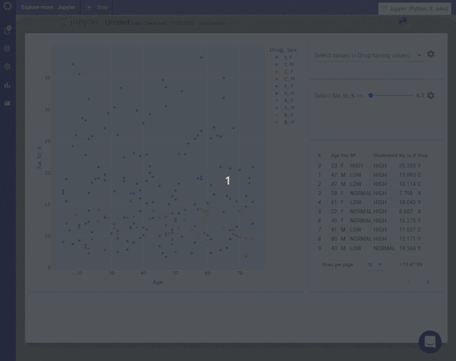

## Background

This tutorial will show you how to build a simple app using drug classification data. The app will allow you to interactively explore the relationship between drug and Sodium/Potassium ratio and age of recipient. The app includes both a visualisation and a table, along with dropdown filters which allow you to select a subset of drugs and a minimum Sodium/Potassium ratio.

## Requirements

{!app/example/include-requirements.md!}

## Tutorial

Initialise the Low Code Assistant™.

Use the Low Code Assistant™ to load the drug classification data.

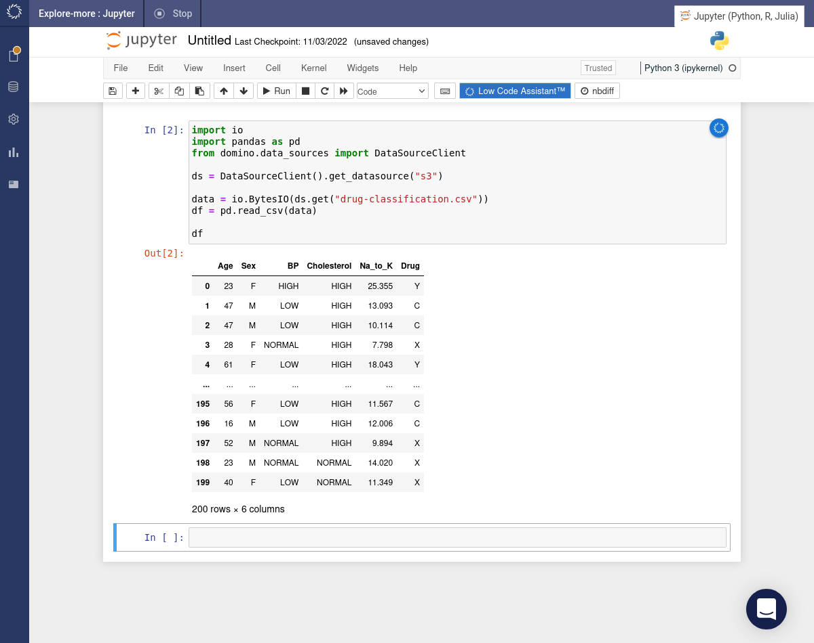

Use the Low Code Assistant™ to create a visualization. Flip the _Enable crossfilter_ toggle so that the visualization will become responsive to crossfilters. Click the INSERT CODE button.

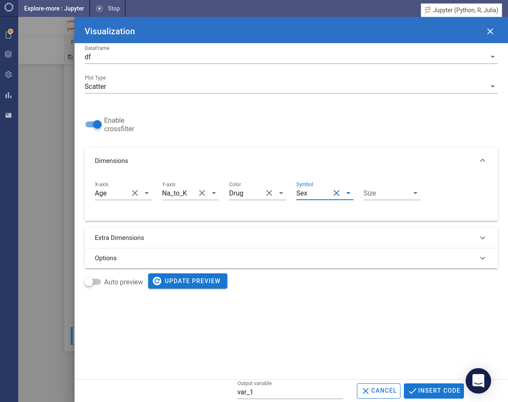

The code will be inserted into the notebook and immediately executed to create the visualization.

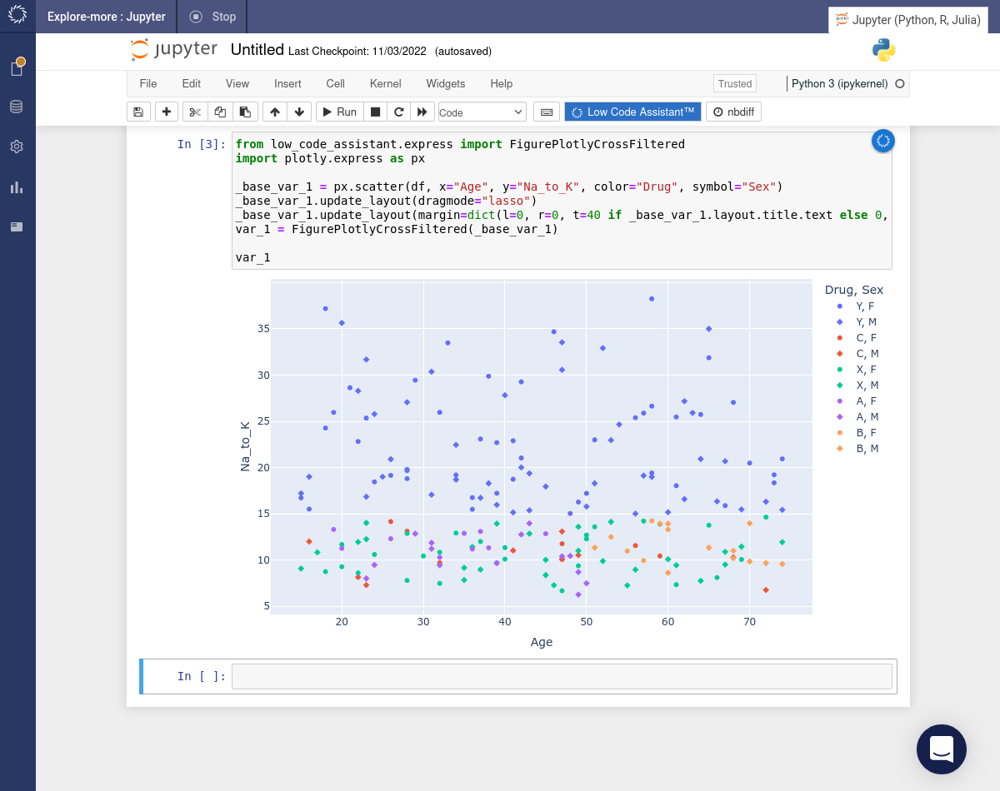

Use the Low Code Assistant™ to create a crossfilter. We'll create a filter which will allow us to select one or more drug classes. Flip the _Multiple_ toggle to ensure that more than one option can be selected. Click the INSERT CODE button.

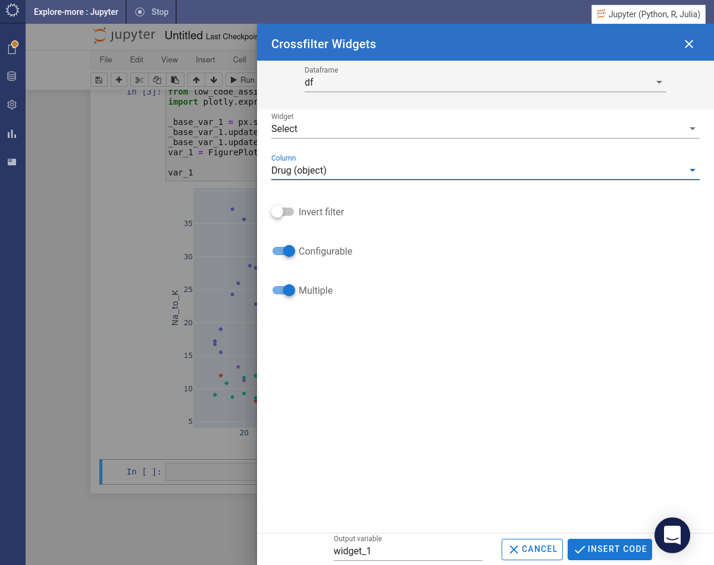

Create a second crossfilter. This time choose a _Slider_ filter and select the `Na_to_K` column. Change the _Mode_ to `>=`. Click the INSERT CODE button.

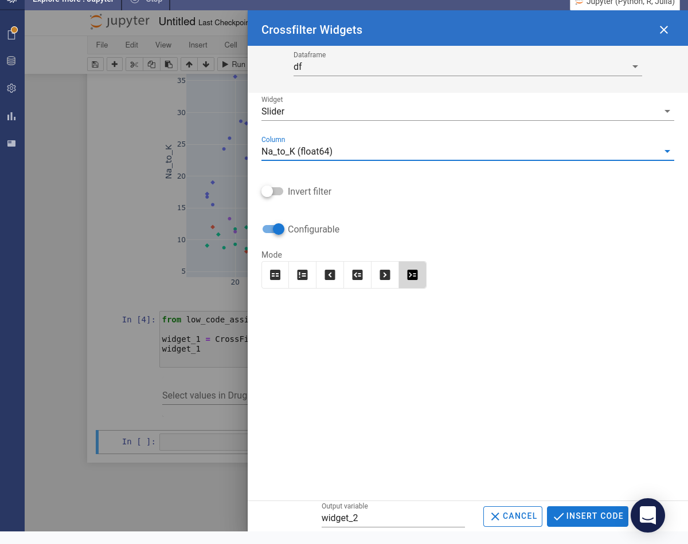

The code for both of the crossfilters will now be present in the notebook. Use the crossfilters to change the appearance of the visualization.

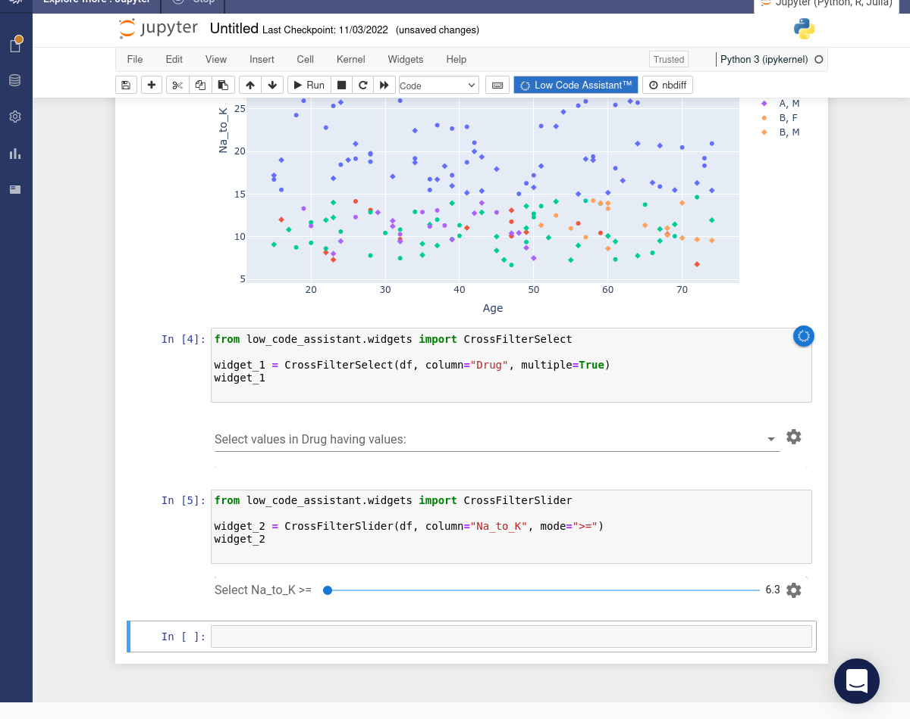

Use the Low Code Assistant™ to create an app. Select, move and resize widgets until you have the required layout. Click the INSERT CODE button.

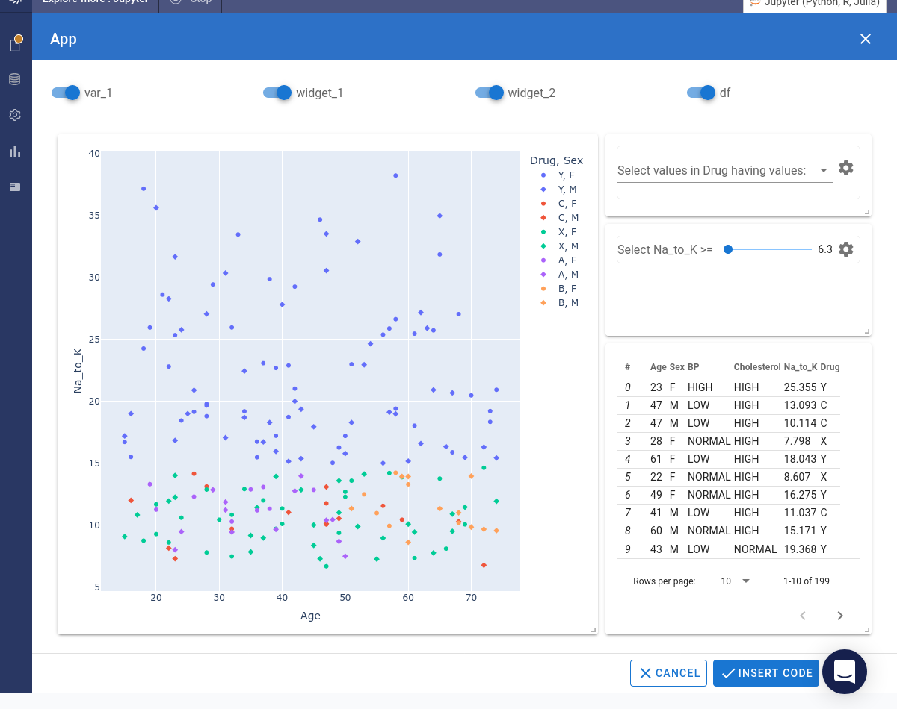

The code will be inserted into the notebook. Click the PREVIEW button.

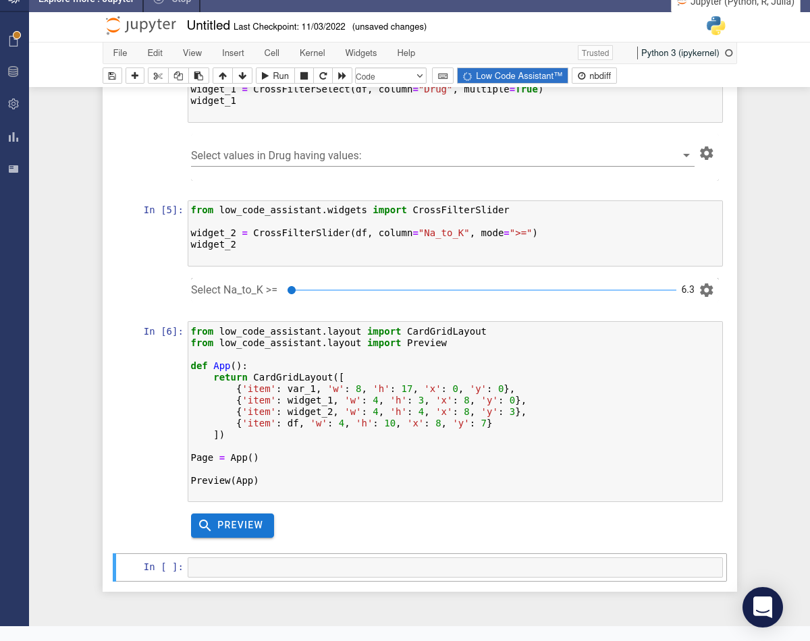

A preview version of the app will be launched.

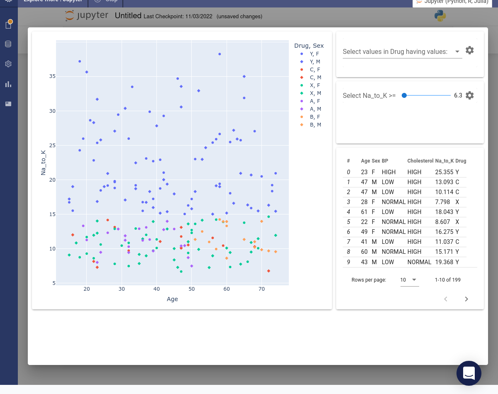

Use a crossfilter to select a subset of drug classes.

Use a crossfilter to vary the lower cutoff for the `Na_to_K` column.

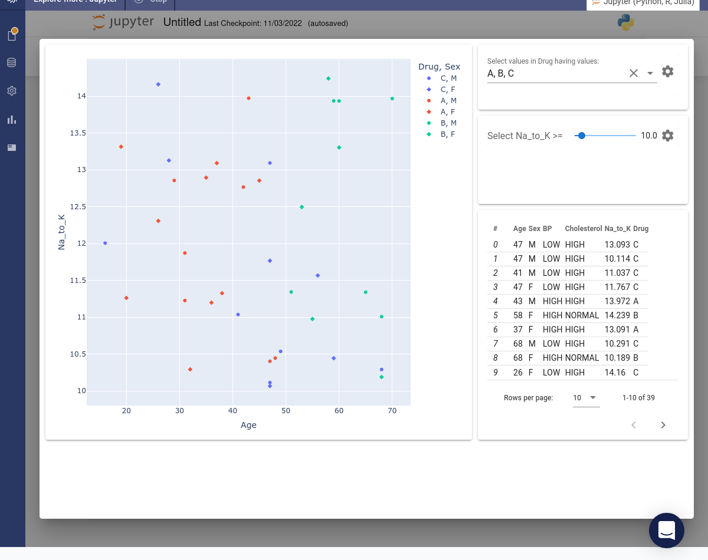