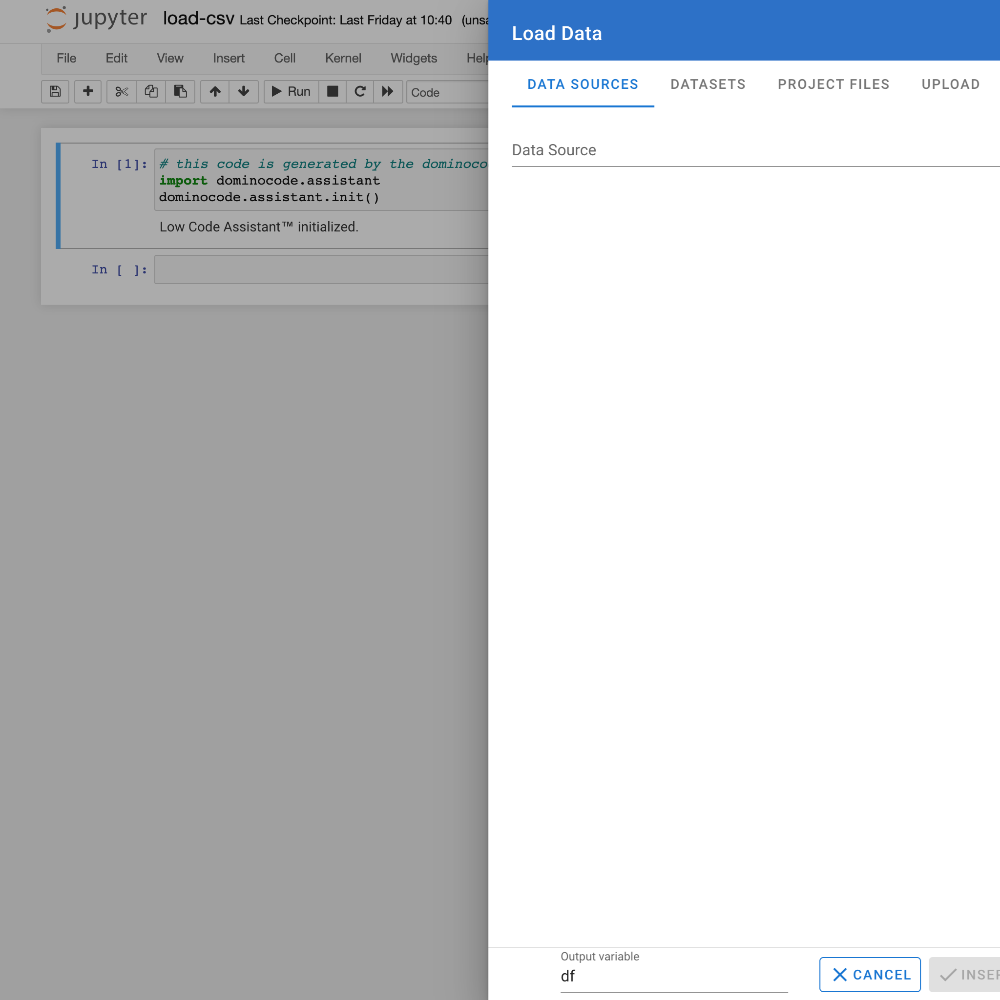
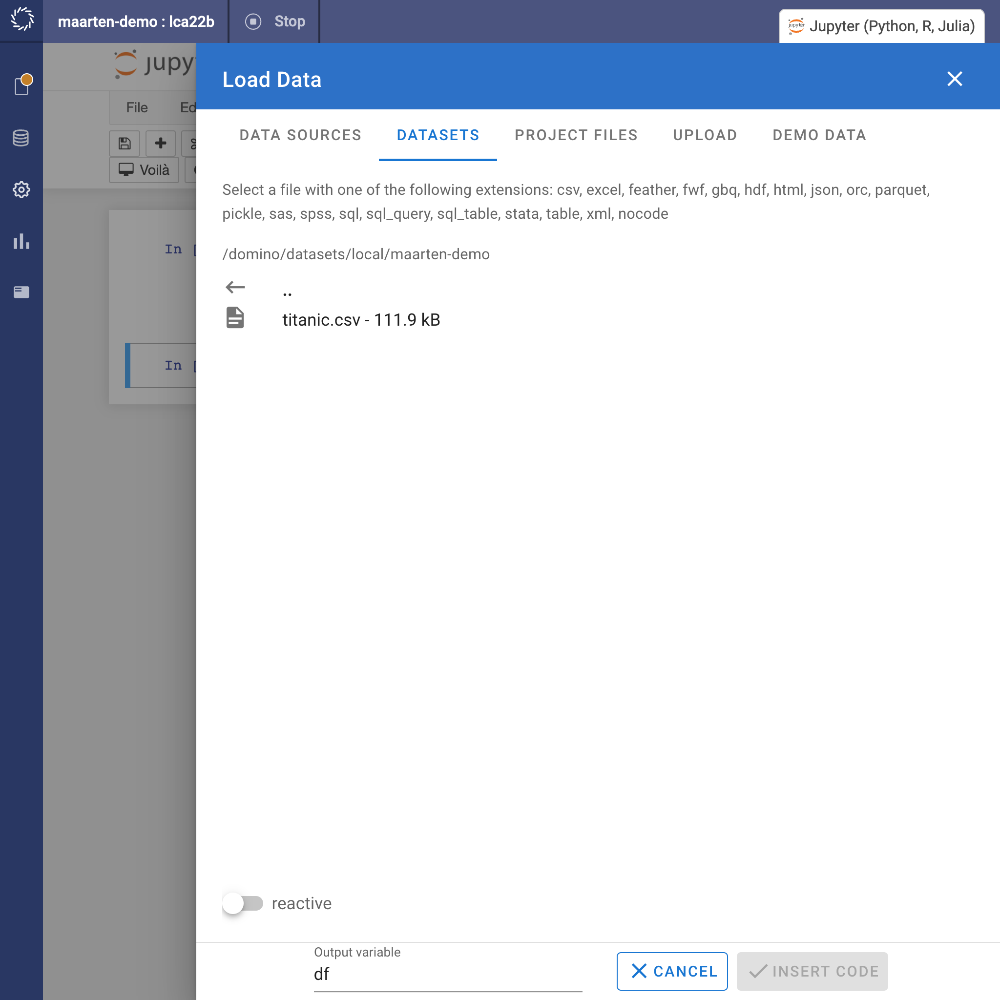
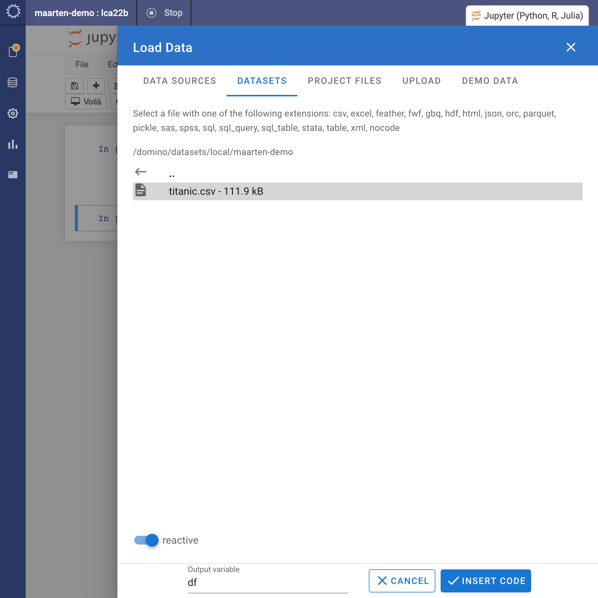
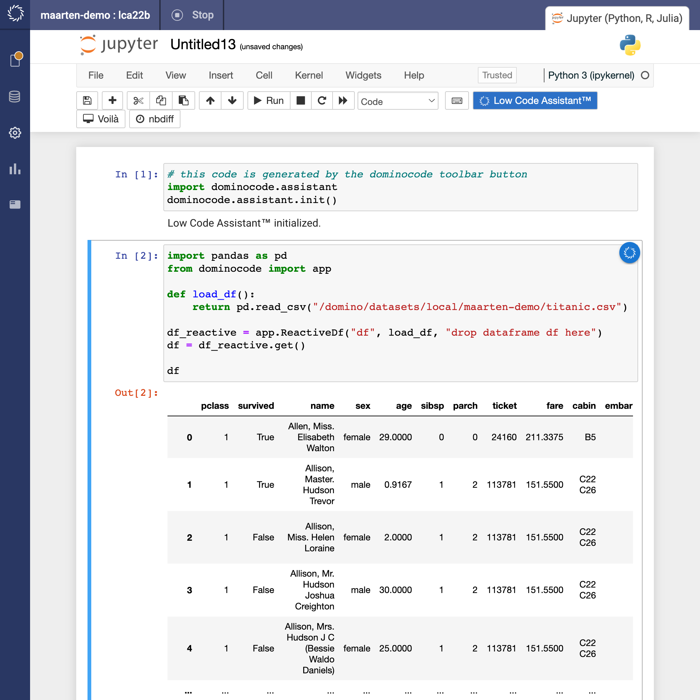
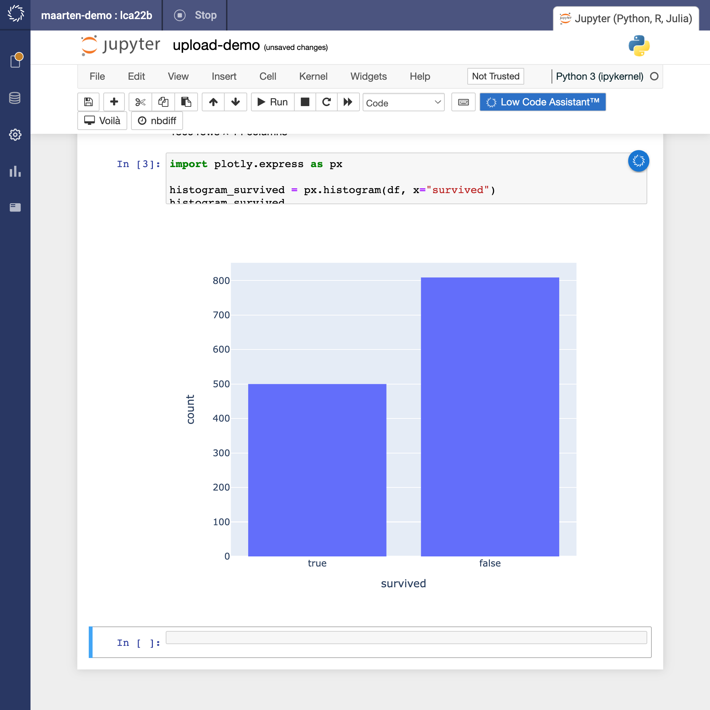
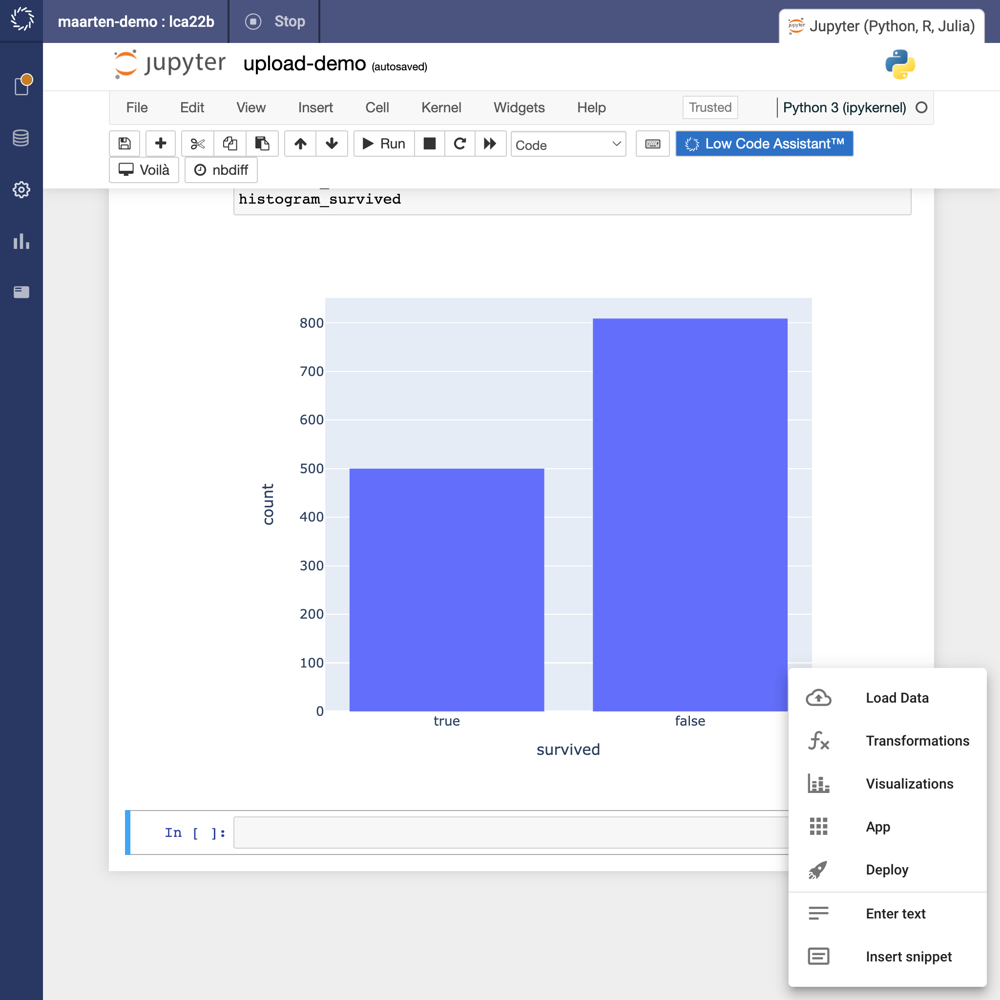
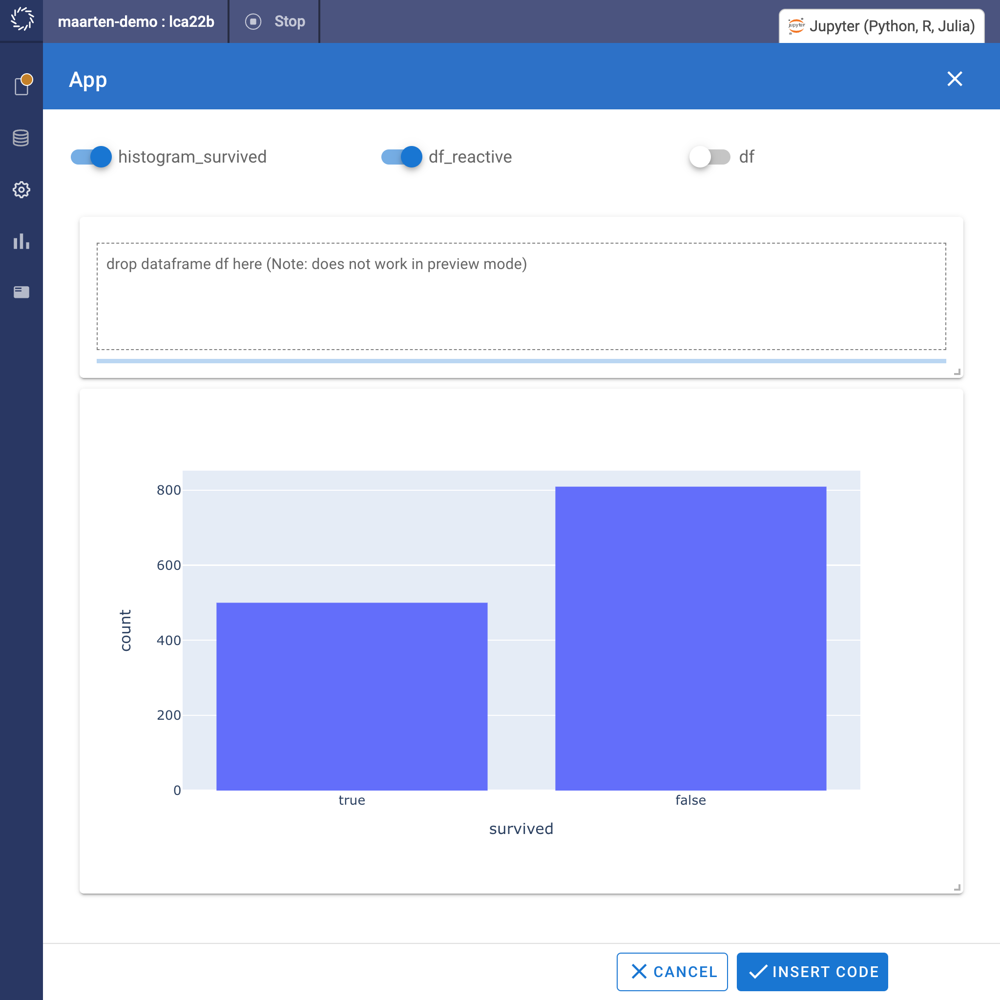

# Upload data to an app


## Check installation

If you have followed the [installation instructions](../../install.md), you should see a blue <span style="background-color: #2D71C7; color: white; padding: 3px 10px 3px 10px">Low Code Assistant™</span> button in the toolbar of your Jupyter notebook.


## Initialize the Low Code Assistant™


The Low Code Assistant™ can be started by clicking the <span style="background-color: #2D71C7; color: white; padding: 3px 10px 3px 10px">Low Code Assistant™</span> button in the toolbar. It will insert a code snippet in a new code cell and execute it. After running successfully, you should see `Low Code Assistant™ initialized`, as in the following screenshot:


If you now hover above a code cell, you should see a blue icon {.assistant-icon} to the right:


If you hover above the {.assistant-icon} icon, it will show a popup menu:


## Loading CSV data into a Pandas DataFrame


### Open dialog

Hover above the {.assistant-icon} icon and click the {.docs-border .menu-item} menu item, which will open the `Load Data` dialog.




### Select `Datasets` tab

To select a file, navigate to the `Datasets` tab and navigate to the right directory:




### Open file


Select the file you want to open and check the `reactive` toggle button. This allows the app we will create to replace the dataframe by uploading data.




This will give slightly different code than what you are expected to see when you simply load the csv (e.g. as in [CSV to Pandas](../../loading-data/csv) )




## Creating visualizations

### Adding a histogram

Create a histogram using the Low Code Assistant™, as described in [Scatter Plot](../viz/scatter.md) or add your own code. In our example we add the following code ourselves:

```python
import plotly.express as px

histogram_survived = px.histogram(df, x="survived")
histogram_survived
```



## Open the App configurator

Click on the App button {.retina-image .docs-border} to open the app configurator.




## Configure the app

Toggle both `df_reactive` and `histogram_survived` and drag and resize the elements to create a good-looking app.




## Deploy the app

Follow the [Deploy an App](../deploy) steps to deploy the app.

## Result

Once the app is deployed, you can view the app, and should see a screen like this:


Now drag a different CSV file into the file drop zone, and the Low Code Assistant™ app will re-execute the whole notebook, but with the data from the uploaded file:

<video controls style="width: 800px">
    <source src="https://user-images.githubusercontent.com/1765949/189431994-1e0b2f11-96ce-4584-ad11-982c7715f573.mp4" type="video/mp4">
</video>


Note that you can do many transformations and visualization. For this example, for simplicity, we only used a single dataframe and a single visualization.

*Note*: it is the user's responsibility at the moment to make sure the column names have the same names as the original file.
