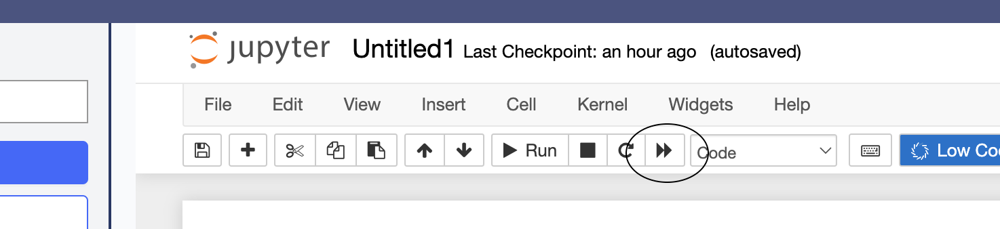

# Code Snippets

## Using snippets

Choose "Insert snippets" from the Low Code Assistant™ menu to insert code snippets into your notebook.

{: style="width: 313px"}

Browse the available snippets and select the one you want to insert.
{: style="width: 1024px"}
{: style="width: 1024px"}

## Adding snippets

A snippet library can be added by adding a git repository with snippets to your Domino project.
{: style="width: 1024px"}

If credentials are required to access the repository, they can be setup in your account:

Select "Account Settings"

{: style="width: 347px"}

Select "Git Credentials"
{: style="width: 1024px"}

{: style="width: 1024px"}

## Snippet format

LCA looks for snippets in a "snippet" folder in the root of the repository. Any python files in this folder will be loaded as snippets.
The sub folder structure will be maintained in the LCA menu.

Example:
<pre>
MySnippets
 ├── .git
 ├── snippets
      ├── my_snippet.py
      ├── subfolder
           ├── my_other_snippet.py
</pre>

## Editing snippets

Snippets can be edited in the git repository with your regular git workflow for this repo or you can open a VSCode workspace
for this project in Domino.

Click on  "Open Folder" in VSCode

{: style="width: 526px"}

Imported git repo's are available at "/repo"

{: style="width: 632px"}

Create a new snippet

{: style="width: 708px"}

Sync changes in the "Imported Repositories" section:

{: style="width: 593px"}

## Updating snippets in Notebook workspace

When snippets are updated in the git repository, the change is only visible in the notebook workspace after pulling the changes and restarting the notebook.

Click on "pull" in the "Imported Repositories" section

{: style="width: 430px"}

Restart the notebook

{: style="width: 737px"}
