# Loading Data from BigQuery

To load data from BigQuery you'll need to have

- access to a BigQuery project containing the data and
- a private key with suitable permissions.

## Add a BigQuery Data Source

Before you can use the Low Code Assistant to access data from BigQuery you'll need to add a suitable data source.

Click the _Data_ option in the left-hand menu. Click the + Add a Data Source button.

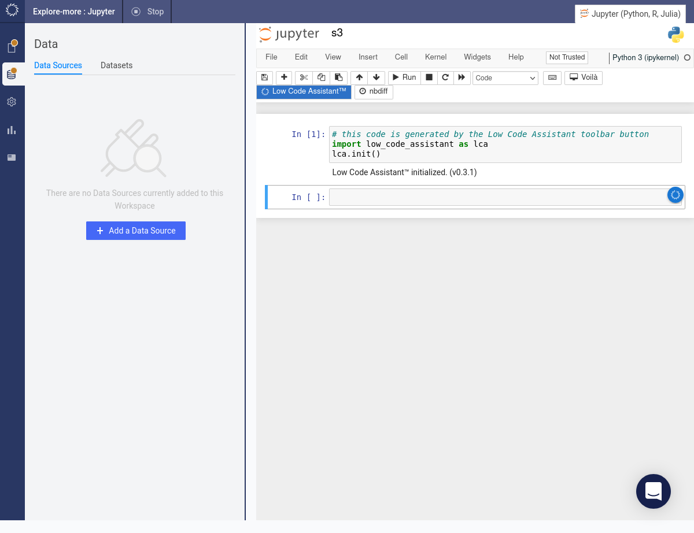

From the drop-down menu select _Google BigQuery_.

<!-- 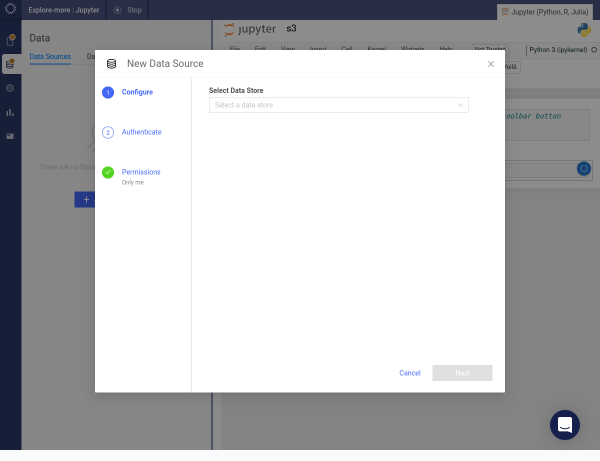 -->
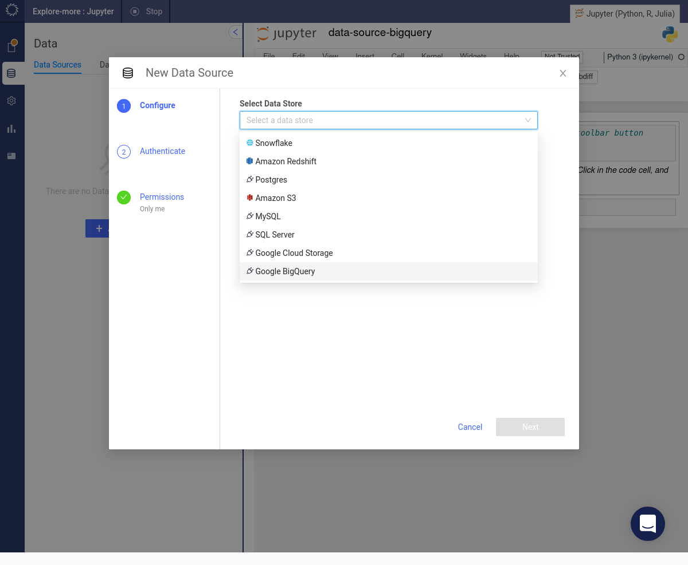

Fill in the details for the BigQuery project.

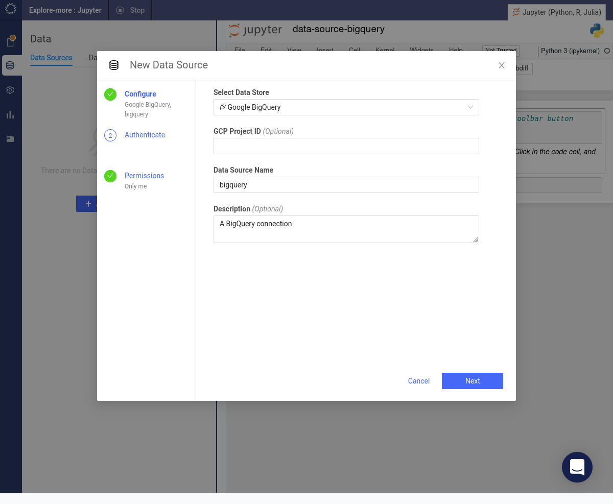

Paste a valid private key in JSON format.

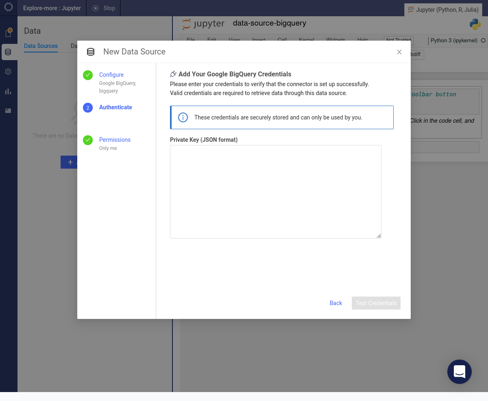

Press the Test Credentials button. When your credentials have been validated, press the Next button.

Specify which users will have access to this data source. Press the Finish Setup button.

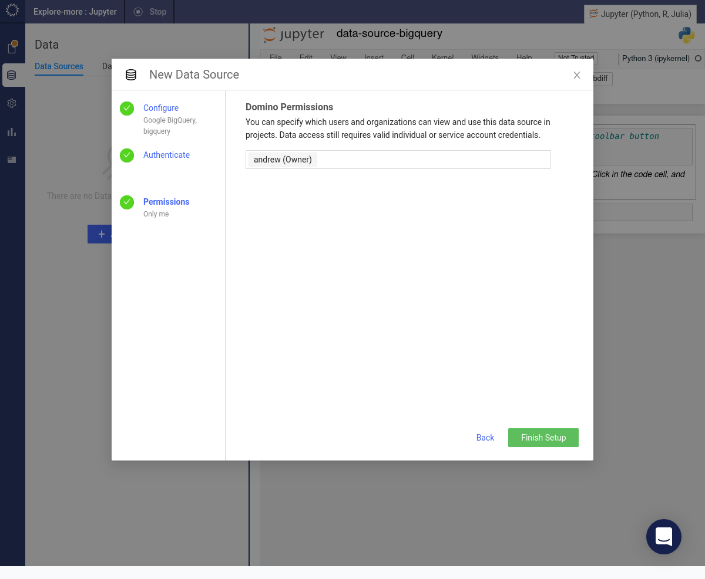

The BigQuery project will appear under the list of data sources.

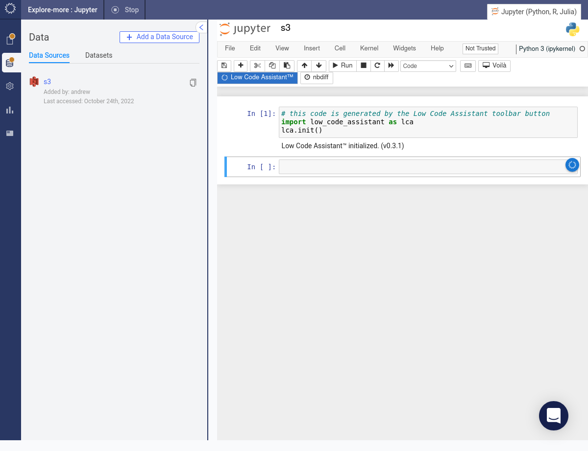

## Load Data from BigQuery

Click the Low Code Assistant™ button in the toolbar. It will insert a code snippet in a new code cell and execute it.

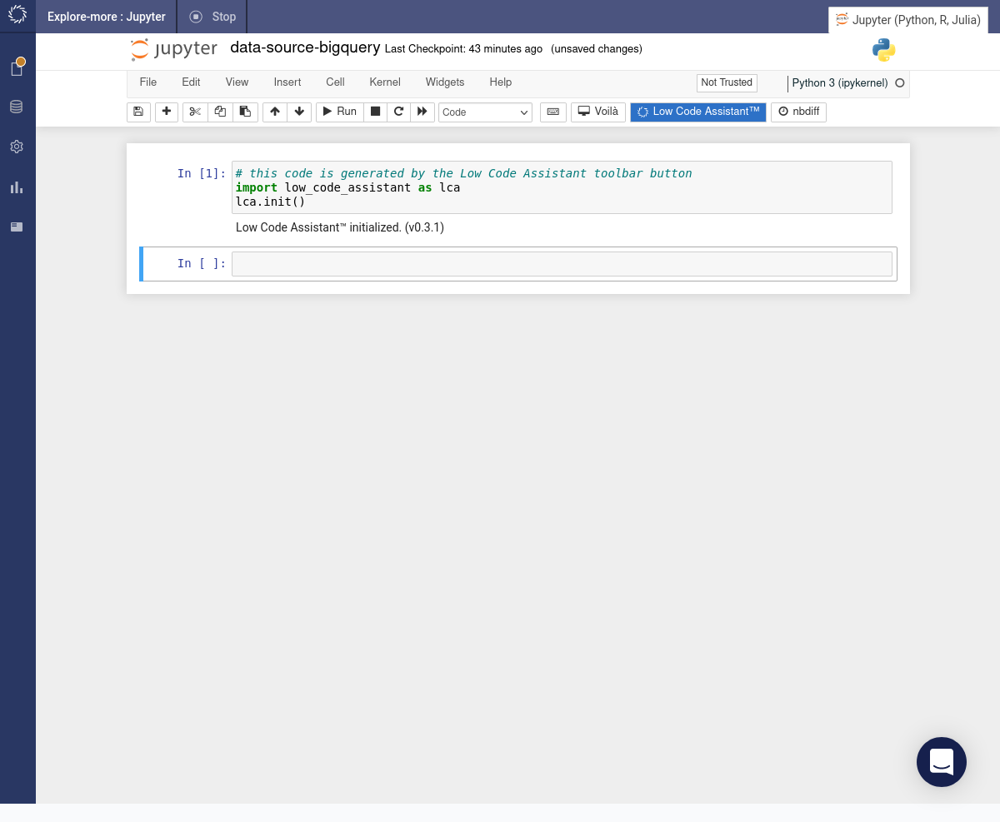

Once the Low Code Assistant™ has been initialised if you hover above a code cell, you will see the assistant icon . If you hover above the assistant icon , it will show a popup menu. Select the _Load Data_ item from the menu.

Under the drop-down list of data sources you will find the data source which we created earlier. Select it.

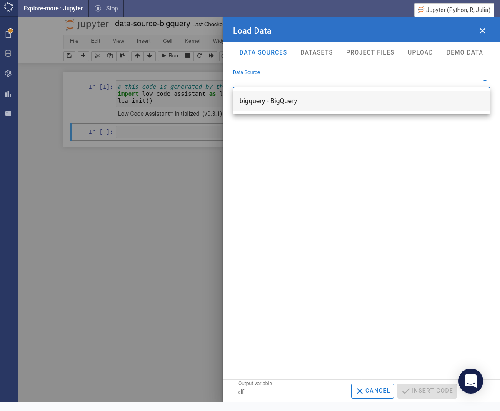

Specify the project, region, dataset and table that you want to load. Click the INSERT CODE button.

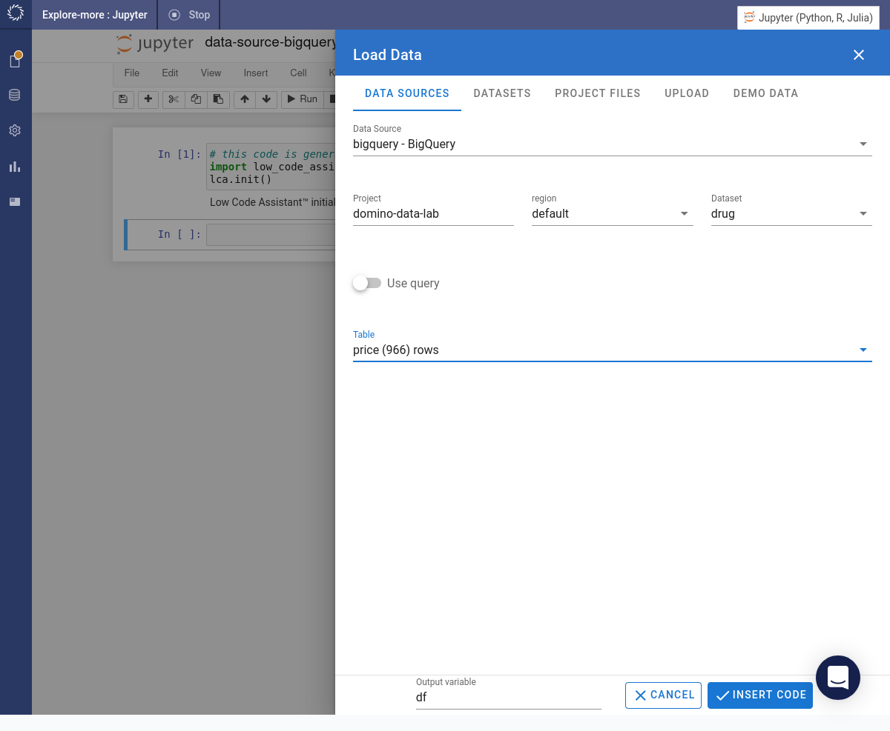

The required code will be inserted into a cell and immediately executed.

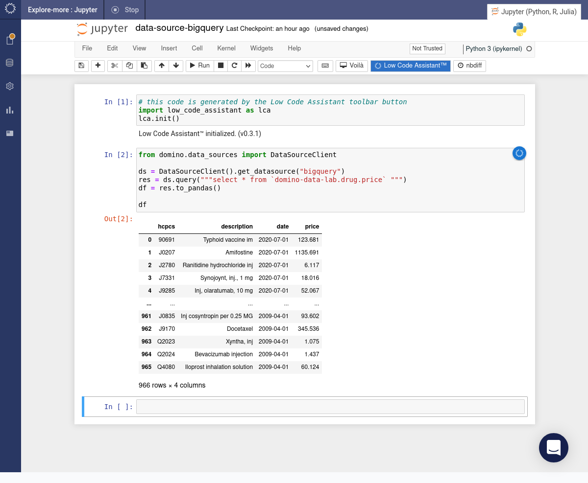