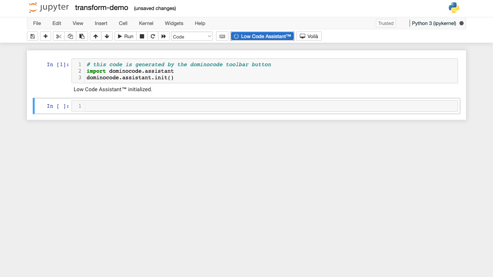
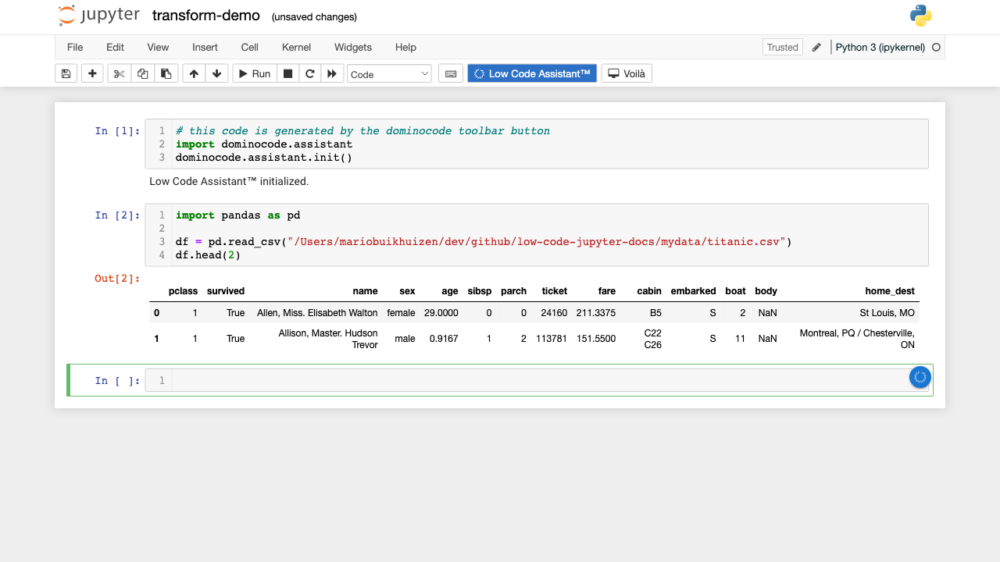
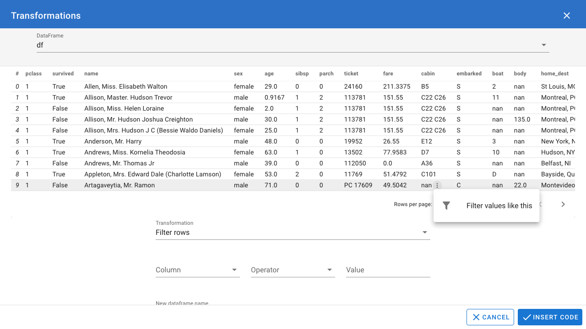
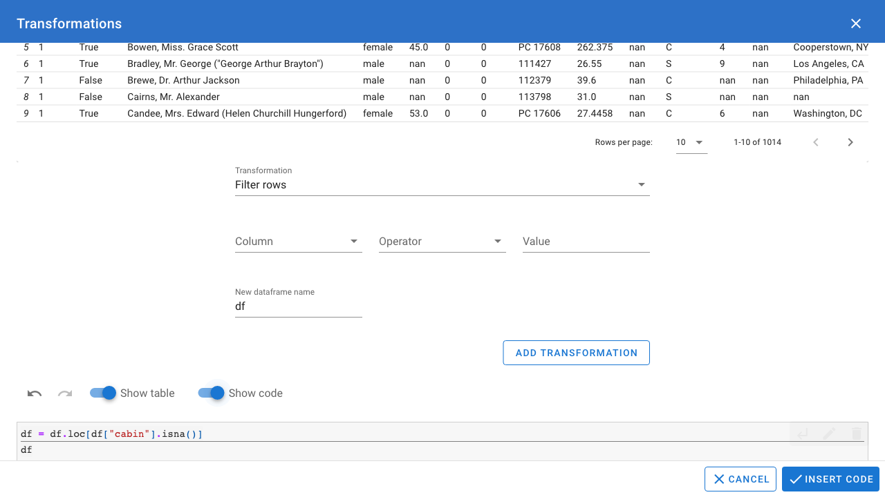

# Transforming data

The following video includes all the steps explained below
<video controls>
    <source src="https://user-images.githubusercontent.com/46192475/166971248-018c650c-068e-4db3-97ff-c473a26d19f4.mp4">
</video>

## Initialize the Low Code Assistant™

We start similarly as in [Loading data](loading-data/csv.md) by initializing the Low Code Assistant™.

## Loading data

In this case, instead of using the Low Code Assistant™, we load the data ourselves:

## Open dialog

Hover above the {.assistant-icon} icon and click the {.docs-border .menu-item} menu item, which will open the `Transformations` dialog.

## Choose dataframe

When the `Tranformations` dialog opens, we have to choose a dataframe.

Click the select box to get an overview of all dataframe variables and click on the one you want to apply transformations on.

After which the data is shown in a table.

## Apply quick transformation

We could manually add a transformation by clicking on the , but
in this example we will add a tranformation by a quick action throught the table. 

Hover above a cell value containing `nan`, and you can then hover above the triple dots icon, to get the menu {.docs-border}

Click the menu item {.docs-border} to open the dialog:

And click the  button to filter the dataframe. Now we can see that we only 
have values with `nan` for the `cabin` column.

## Show code

Toggle the switch {.docs-border} to show the code

## Insert code

And click the  button to insert the code into the notebook.

