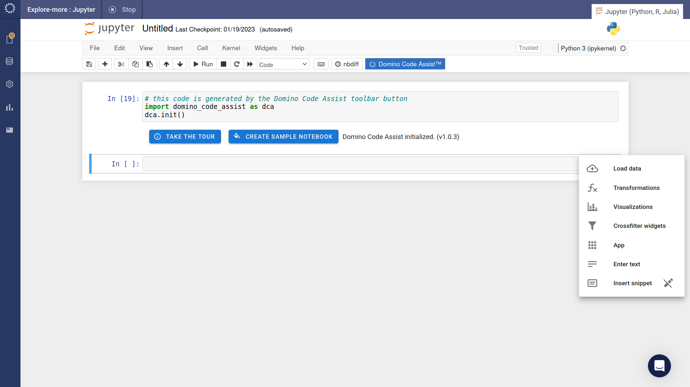

# Summary

Code Assist provides a simple, intuitive point-and-click interface for generating Python or R code. It aims to enable those not familiar with writing code to quickly become productive in Domino Data Lab. For those more familiar with writing code, Code Assist accelerates common data analysis tasks.

Code Assist can generate code for these tasks:

1. Import data from Cloud stores like [S3](./loading-data/s3/), [Snowflake](./loading-data/snowflake/), [BigQuery](./loading-data/bigquery/) or [Redshift](./loading-data/redshift/).
2. Wrangle data with operations like [filtering](./transform/filter) and [aggregation](./transform/group-aggregate).
3. Create [visualizations](./visualization/create-plot).
4. Create and easily deploy [data apps](./app/create).

## Benefits

The benefits of Code Assist can be divided into four categories:

1. **Improved Performance** In tests with analysts new to Python (new graduates), Code Assist enhanced productivity by 5-20x.

    | Task                                          | Novice - Productivity Gain | Expert - Productivity Gain      |
    | :---                                          | :---                       | :---                            |
    | Make a statistical data visualization         | 5x faster                  | 1x faster                       |
    | Connect to Snowflake and import data          | 5x faster                  | 2x faster                       |
    | Make an app where users can upload their data | 10x faster                 | 2x faster                       |
    | Publish & share an interactive dashboard      | 20x faster                 | 3x faster                       |

2. **Portability** The code generated by Code Assist is always generic Python or R code, and so it's perfectly portable. It can be productionized or downloaded and run off-platform. 
3. **Building Skills** Generating Python and R code interactively via Code Assist is a powerful learning tool. It flattens the learning curve and makes complex topics easily accessible.
4. **Tweakability** The code produced by Code Assist may not precisely do what's required. However, it's a useful first draft which can then be tweaked to get percisely what's needed.

## Appetizer

Below are images showing what Code Assist looks like in Jupyer and RStudio running on Domino Data Lab.

