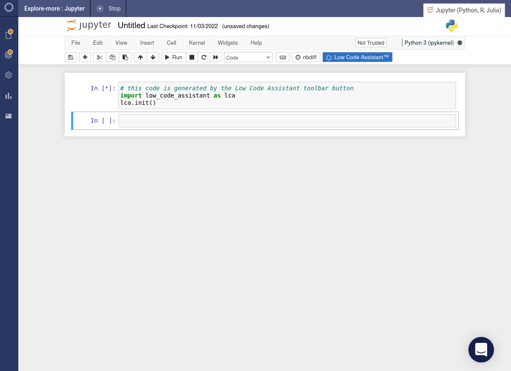
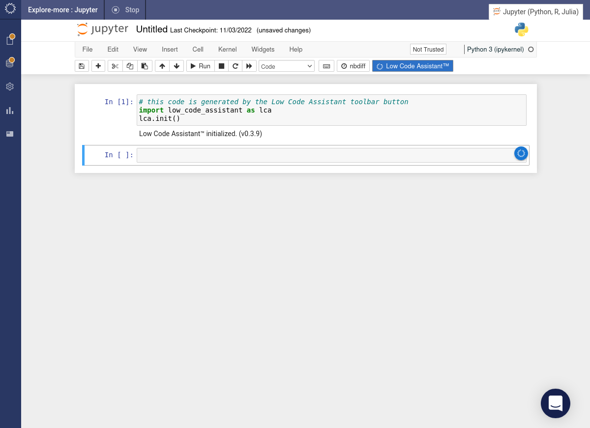

# Initialize

If you have followed the [installation instructions](./install.md), you should see a blue Low Code Assistant button in the toolbar of your Jupyter notebook.

The Low Code Assistant can be started by clicking the Low Code Assistant button in the toolbar. It will insert a code snippet in a new code cell and execute it.

If you now hover above a code cell, you should see a blue icon   to the right.

If you hover above the   icon, it will show a popup menu.

