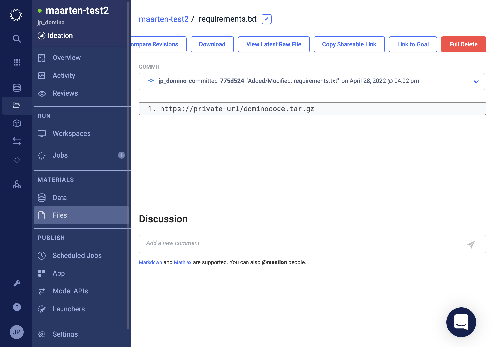

# Installation

Dominocode is not available from pypi, please contact us for a private link so you can install it.

!!! warning "Jupyter lab not yet supported"

    Currently, the code assistant only works in the (classical) Jupyter notebook. Jupyter lab is not yet supported.


## Manual installation
Once you have the private link, you can install it manually in an existing Python environment using.


<div class="termy">

```console
$ pip install https://private-url/dominocode.tar.gz

---> 100%
```

</div>

!!! info "From a notebook"

    You can also run this from your notebook, by running `!pip install ...` from a code cell.

!!! warning "Not persistent"

    If you install this into a running workspace, you might lose the installed package when the workspace restarts.
    It is best practice to install it as explained in the next section.

## Install for workspace

When a workspace is created, a `requirements.txt` file will be used to install Python packages into your new environment. 
We can use this to make sure dominocode is installed before we start our notebook.

### Navigate to `Files`

In your project, navigate to `Files`.


### Create a new file

Create a new file by clicking the left most :material-file-plus: icon to get to the following screen


### Give filename and enter url

Enter the `requirements.txt` filename in the top textfield and the private url in the bottom textarea.


### Save file

Clicking the `Save` button should give you the following screen, on success.


### Optional: check file

Navigate to `Files` again, to make sure you have added the file


