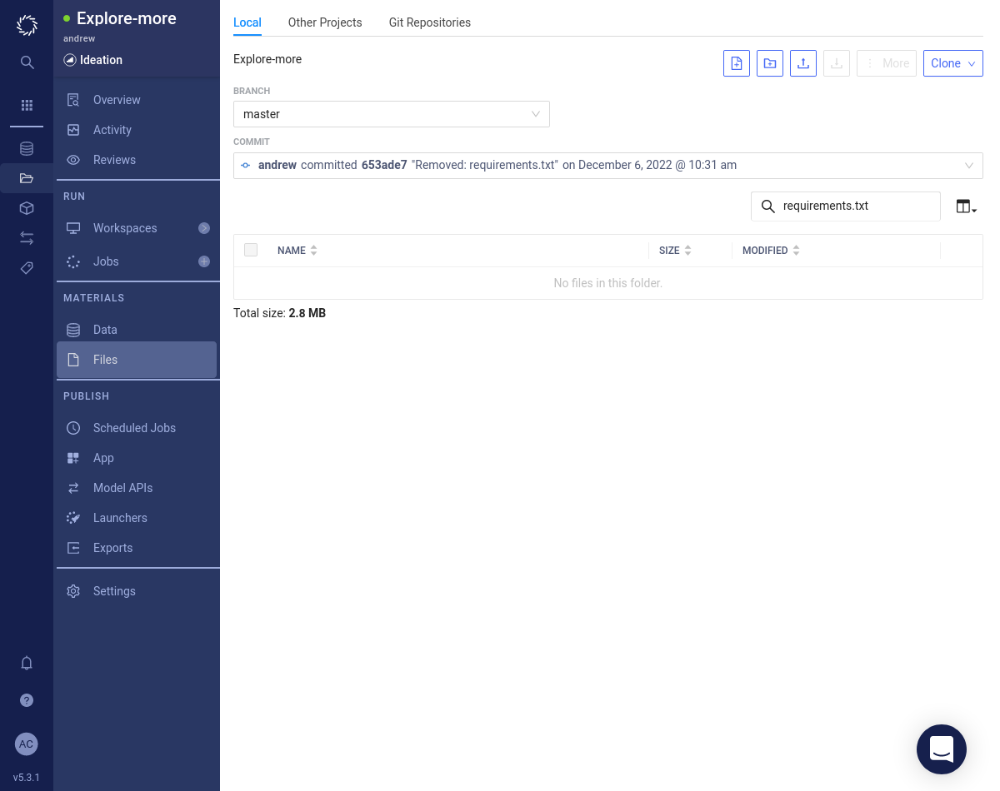

<div class="sticky-banner sticky-banner-warning">
    The Low Code Assistant (LCA) is automatically installed in Domino version 5.5 and above.
</div>

# Installation

## Install the Low Code Assistant

The Low Code Assistant (LCA) can be used with either Python or R.

=== "Python"

      If you do not already have a _Jupyter_ or _JupyterLab_ workspace, then create one now. Launch the workspace.

      Run the following command in a notebook code cell:

      ```
      !pip install --user low-code-assistant
      ```

      

      After the installation completes, refresh your browser tab. The <span class="blue-button">Low Code Assistant</span> button will appear in the Jupyter toolbar. Click this button to initialize the assistant.

      

      To upgrade an existing version do:

      ```
      !pip install --user --upgrade low-code-assistant
      ```

=== "R"

    There are three distinct approaches to installing the R package:

    - [installing in a Domino RStudio workspace](#rstudio-workspace)
    - [installing in a Domino Compute environment](#domino-compute-environment) (recommended) and
    - [installing from source](#source).

    ### RStudio Workspace

    If you do not already have an _RStudio_ workspace, then create on now. Launch the workspace.

    If you do not have the `{remotes}` package installed, then install it now by running the following command in the RStudio console.

    ```r
    install.packages("remotes")
    ```

    Now install the LCA package.

    ```r
    remotes::install_github("dominodatalab/low-code-assistant-rstudio")
    ```

    You may be prompted to update dependencies. Choose the appropriate option. The installation will take a few minutes.

    🚨 If you encounter a timeout error during the installation, then make sure that you've selected a harware tier that allows egress. Otherwise, your workspace will not be able to reach GitHub to download the package.

    

    If you want to automatically upgrade packages then you can run the following:

    ```r
    remotes::install_github(
        "dominodatalab/low-code-assistant-rstudio",
        upgrade = "always"
    )
    ```

    After the installation completes, refresh your browser tab. Under the _Addins_ menu option you should now see an _ASSISTDOMINO_ section with various actions listed below. You can also confirm that the `{assistDomino}` package has been installed by searching in the _Packages_ tab.

    

    This is the easiest way to get started with LCA, but if you restart you workspace, you will need to reinstall Low Code Assistant again. To enable LCA more permanantly, [make it the default configuration](#make-lca-default-configuration).

    ### Domino Compute Environment

    1. Select _Environments_ from the side navigation bar.
    2. Choose the environment in which LCA for R package should be installed.
    3. Click the _Edit Definition_ button.
    4. Add the following line to the end of the `Dockerfile` section (but before the last USER ubuntu command):
    ```
    RUN R -e 'remotes::install_github("dominodatalab/low-code-assistant-rstudio", upgrade = "always")'
    ```
    5. Click the _Build_ button at the bottom of the page

    This will install LCA for R in every workspace that uses the Domino environment.

    ### Source

    In some situations you will not be able to run `remotes::install_github()` because your environment won't permit a connection to GitHub. In this case you can still install LCA from source.

    1. Clone [this Git repository](https://github.com/dominodatalab/low-code-assistant-rstudio) to any computer that has access to GitHub and has R installed. Alternatively you can download a [ZIP archive](https://github.com/dominodatalab/low-code-assistant-rstudio/archive/refs/heads/master.zip) and unpack it.
    2. Open an R session inside the root of this project.
    3. Make sure the `{devtools}` and `{remotes}` R packages are installed.
    ```r
    install.packages(c("devtools", "remotes"))
    ```
    4. Build the package.
    ```r
    devtools::build()
    ```
    5. That will have created a file named `assistDomino_<version>.tar.gz` in the parent directory. Copy this file to your Domino project.
    6. In Domino, you can now use the file from the previous step to install.
    ```r
    remotes::install_local("path/to/assistDomino_<version>.tar.gz")
    ```

## Initialize

=== "Python"

    If you have followed the [installation instructions](./install.md), you should see a blue <span class="blue-button">Low Code Assistant</span> button in the toolbar of your Jupyter notebook.

    

    The Low Code Assistant can be started by clicking the <span style="background-color: #2D71C7; color: white; padding: 3px 10px 3px 10px">Low Code Assistant</span> button in the toolbar. It will insert a code snippet in a new code cell and execute it.

    

    If you now hover above a code cell, you should see a blue icon   to the right.

    

    If you hover above the   icon, it will show a popup menu.

    

=== "R"

    There is no initialization required in R. Various LCA actions will be listed under the _Addins_ menu option.

## LCA Default Configuration {#make-lca-default-configuration}

If you restart your workspace, then you will need to repeat the installation steps. To enable LCA more permanently you can add it to the default configuration.

There are 2 ways to make LCA a default configuration:

 * [Enable in a Domino Project](#enable-lca-domino-project), or
 * [Enable in a Domino Compute Environment](#enable-lca-domino-compute-environment)

Enabling LCA in your organization's most used compute environments (CE) is the fastest way to deploy LCA. This way, LCA will appear automatically in any Jupyter or RStudio toolbar that is built from that CE. However, the CE will need to be rebuilt everytime there is an LCA update. If CE's are not rebuilt weekly, we recommend enabling LCA at the project-level.

## LCA in Project {#enable-lca-domino-project}

When a workspace is created, a `requirements.txt` file will be used to install Python packages into your new environment. 
We can use this to install Low Code Assistant into any workspace created within a project.

Check if you have a `requirements.txt` file. Navigate to _Files_. You should see something like the image below. If there are many files then you can search for the `requirements.txt` file.

Depending on whether or not you have a `requirements.txt` file follow the appropriate instructions below.

=== "I have a requirements.txt"

      

      1. Click on the `requirements.txt` file link.
      2. Click the <span class="white-button">Edit</span> button.

         

      3. Add the `low-code-assistant` package to your `requirements.txt` file. You can specify a version like `low-code-assistant==0.4.1`. If you don't specify a version then the latest version will be installed.

         

      4. Click the <span class="white-button">Save</span> button.

=== "I don't have a requirements.txt"

      

      1. Download our [requirements.txt](requirements.txt).
      2. Press the _Upload_ button. Either drag and drop or browse to find the `requirements.txt` file.

         

      3. Click the <span class="blue-button">Upload</span> button.
      
         

      4. Confirm that the `requirements.txt` file has been successfully uploaded.

         

Now create a new _Jupyter_ or _JupyterLab_ workspace with and the Low Code Assistant button will be available.

## LCA in Compute Environment {#enable-lca-domino-compute-environment}

1. Go to the Domino Standard Environment (under _Environments_ in the side navigation bar).
2. Add this line to the end of the environment's `Dockerfile` setup (but before the last `USER ubuntu` command):

    === "Python"
        ```
        RUN pip install low-code-assistant
        ```
    === "R"
        ```
        RUN R -e 'remotes::install_github("dominodatalab/low-code-assistant-rstudio", upgrade = "always")'
        ```

3. Save the default environment `Dockerfile`.
4. Click the _Build_ button.

## Rebuild Compute Environment

1. Go to the _Environments_ page (the cube icon in the left-side-bar).
2. Open your LCA environment definition.
3. Click the <span class="white-button">Edit Definition</span> button.
4. Scroll to the bottom and check :fontawesome-regular-square: _Full rebuild without cache_.
5. Click the <span class="white-button">Build</span> button.

## Check Versions

It can be useful to know the precise version of Python and LCA which are running in your environment.

### Check Python Version

To check the version of Python in your environment, run the following:

```python
from platform import python_version

python_version()
```

### Check LCA Version

To check the version of LCA installed, run the following:

```python
import low_code_assistant

low_code_assistant.__version__
```

Follow [these instructions](#enabling-low-code-assistant-in-jupyter) to upgrade your LCA installation.
