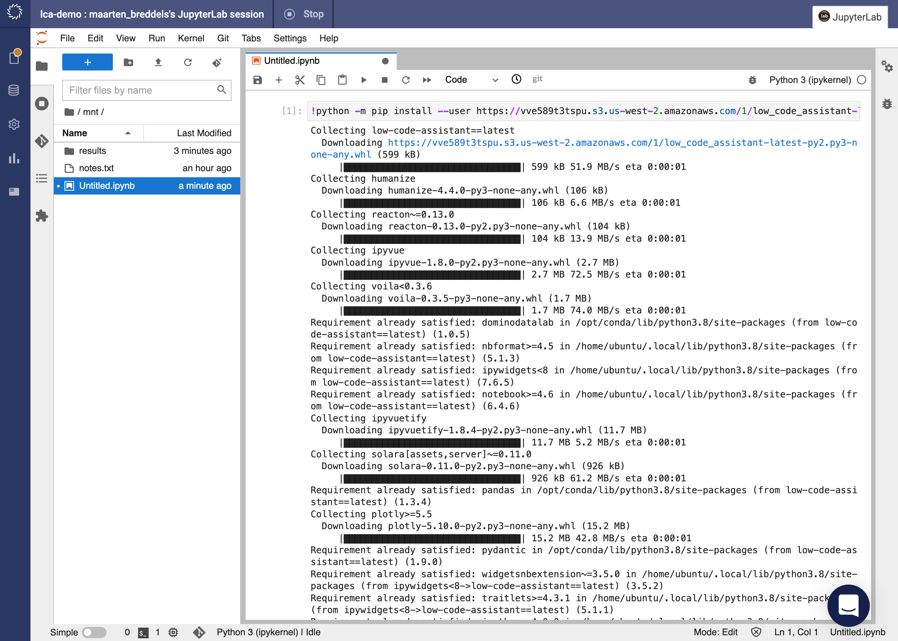
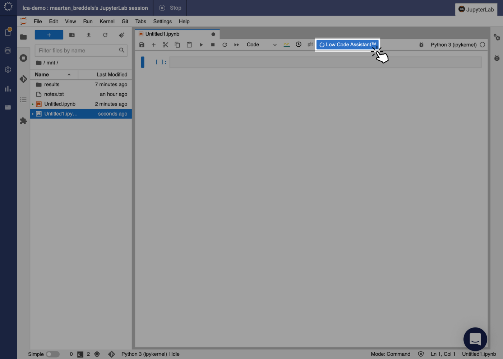
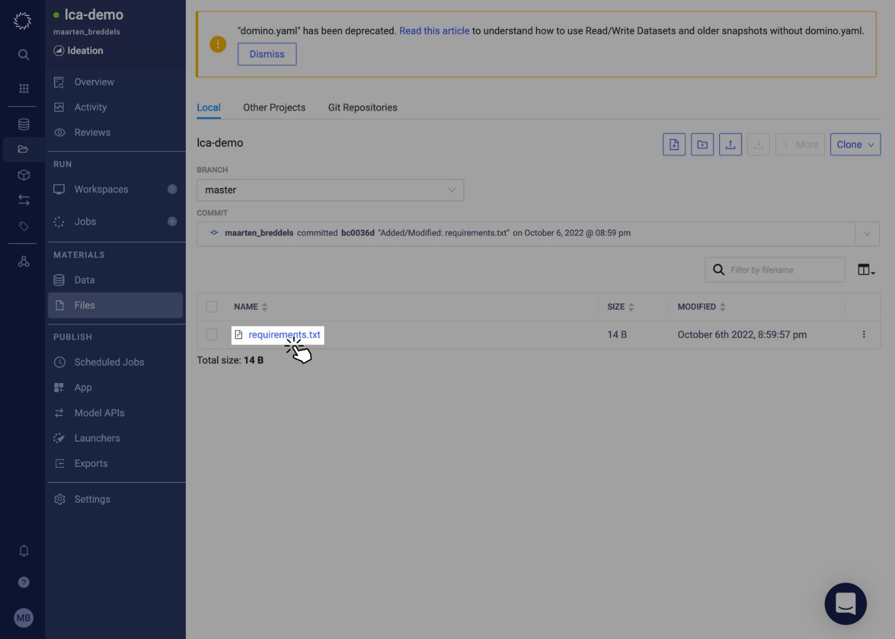
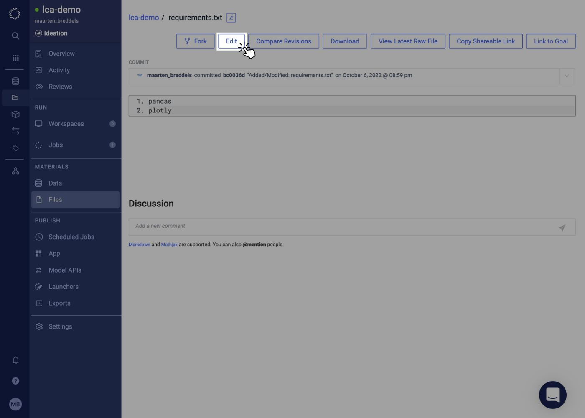
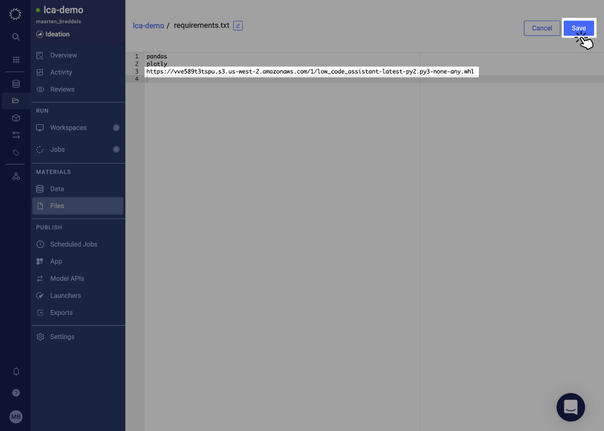
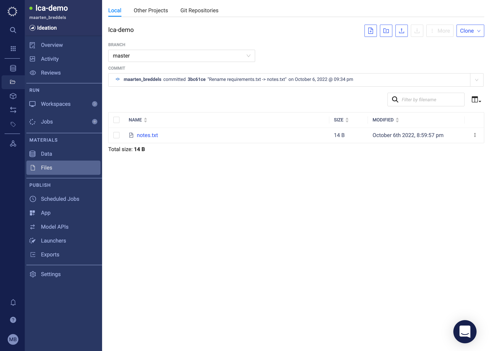
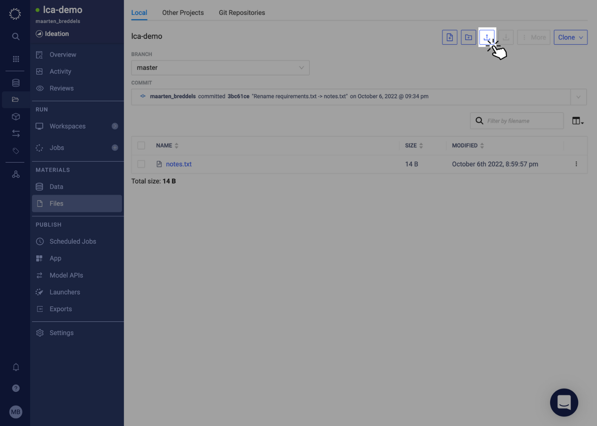
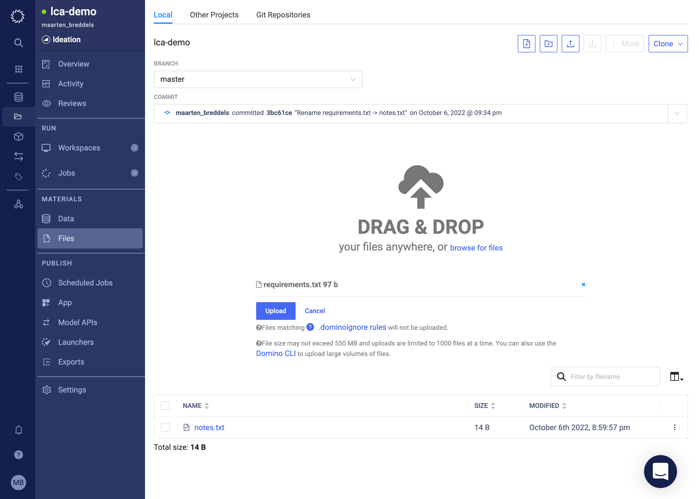
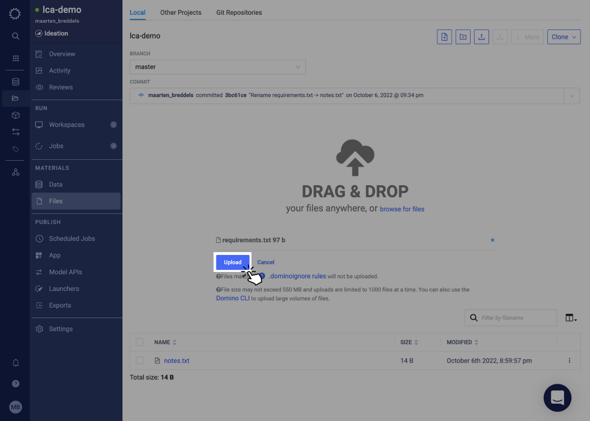

# Installation

## Enabling Low Code Assistant in Jupyter/JupyterLab

If you already have a workspace with "Jupyter" or "JupyterLab", you can enable Low Code Assistant (LCA) right now in your existing workspace. Run the following command in a notebook code cell:

```
!python -m pip install --user https://vve589t3tspu.s3.us-west-2.amazonaws.com/1/low_code_assistant-latest-py2.py3-none-any.whl
```


After the installation completes, refresh your browser tab -- then the "Low Code Assistant" button will appear in the Jupyter toolbar. Click this button to initialize the Assistant.



This is the easiest way to get started with LCA, but if you restart you workspace, you will need to reinstall Low Code Assistant again. To enable LCA more permanantly, please follow the instructions for:

 * [Installing in a project](#enabling-low-code-assistant-in-a-domino-project)
 * [Installing in a Compute environment](#enabling-low-code-assistant-in-a-domino-compute-environment)

## Enabling Low Code Assistant in a Domino Project

When a workspace is created, a `requirements.txt` file will be used to install Python packages into your new environment. 
We can use this to install Low Code Assistant into any workspace created within a project.

### Check if you have a requirements.txt

Navigate to "Files", so you should see the following:


You may or may not already have a `requirements.txt` file

### I have a requirements.txt file

#### Click on the `requirements.txt` file,


#### Click the edit Button



#### Add the LCA url to your `requirements.txt` file:

Put the following text in your requirements.txt file.
```
https://vve589t3tspu.s3.us-west-2.amazonaws.com/1/low_code_assistant-latest-py2.py3-none-any.whl
```

And click "Save".



Now create a new workspace with "Jupyter" or "JupyterLab" and the Low Code Assistant button should be available.

### I do not have a requirements.txt file

Download our [requirements.txt file by right clicking this link and choose "Save link as" or "Save as" or "](https://raw.githubusercontent.com/dominodatalab/low-code-jupyter-docs/main/docs/requirements.txt)


#### Navigate to `Files`




#### Click on upload



#### Drag and drop the requirements.txt file you downloaded




#### Click upload



#### Confirm your requirements.txt file is uploaded

It might take a few seconds, but you should see the `requirements.txt` file in you "Files" list.


Now create a new workspace with "Jupyter" or "JupyterLab" and the Low Code Assistant button should be available.

## Enabling Low Code Assistant in a Domino Compute environment

1. Go to the customer’s Domino Standard Environment (under Environments in the side navigation bar)
2. Add this line to the end of the env’s Dockerfile setup (but before the last USER ubuntu command):
   <pre><code>
   RUN pip install https://vve589t3tspu.s3.us-west-2.amazonaws.com/1/low_code_assistant-latest-py2.py3-none-any.whl
   </code></pre>
4. Save the default environment Dockerfile.
5. **That’s it! You’re done!**

The LCA toolbar button will now show up in the Jupyter toolbar for your customer.
Be sure to add LCA to any other env’s that are frequently used by your customer.
