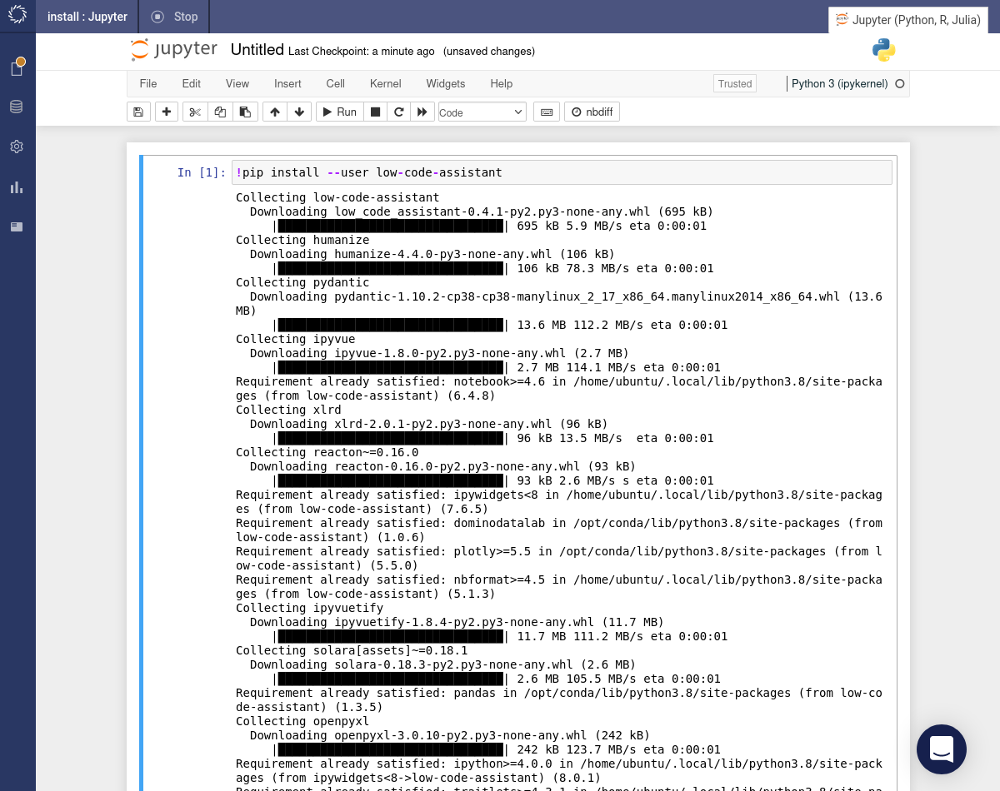
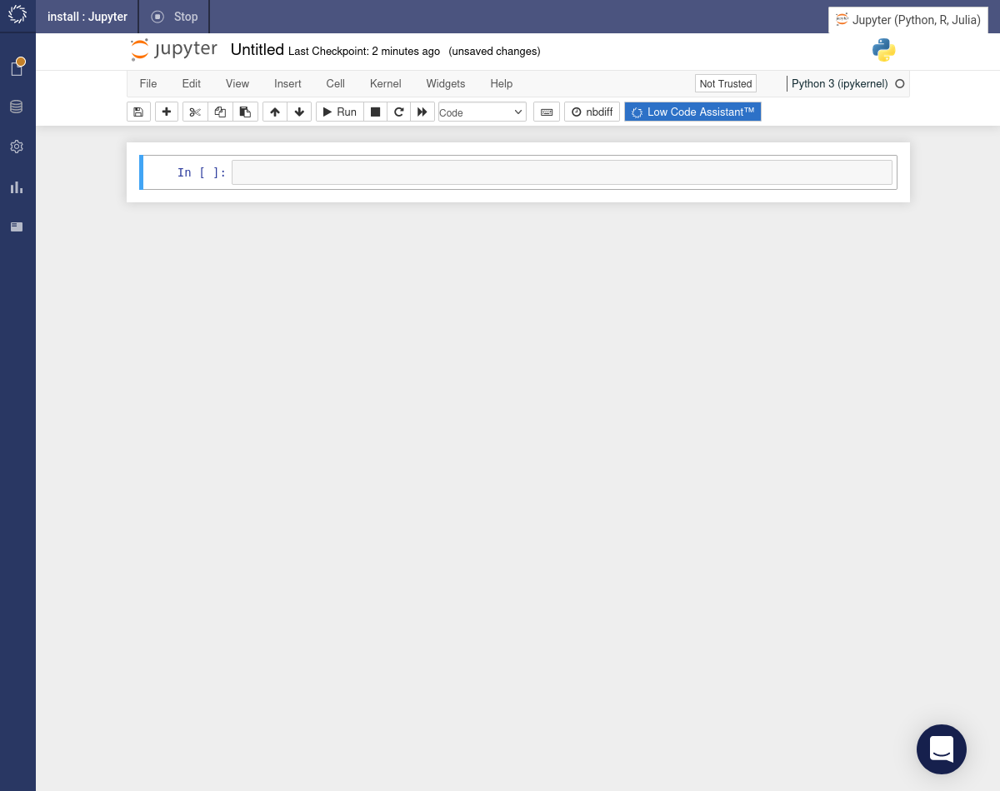
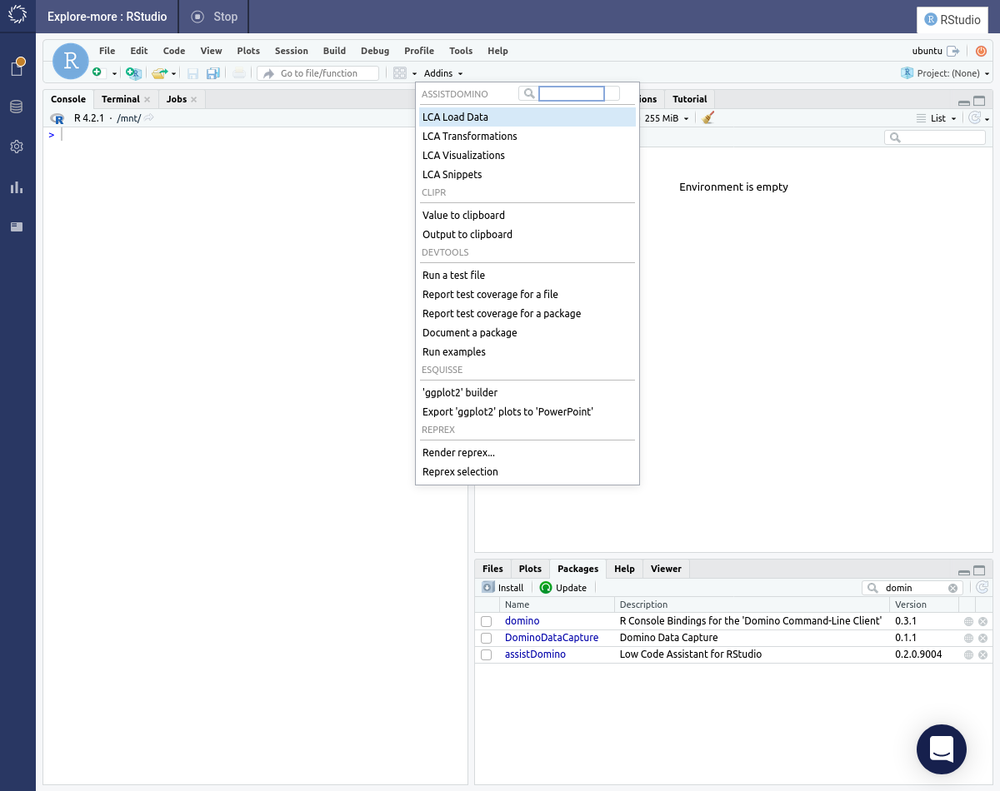
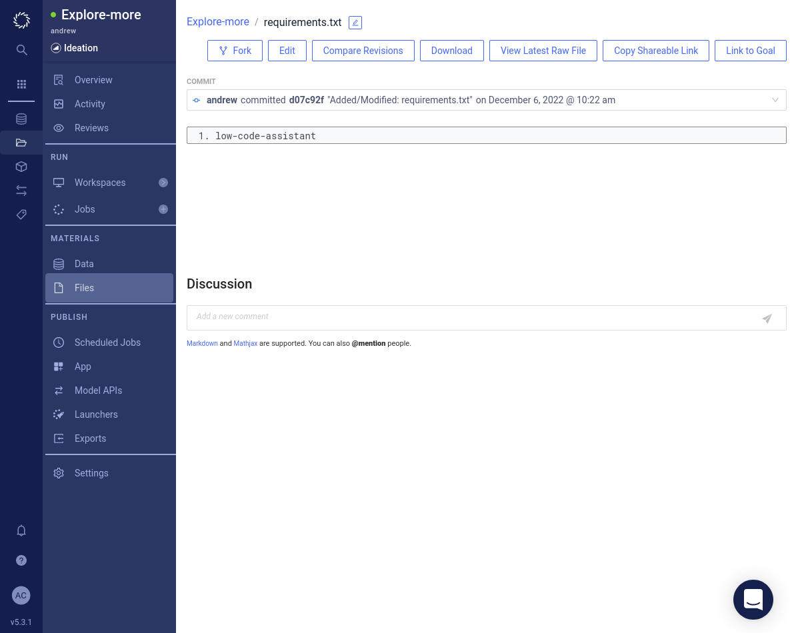
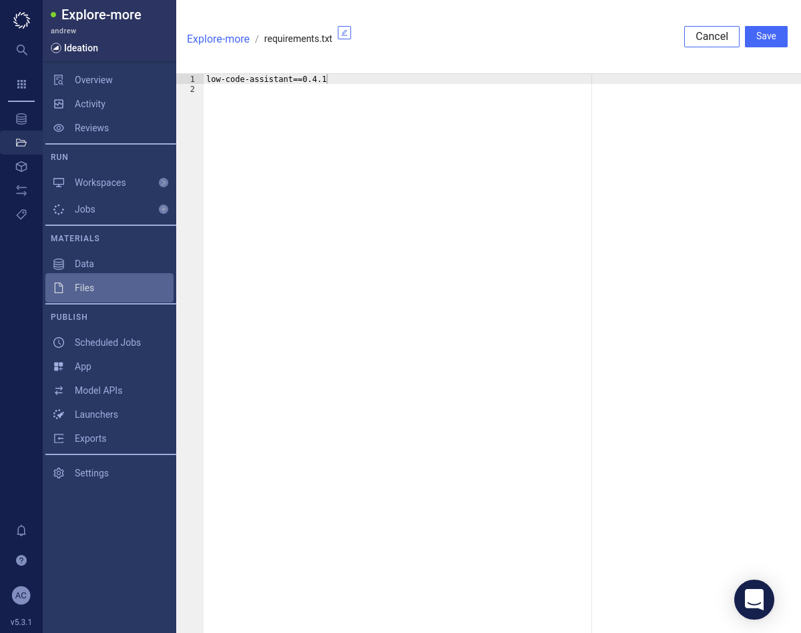
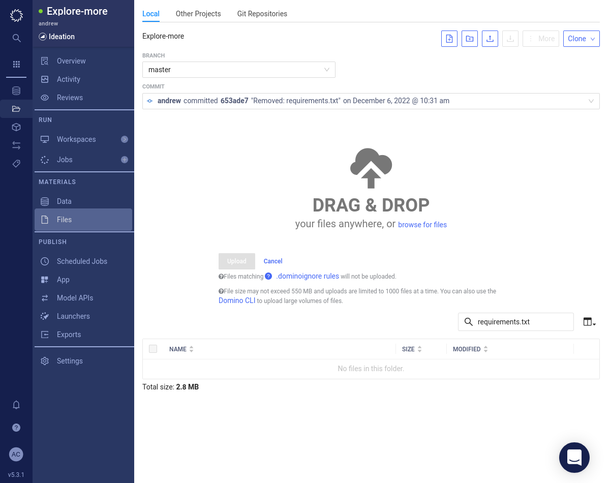

<div class="sticky-banner sticky-banner-warning">
    Code Assist is automatically installed in Domino version 5.5 and above.
</div>

# Installation

## Install Code Assist

The Code Assist can be used with either Python or R.

There are three distinct approaches to installing the package for either Python or R:

- [Install in a Workspace](#install-in-a-workspace)
- [Install in a Project](#install-in-a-project)
- [Install in a Compute Environment](#install-in-a-compute-environment)
- [Install from Source](#install-from-source)

The first approach is the easiest way to get started with Code Assist. But if you restart you workspace, then you will need to reinstall Code Assist. The second and third approaches will enable Code Assist more permanantly.

### Install in a Workspace

If you do not already have a Jupyter, JupyterLab or RStudio workspace, then create and launch one now.

The next steps will depend on whether you are working with Python (Jupyter or JupyterLab) or R (RStudio workspace).

=== "Python"

      Run the following command in a notebook code cell:

      ```
      !pip install --user domino-code-assist
      ```

      

      After the installation completes, refresh your browser tab. The <span class="blue-button">Domino Code Assist</span> button will appear in the Jupyter toolbar. Click this button to initialize Code Assist.

      

      To upgrade an existing installation do:

      ```
      !pip install --user --upgrade domino-code-assist
      ```

=== "R"

    If you do not have the `{devtools}` package installed, then install it now by running the following command in the RStudio console.

    ```r
    install.packages("devtools")
    ```

    Now install the Code Assist package.

    ```r
    devtools::install_url("https://mirrors.domino.tech/dca/assistdomino_latest.tar.gz", upgrade="always")
    ```

    🚨 If you encounter a timeout error during the installation, then make sure that you've selected a harware tier that allows egress. Otherwise, your workspace will not be able to reach GitHub to download the package.

    After the installation completes, refresh your browser tab. Under the _Addins_ menu option you should now see an _ASSISTDOMINO_ section with various actions listed below. You can also confirm that the `{assistDomino}` package has been installed by searching in the _Packages_ tab.

    

### Install in a Project

=== "Python"

    A `requirements.txt` file is used to install Python packages into a new workspace created within a project. Navigate to _Files_ to check whether you have a `requirements.txt` file.

    

    If you _do_ have a `requirements.txt` file then it will be listed (possibly among a selection of other files) then proceed as follows:

    1. Click on the `requirements.txt` file link.
    2. Click the <span class="white-button">Edit</span> button.
    
    3. Add the `domino-code-assist` package to your `requirements.txt` file. You can specify a version like `domino-code-assist==0.4.1`. If you don't specify a version then the latest version will be installed.
    
    4. Click the <span class="white-button">Save</span> button.

    If you _don't_ have a `requirements.txt` file then do the following:

    5. Download our [requirements.txt](requirements.txt).
    6. Press the _Upload_ button. Either drag and drop or browse to find the `requirements.txt` file.
    
    7. Click the <span class="blue-button">Upload</span> button.
    
    8. Confirm that the `requirements.txt` file has been successfully uploaded.
    

    Now create a new _Jupyter_ or _JupyterLab_ workspace with and the Code Assist button will be available.

=== "R"

    Documentation pending.

### Install in a Compute Environment

Enabling Code Assist in your organization's most used compute environments (CE) is the fastest way to deploy Code Assist. This way, Code Assist will appear automatically in any Jupyter or RStudio toolbar that is built from that CE. However, the CE will need to be rebuilt every time there is an Code Assist update. If CE's are not rebuilt weekly, we recommend enabling Code Assist at the project-level.

=== "Python"

    Documentation pending.

=== "R"

    1. Select _Environments_ from the side navigation bar.
    2. Choose the environment in which Code Assist for R package should be installed.
    3. Click the _Edit Definition_ button.
    4. Add the following line to the end of the `Dockerfile` section (but before the last `USER ubuntu` command):
    ```
    RUN R -e 'devtools::install_url("https://mirrors.domino.tech/dca/assistdomino_latest.tar.gz", upgrade="always")'
    RUN chown -R ubuntu:ubuntu /usr/local/lib/R/site-library
    ```
    5. Click the _Build_ button at the bottom of the page

    This will install Code Assist for R in every workspace that uses the Domino environment.

### Install from Source

This is the preferred approach in an [air-gapped environment](https://en.wikipedia.org/wiki/Air_gap_(networking)) where you are unable to connect to the internet to install the package using  of the previous approaches.

If your Domino deployment does not have open access to the internet (you're in an [air-gapped environment](https://en.wikipedia.org/wiki/Air_gap_(networking))), then DCA and any of its dependencies will fail to download. In this case, you will need to resort to an alternate method of installing DCA.

=== "Python"

    1. Download the package onto your local machine. It would make sense to run this command in an empty directory because it will result in a large number of files being downloaded.s
    ```
    pip download domino-code-assist
    ```
    2. Get somebody on your IT team to transfer all of the files downloaded in the previous step across to your Domino environment.
    3. In your Domino environment run the following command to install the package. You might need to update the version of the package to be consistent with the files that you downloaded (the command below is for version 1.0.3).
    ```
    pip install domino_code_assist-1.0.4-py2.py3-none-any.whl
    ```

=== "R"

    1. Download a ZIP archive from https://mirrors.domino.tech/dca/dca_sources.zip onto your local machine. One might do this as follows:
    ```
    wget https://mirrors.domino.tech/dca/dca_sources.zip
    ```
    2. Get somebody on your IT team to transfer the downloaded file (`dca_sources.zip`) from the previous step across to your Domino environment.
    3. Once the ZIP archive has been unpacked you can install the packages.

## Initialize

=== "Python"

    If you have followed the [installation instructions](./install.md), you should see a blue <span class="blue-button">Domino Code Assist</span> button in the toolbar of your Jupyter notebook.

    

    Code Assist can be started by clicking the <span class="blue-button">Domino Code Assist</span> button in the toolbar. It will insert a code snippet in a new code cell and execute it.

    

    If you now hover above a code cell, you should see the  icon to the right.

    

    If you hover above the  icon, it will show a popup menu.

    

=== "R"

    There is no initialization required in R. Various Code Assist actions will be listed under the _Addins_ menu option.

## Check Version

To check the version of Code Assist installed, run the following:

=== "Python"

    ```python
    import domino_code_assist

    domino_code_assist.__version__
    ```

=== "R"

    ```r
    packageVersion("assistDomino")
    ```
