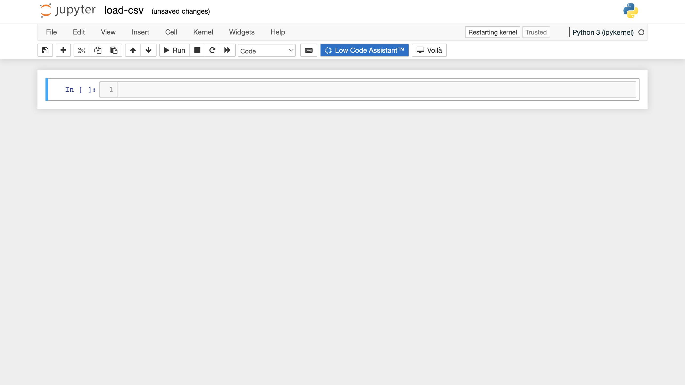
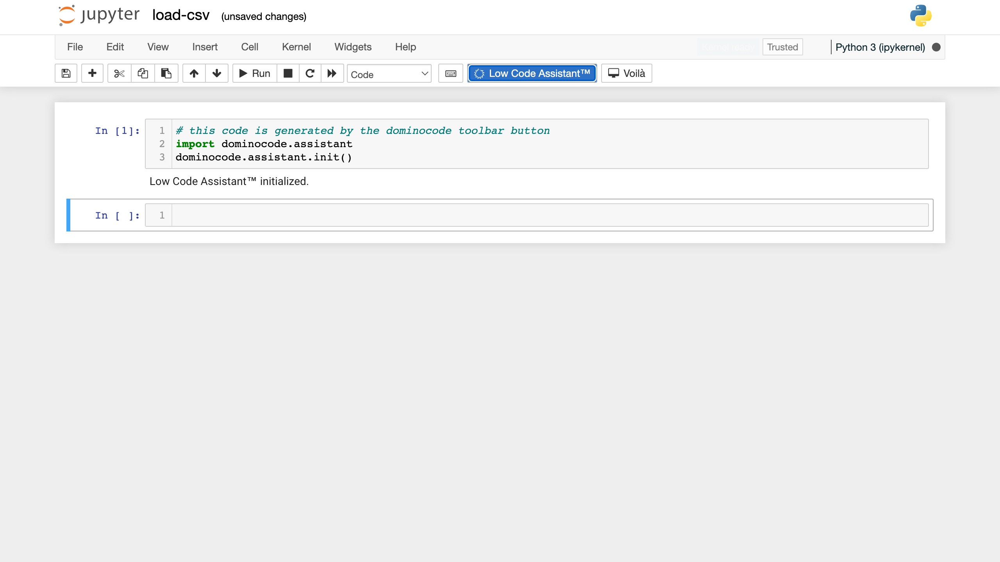
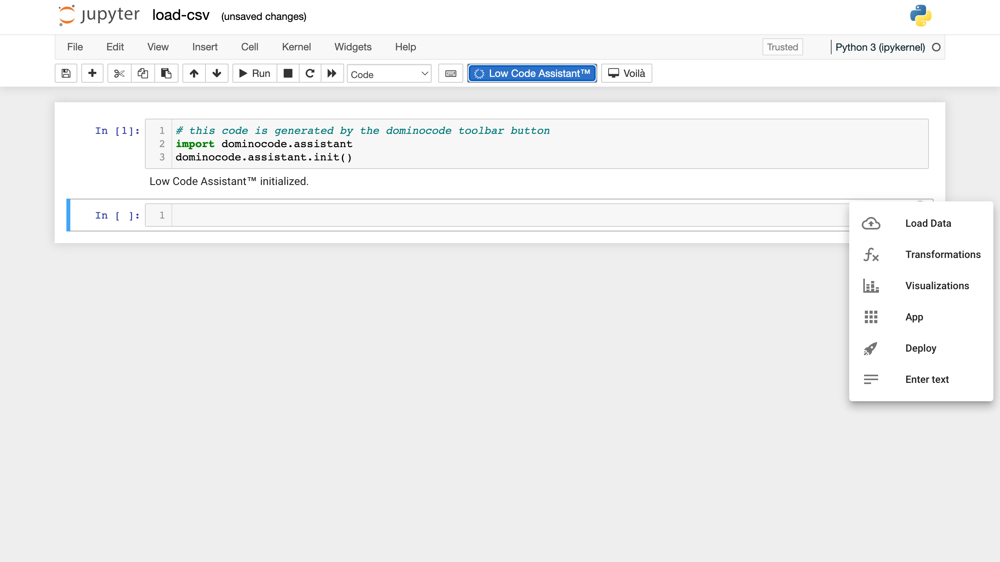

# Loading Data from CSV

The following video includes all the steps explained below

<video controls>
    <source src="https://user-images.githubusercontent.com/46192475/182823773-7af97491-89d4-44f3-9996-9b08900d38e1.mp4" type="video/mp4">
</video>

## Uploading a CSV File

=== "Python"

    Hover over the assistant icon . Select the _Load data_ item from the popup menu.

    

    Select the _Upload_ tab.

    

    Drag a file into the drop zone.

    

    Press the INSERT CODE button. The required code will be inserted into the notebook and immediately executed.

    

=== "R"

    Press the _Addin_ button.

    

    Select _LCA Load Data_ from the menu.

    
    
    Press the _Browse_ button and select the file which you want to upload.

    

    The first few lines from the file will be displayed. Press the Apply button.

    

    The required code will be inserted into the script.

    

## Using a CSV File from a Workspace

=== "Python"

    Hover over the assistant icon . Select the _Load data_ item from the popup menu. Select the _Datasets_ tab.

    

    Find the dataset.

    

    Press the INSERT CODE button. The required code will be inserted into the notebook and immediately executed.

    

=== "R"

    Press the _Addin_ button. Select _LCA Load Data_ from the menu. Select the _Datasets_ option.

    

    Find the dataset.

    

    The first few lines from the selected file will be displayed. Press the Apply button.

    

    The required code will be inserted into the script.

    

## Check installation

If you have followed the [installation instructions](../install.md), you should see a blue Low Code Assistant™ button in the toolbar of your Jupyter notebook.

## Initialize the Low Code Assistant™

The Low Code Assistant™ can be started by clicking the Low Code Assistant™ button in the toolbar. It will insert a code snippet in a new code cell and execute it. After running succesfully, you should see `Low Code Assistant™ initialized`, as in the following screenshot:

If you now hover above a code cell, you should see a blue icon {.assistant-icon} to the right:

If you hover above the {.assistant-icon} icon, it will show a popup menu:

## Loading CSV data into a Pandas DataFrame

### Open dialog

Hover above the {.assistant-icon} icon and click the {.docs-border .menu-item} menu item, which will open the `Load Data` dialog.

### Select `Datasets` tab

To select a file, navigate to the `Datasets` tab:

### Navigate to the right directory

Use `..` to move a directory up:

And click the **bold** directory name to enter a directory

### Click to open

Click on the `titanic.csv` file, and it will close the dialog, and insert the Python code to load the `.csv` file
into a Pandas dataframe.

The dataframe will be assigned to the `df` variable. The last expression (the last line) of the code cell will only be the `df` variable, which will
cause the notebook to display its content.

You can now do your custom data transformations, by following the Pandas documentatio