# Loading Data from Redshift

<!-- https://user-images.githubusercontent.com/46192475/182823701-695fc350-b814-48bf-8ce9-ffed4d347f86.mp4 -->

To load data from Redshift you'll need to have access to a Redshift cluster containing the data.

## Add a Redshift Data Source

Before you can use the Low Code Assistant (LCA) to access data from Redshift you'll need to add a suitable data source. Click the _Data_ option in the left-hand menu. Click the + Create a Data Source button.

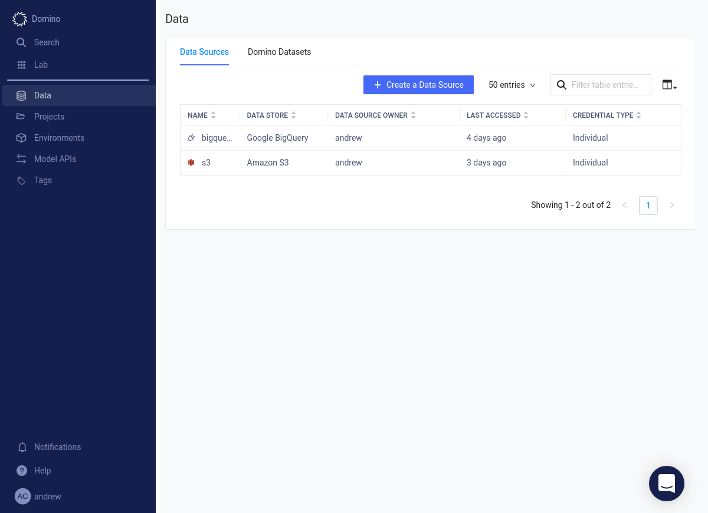

Select the _Amazon Redshift_ option.

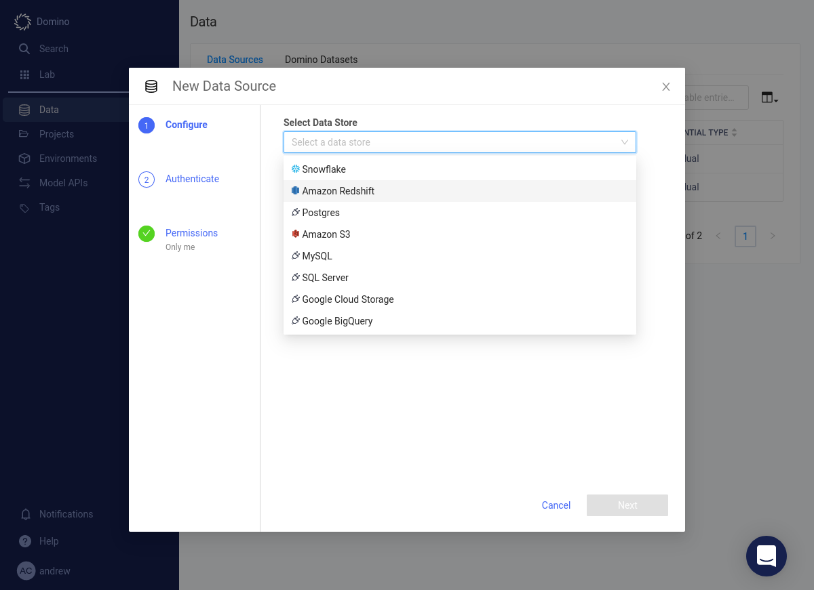

Provide the details of the Redshift cluster.

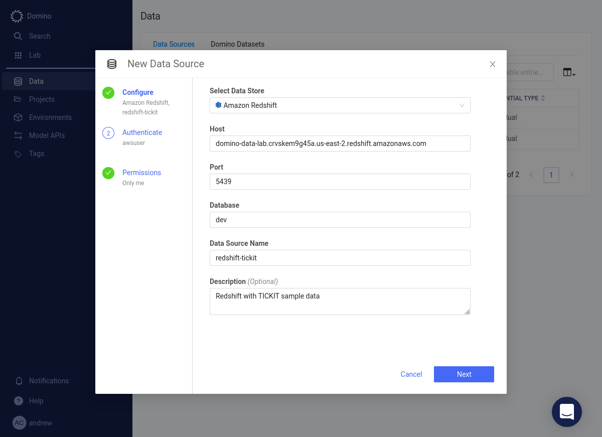

Fill in your credentials. Press the Test Credentials button.

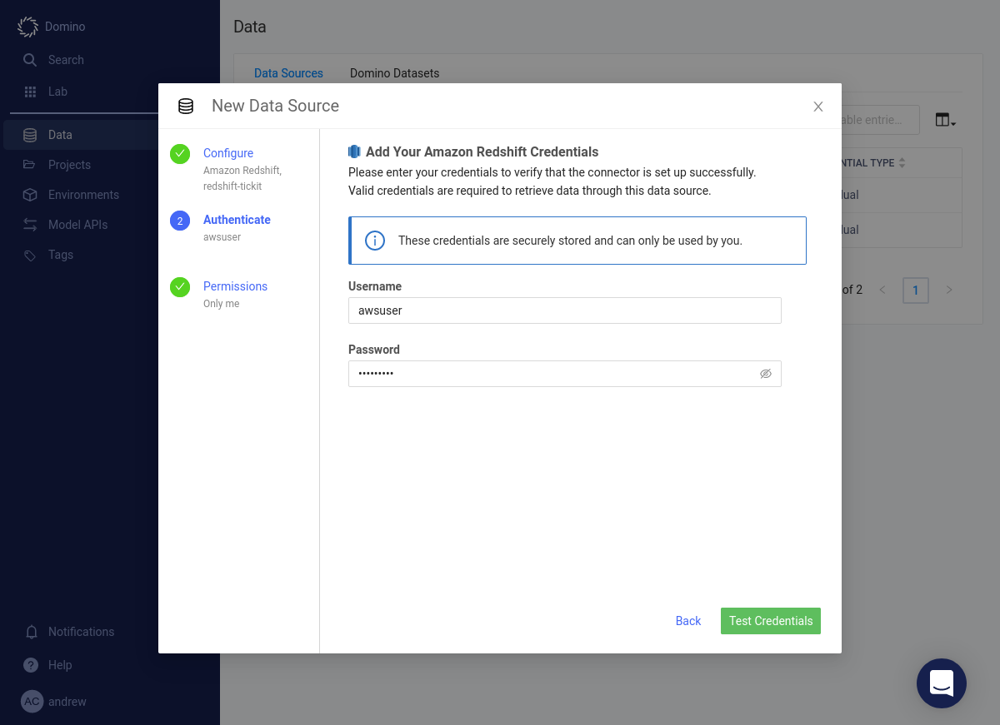

When your credentials have been validated, press the Next button.

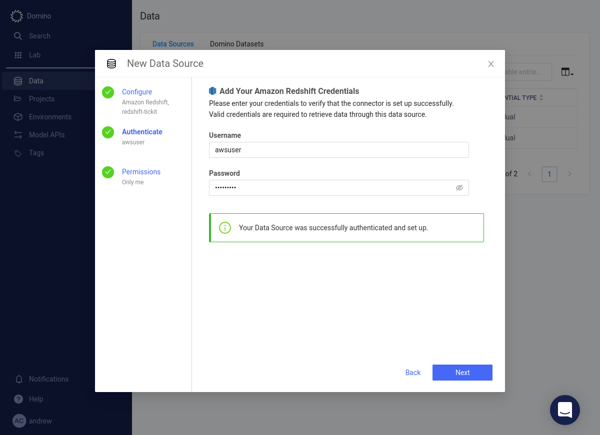

Specify which users will have access to this data source. Press the Finish Setup button.

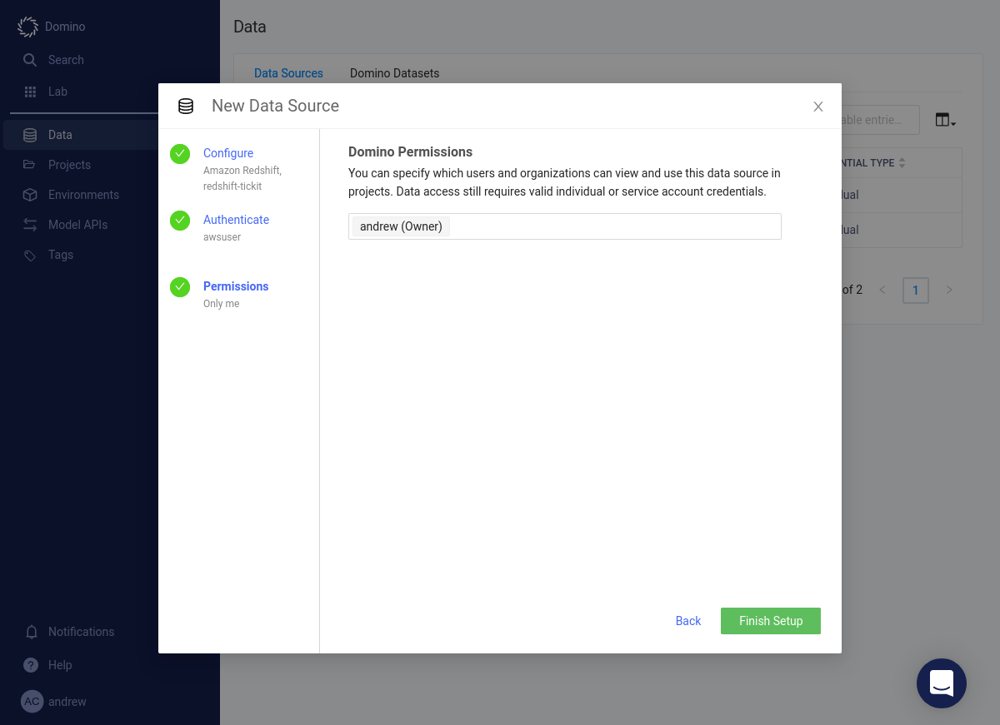

The Redshift cluster will be added to the list of available data sources.

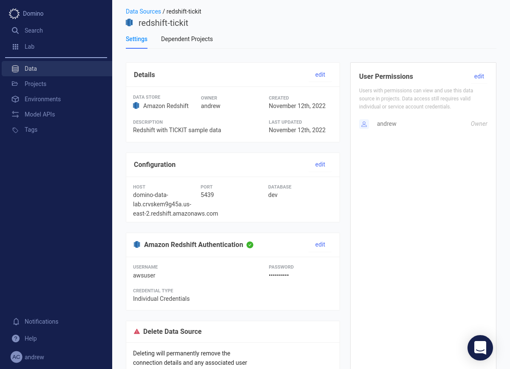
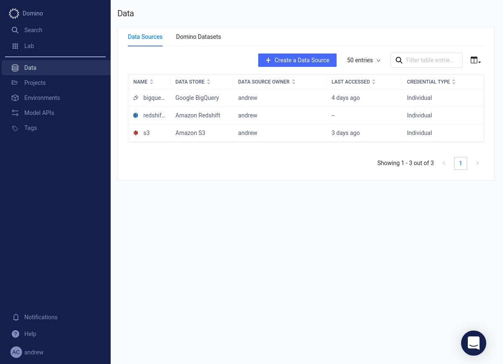

## Load Data from Redshift

=== "Python"

    Launch a Jupyter workspace.

    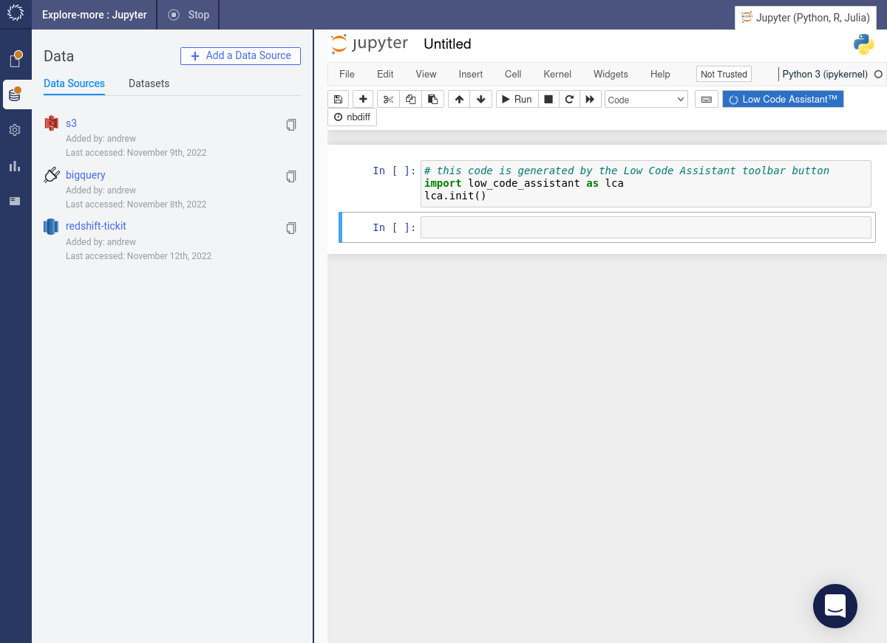

    Initialize LCA and select the _Load data_ option.

    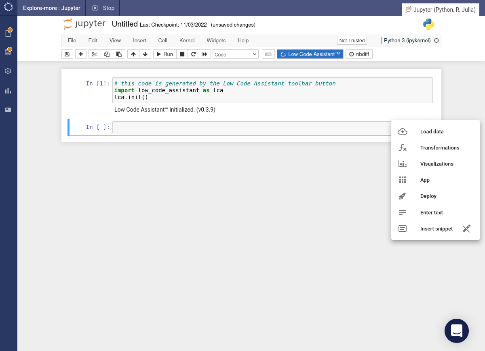

    Select the Redshift cluster data source.

    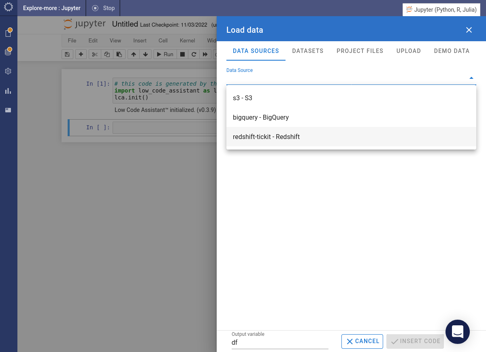

    Specify the required database and schema and then choose a table.

    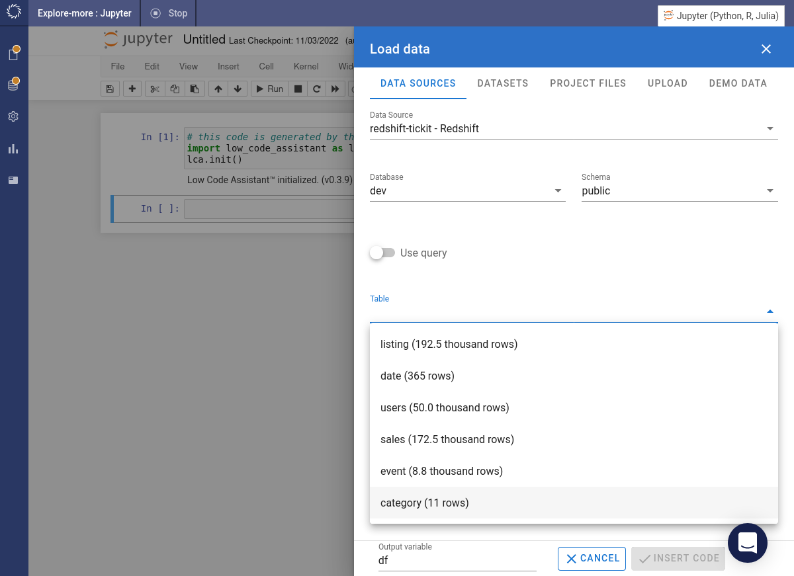

    Click the INSERT CODE button.

    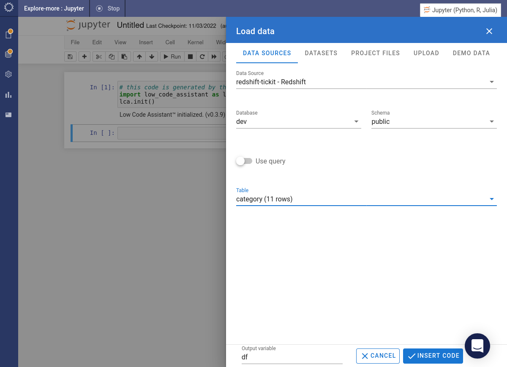

    The required code will be inserted into a cell and immediately executed.

    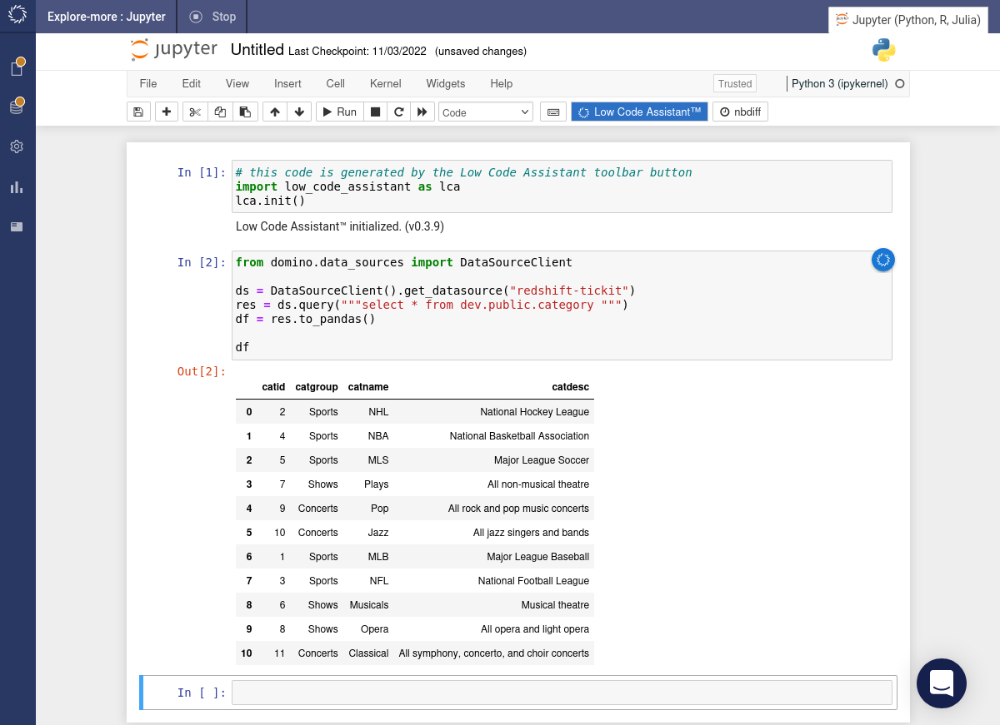

=== "R"

    This feature is not yet implemented in the R version of LCA.