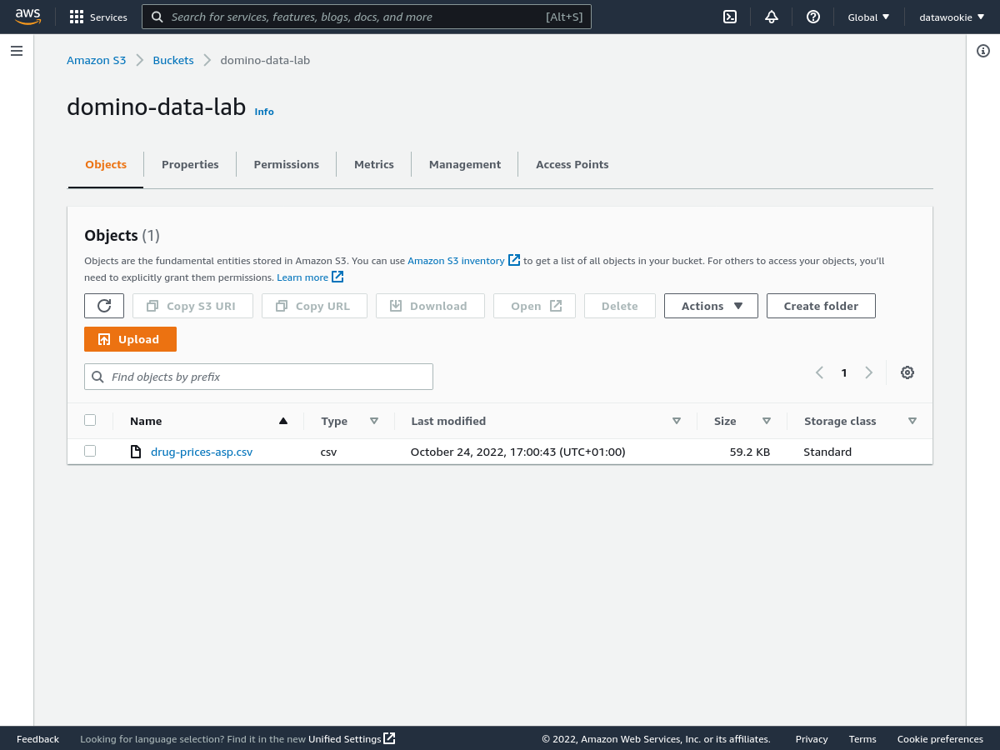
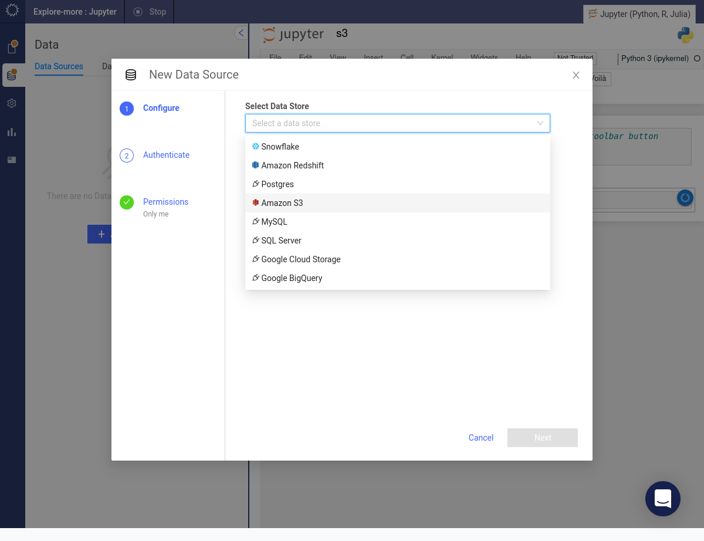
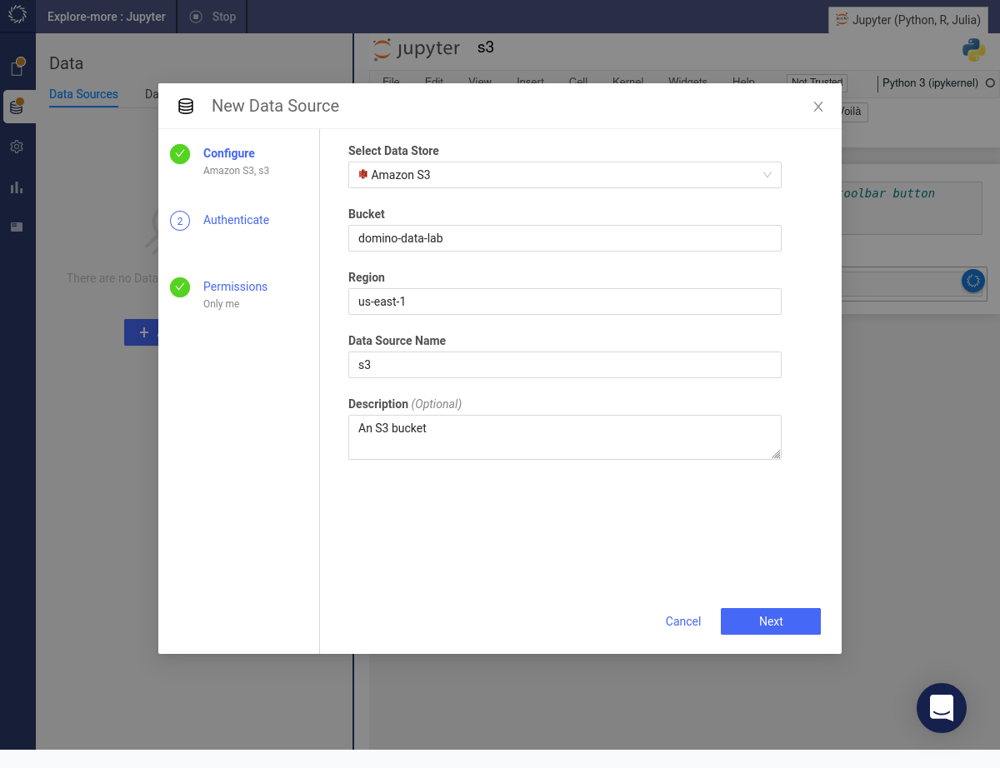
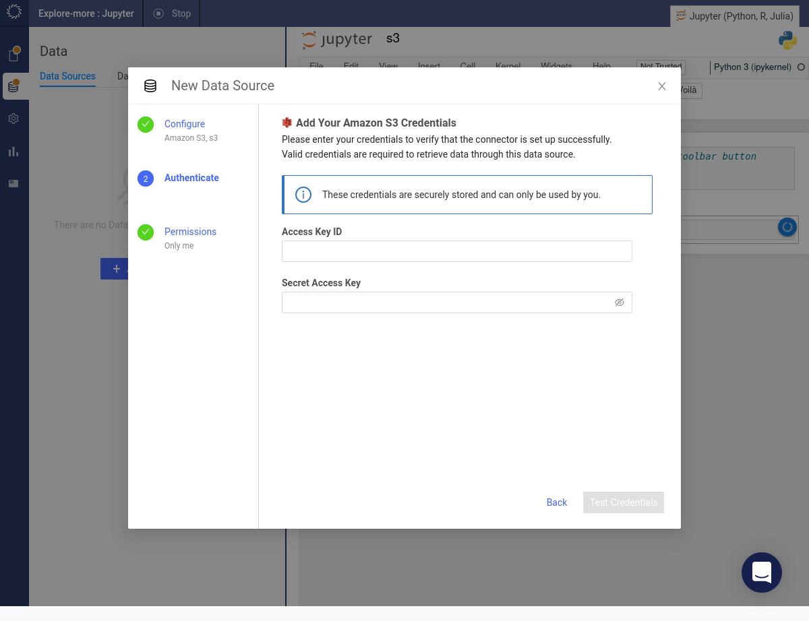
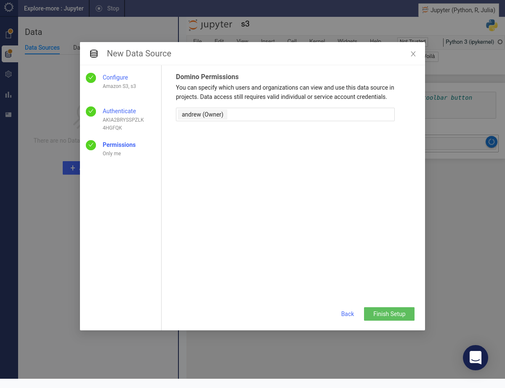
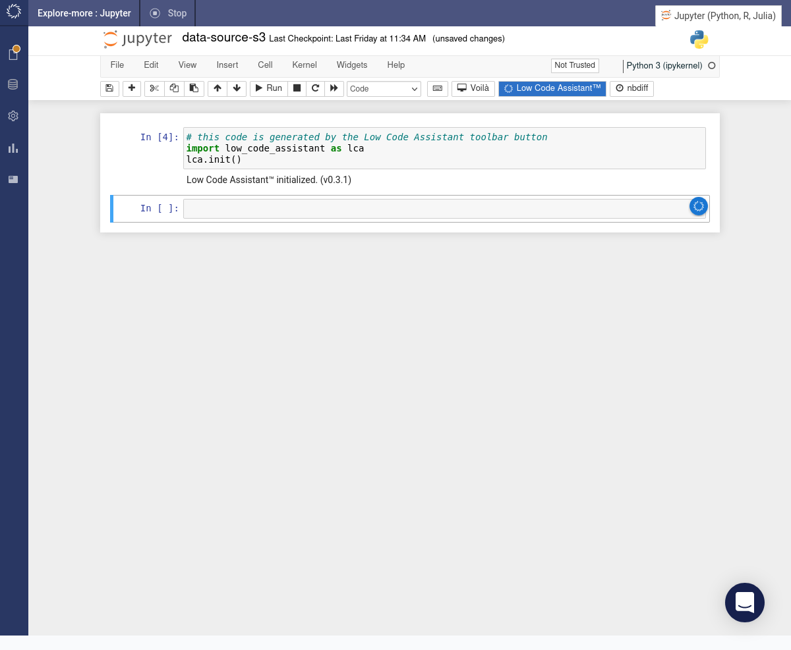
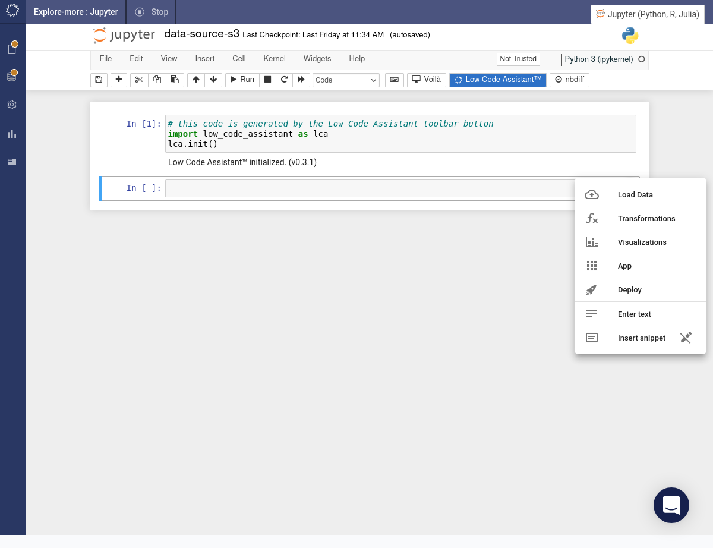
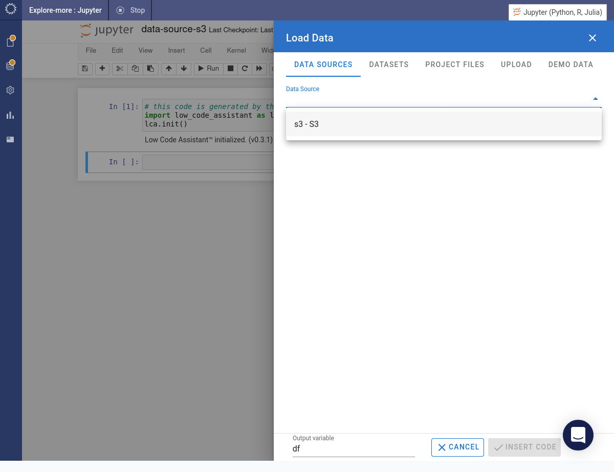
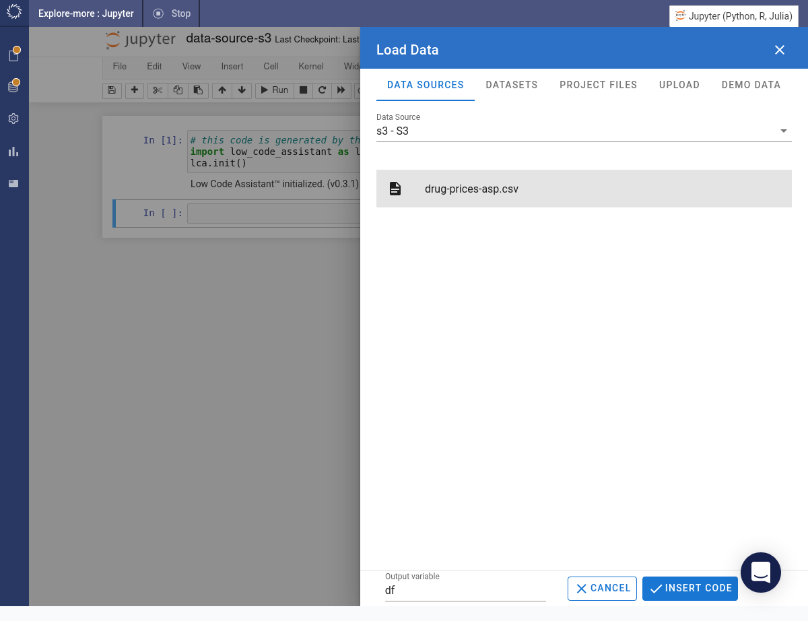
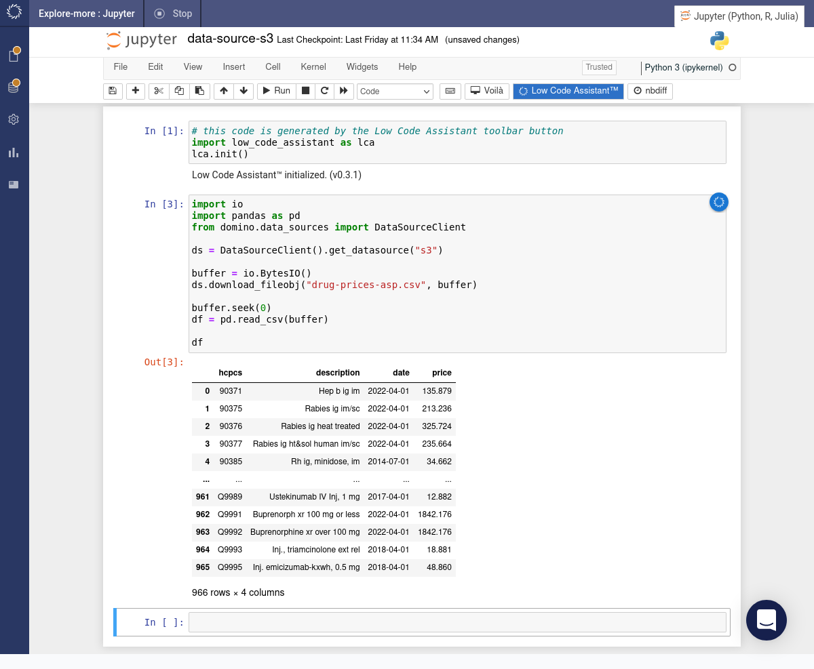

# Loading Data from S3

<!-- https://user-images.githubusercontent.com/6134409/197819542-798437a5-f6b5-4274-865d-9b2b0cdd177c.mp4 -->

To load data from S3 you'll need to have

- access to an S3 bucket containing the data and
- access key ID and secret access key with suitable permissions.

## Add an S3 Data Source

Before you can use the Low Code Assistant to access data from S3 you'll need to add a suitable data source.

Click the _Data_ option in the left-hand menu. Click the + Add a Data Source button.

From the drop-down menu select _Amazon S3_.

<!--  -->

Fill in the details for the S3 bucket.

Specify the access key ID and secret access key.

Specify which users will have access to this data source. Press the Finish Setup button.

The S3 bucket will appear under the list of data sources.

## Load Data from S3 Data Source

=== "Python"

    Click the Low Code Assistant™ button in the toolbar. It will insert a code snippet in a new code cell and execute it.

    

    Once the Low Code Assistant™ has been initialised if you hover above a code cell, you will see the assistant icon . If you hover above the assistant icon , it will show a popup menu. Select the _Load Data_ item from the menu.

    

    Under the drop-down list of data sources you will find the data source which we created earlier. Select it.

    

    Choose the file that you want to load. Click the INSERT CODE button.

    

    The required code will be inserted into a cell and immediately executed.

    

=== "R"
