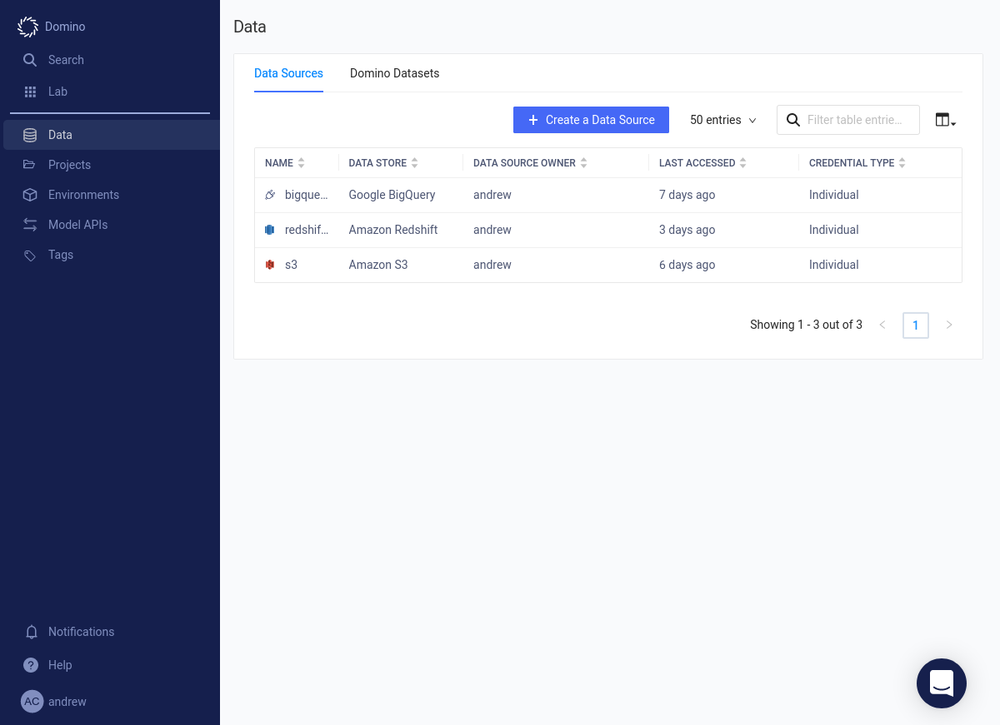
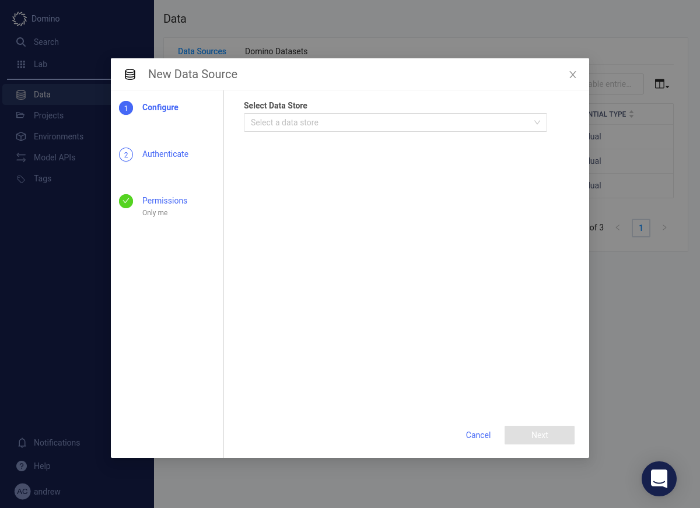
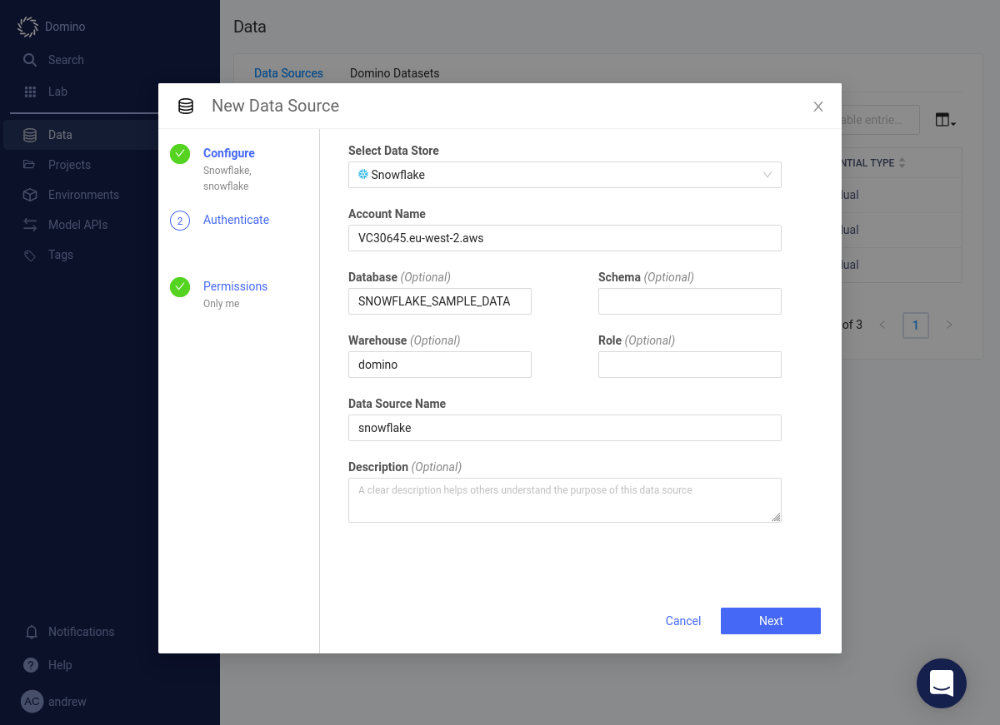
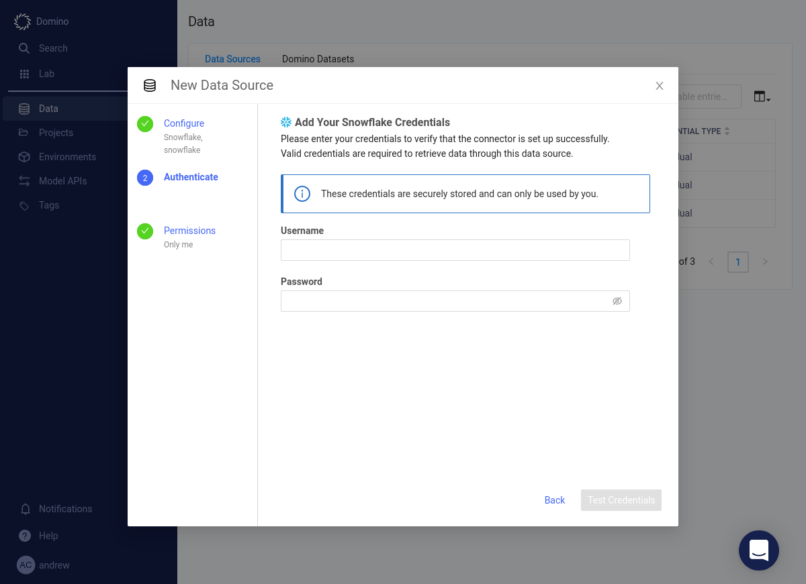
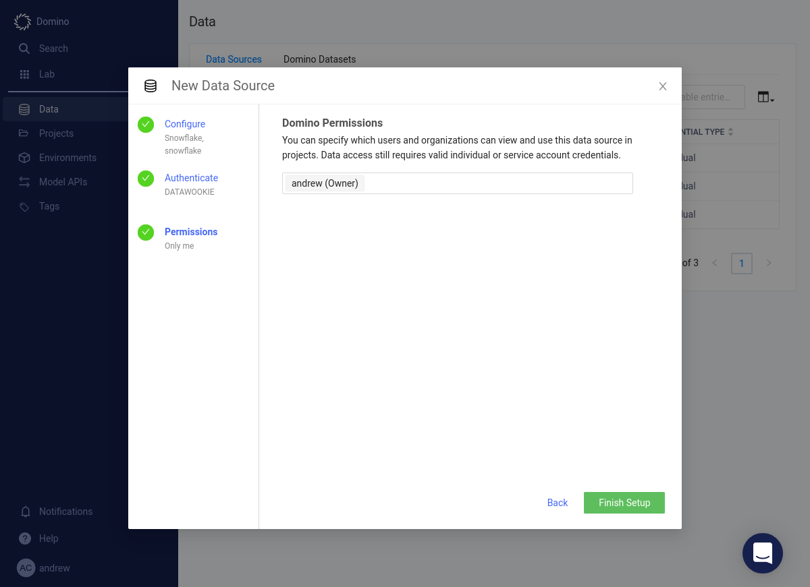
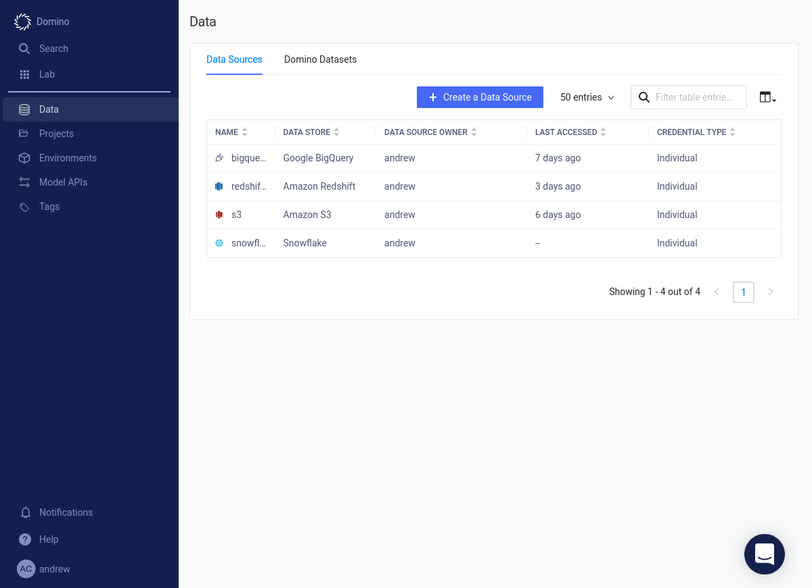
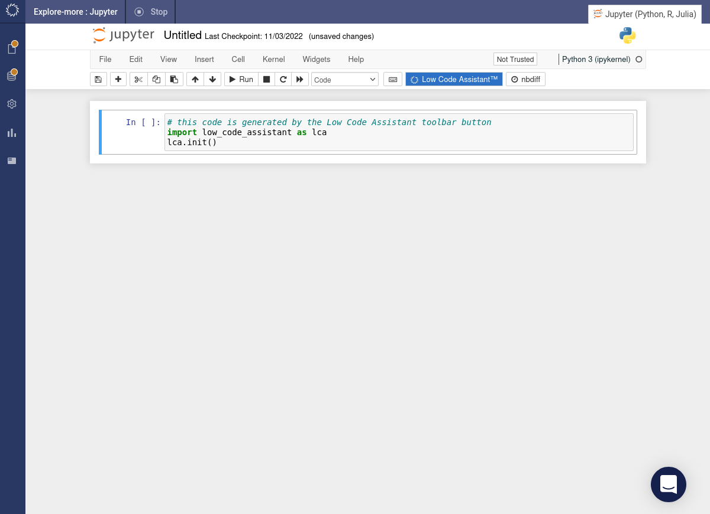
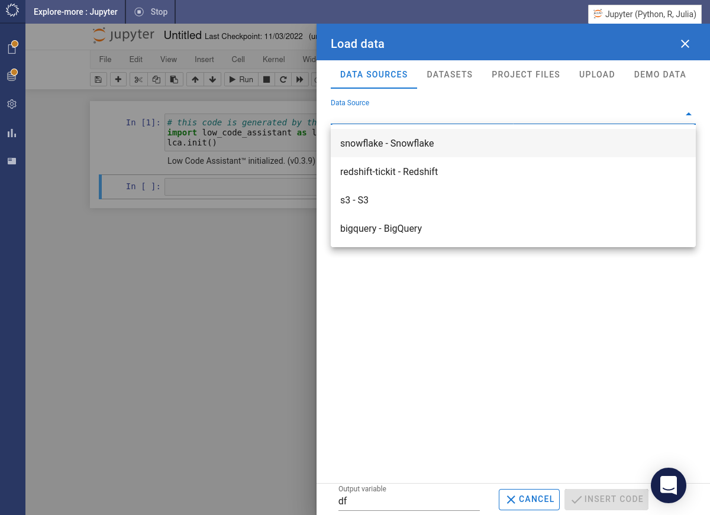
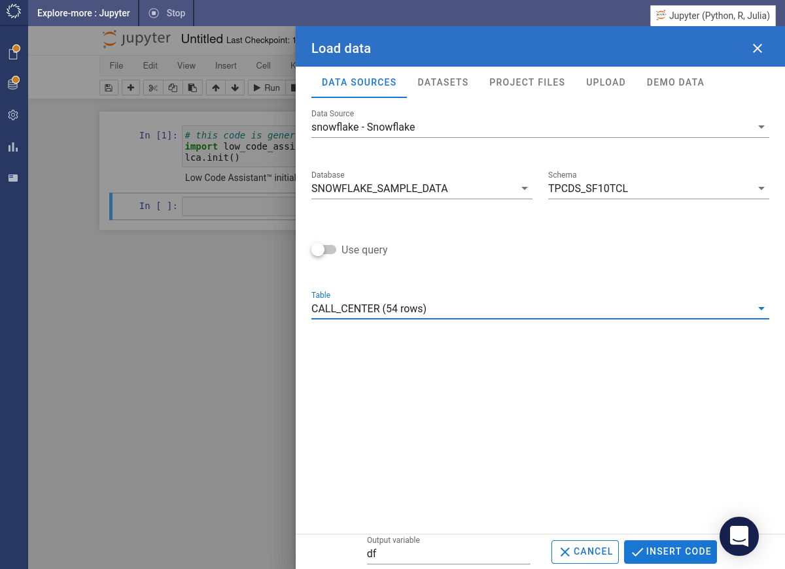
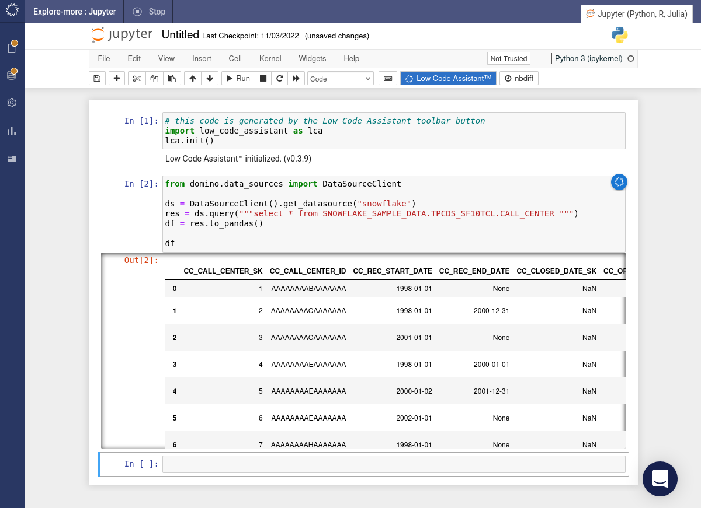

# Loading Data from Snowflake

<!-- https://user-images.githubusercontent.com/46192475/182823489-e5c868b7-00eb-47e7-a16b-6727f4e26639.mp4 -->

## Add a Redshift Data Source

Before you can use Code Assist to access data from Snowflake you'll need to add a suitable data source. Click the _Data_ option in the left-hand menu. Click the + Create a Data Source button.

Select the _Snowflake_ option from the dropdown menu.

Provide the details of the Snowflake database.

Fill in your credentials.

Press the Test Credentials button. When your credentials have been validated, press the Next button.

Specify which users will have access to this data source. Press the Finish Setup button.

The Snowflake connection will appear under the list of data sources.

## Load Data from Snowflake

=== "Python"

    Click the Low Code Assistant™ button in the toolbar. It will insert a code snippet in a new code cell and execute it.

    

    Once Code Assist has been initialised if you hover above a code cell, you will see the assistant icon . If you hover above the assistant icon , it will show a popup menu. Select the _Load Data_ item from the menu.

    

    Under the drop-down list of data sources you will find the Snowflake data source which we created earlier. Select it.

    

    Specify the database, schema and table that you want to load. Click the INSERT CODE button.

    

    The required code will be inserted into a cell and immediately executed.

    

=== "R"

    This feature is not yet implemented in the R version of Code Assist.