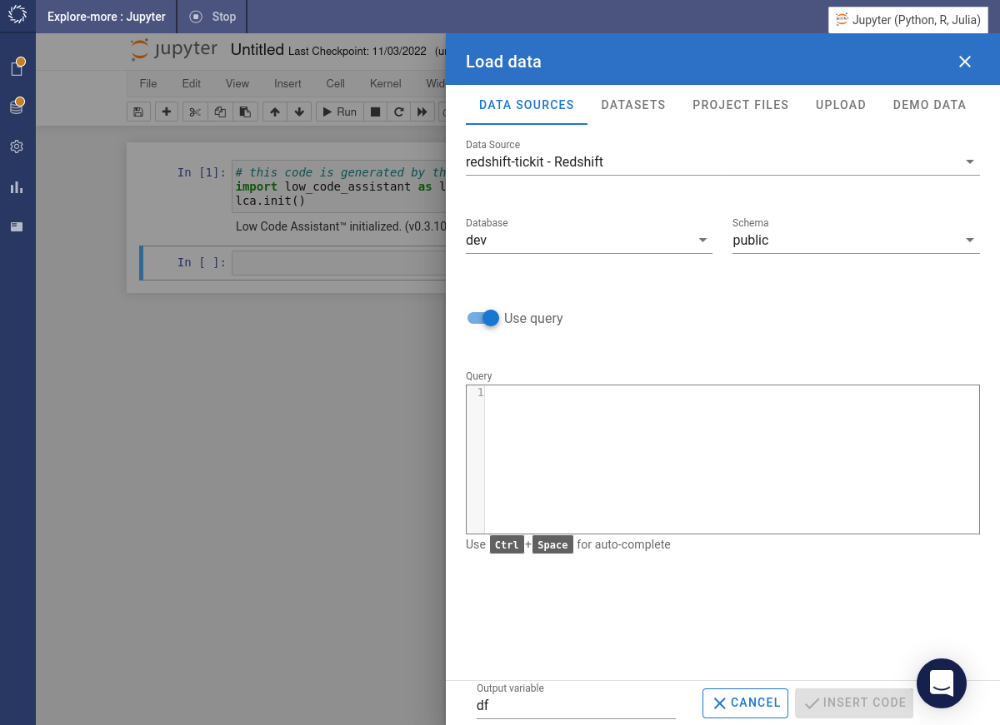
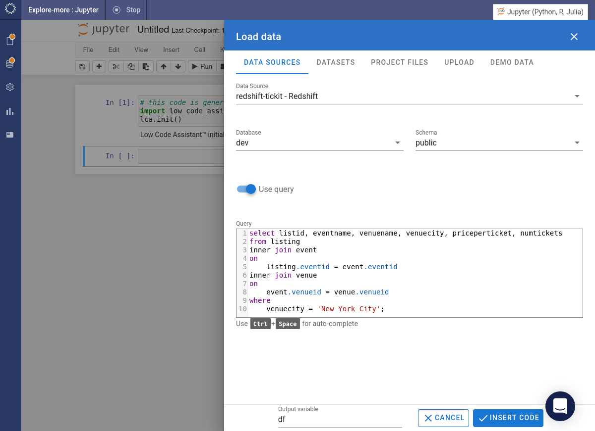
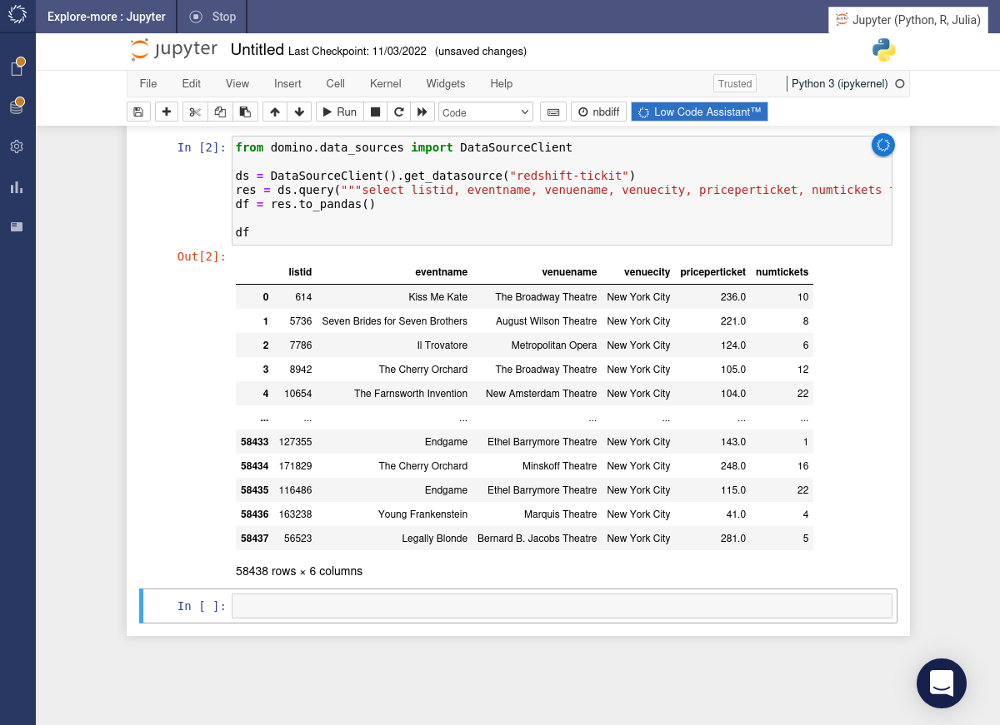
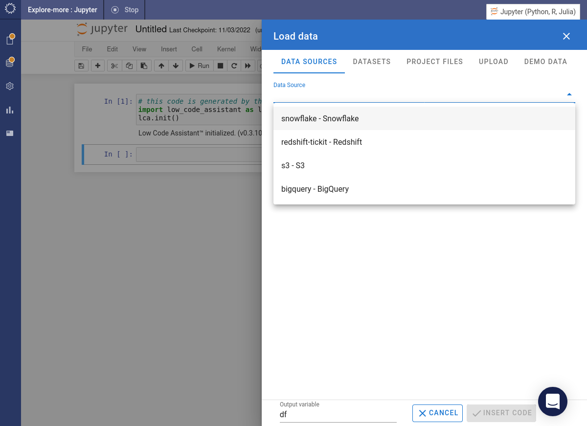
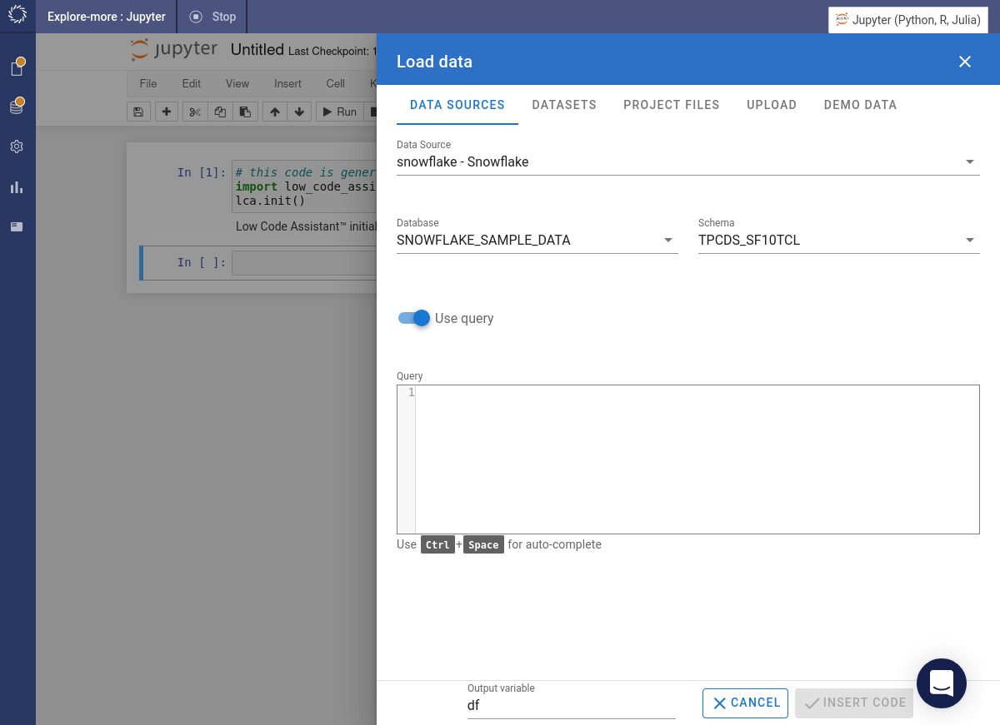
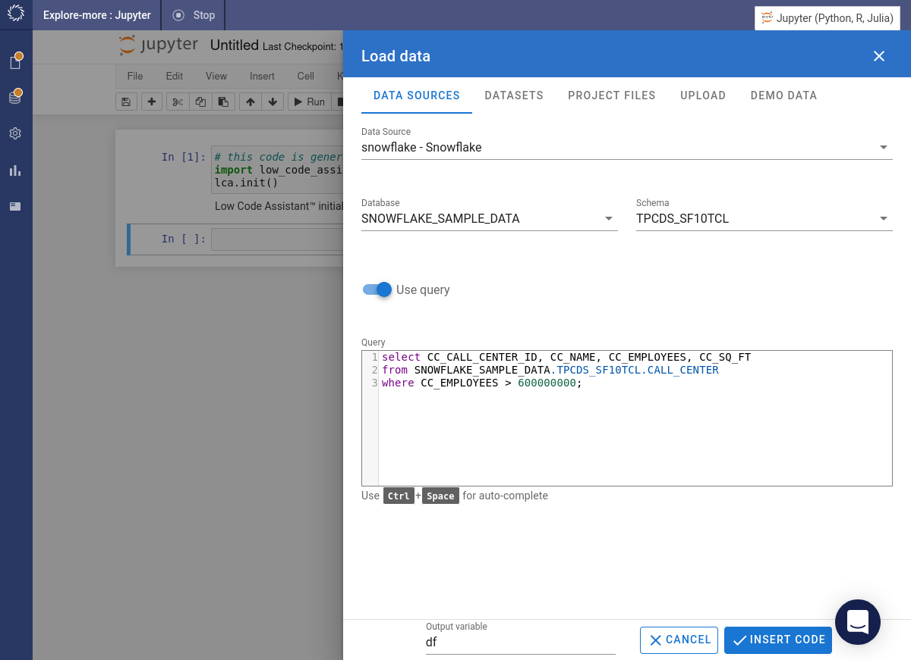
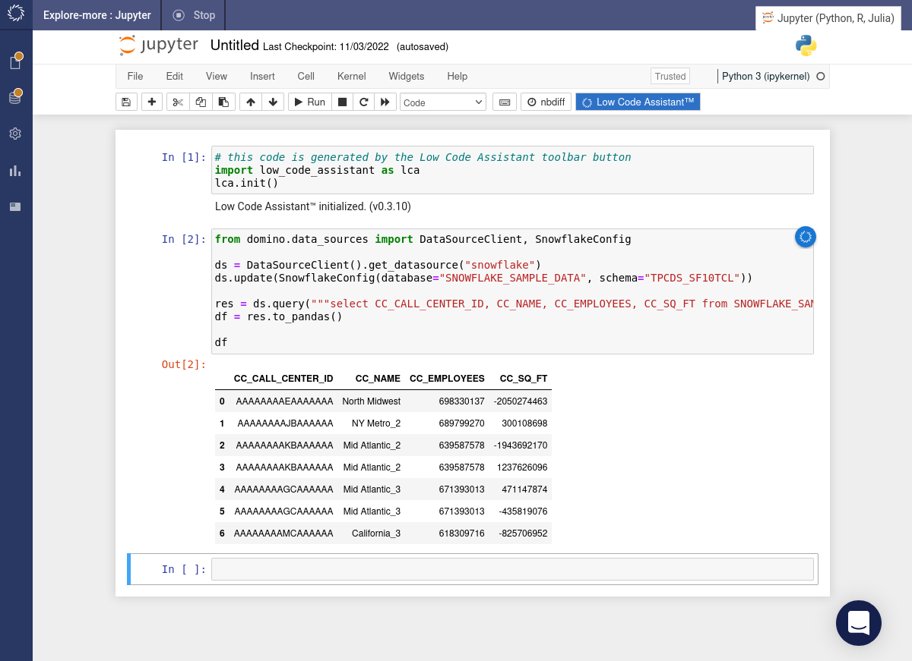

# Loading Data with SQL

This example shows how to load data using custom SQL and demonstrates the auto complete feature of the SQL editor.

<!-- https://user-images.githubusercontent.com/46192475/182823646-e5643a32-8757-4a4c-af5c-86faa76b8177.mp4 -->

## SQL & Redshift

=== "Python"

    Select Redshift from the drop-down list of data sources.

    

    Choose the database and schema, then toggle on _Use query_.

    

    Type the query into the _Query_ box. For example:

    ```sql
    select listid, eventname, venuename, venuecity, priceperticket, numtickets
    from listing
    inner join event
    on
        listing.eventid = event.eventid
    inner join venue
    on
        event.venueid = venue.venueid
    where
        venuecity = 'New York City';
    ```

    Click the <span class="blue-button">INSERT CODE</span> button.

    

    The required code will be inserted into a cell and immediately executed.

    

=== "R"

    This feature is not yet implemented in the R version of Code Assist.

## SQL & Snowflake

=== "Python"

    Select Snowflake from the drop-down list of data sources.

    

    Choose the database and schema, then toggle on _Use query_.

    

    Type the query into the _Query_ box. For example:

    ```sql
    select CC_CALL_CENTER_ID, CC_NAME, CC_EMPLOYEES, CC_SQ_FT
    from SNOWFLAKE_SAMPLE_DATA.TPCDS_SF10TCL.CALL_CENTER
    where CC_EMPLOYEES > 600000000;
    ```

    Click the <span class="blue-button">INSERT CODE</span> button.

    

    The required code will be inserted into a cell and immediately executed.

    

=== "R"

    This feature is not yet implemented in the R version of Code Assist.