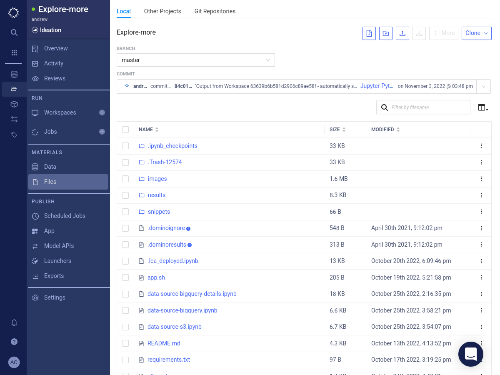
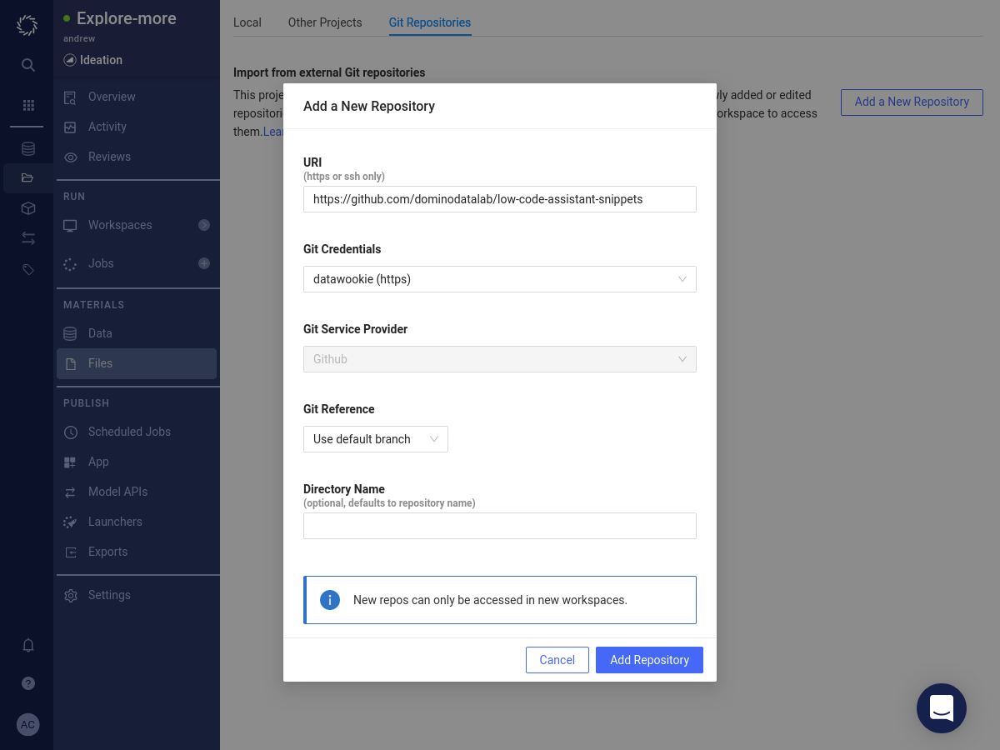

# Files

## Adding a Git Repository

You can add a Git repository in order to gain access to its files.

Select _Files_ from the project menu.

Select the _Git Repositories_ tab.

Press the Add a New Repository button.

Fill in the repository details. Press the Add Repository button.

The repository will be added to the list of linked repositories.

