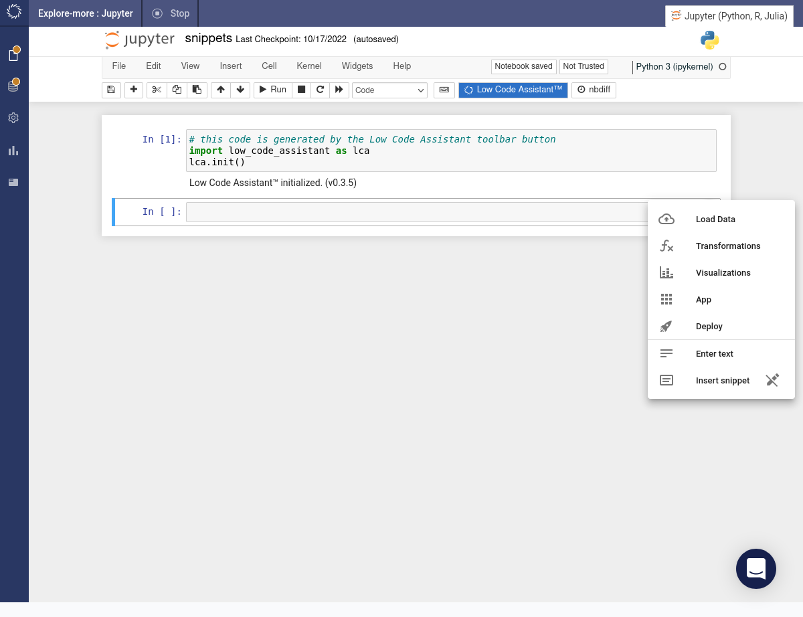
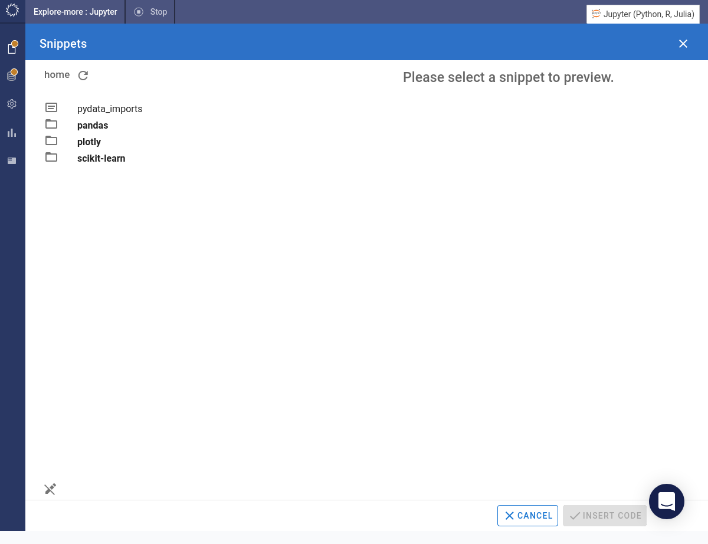
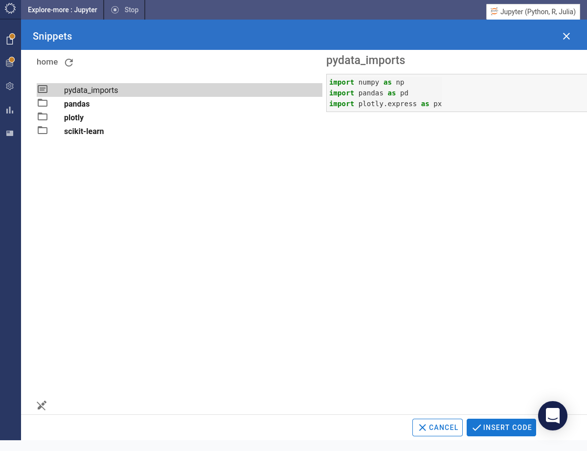
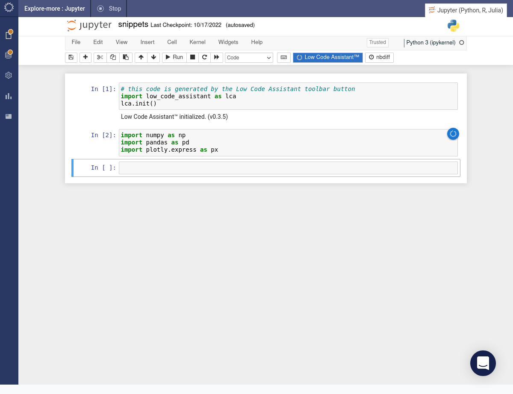
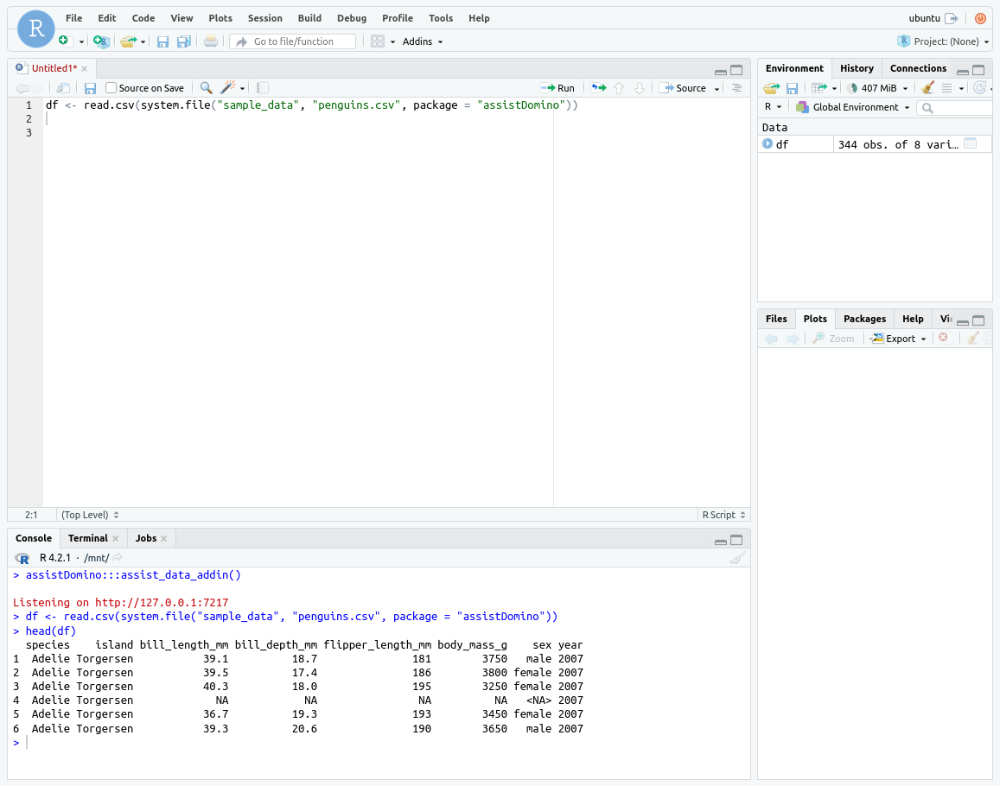
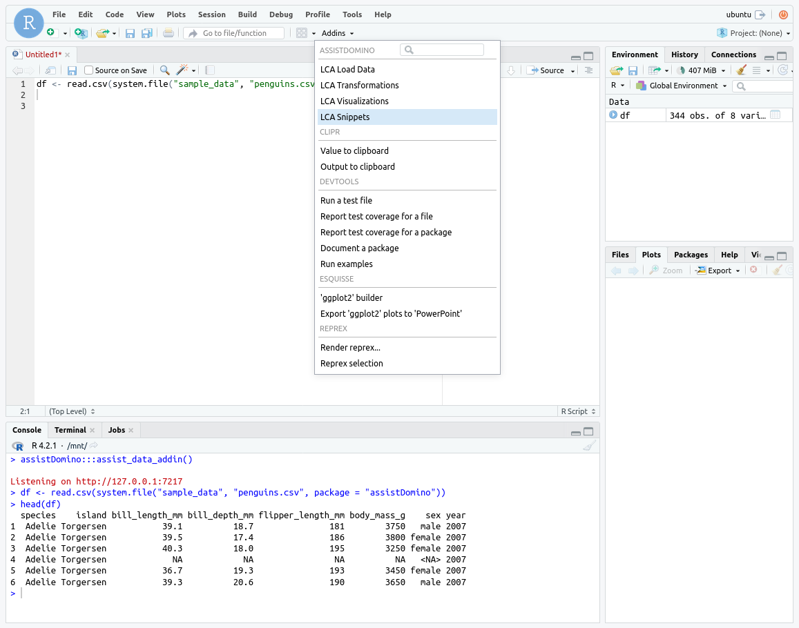
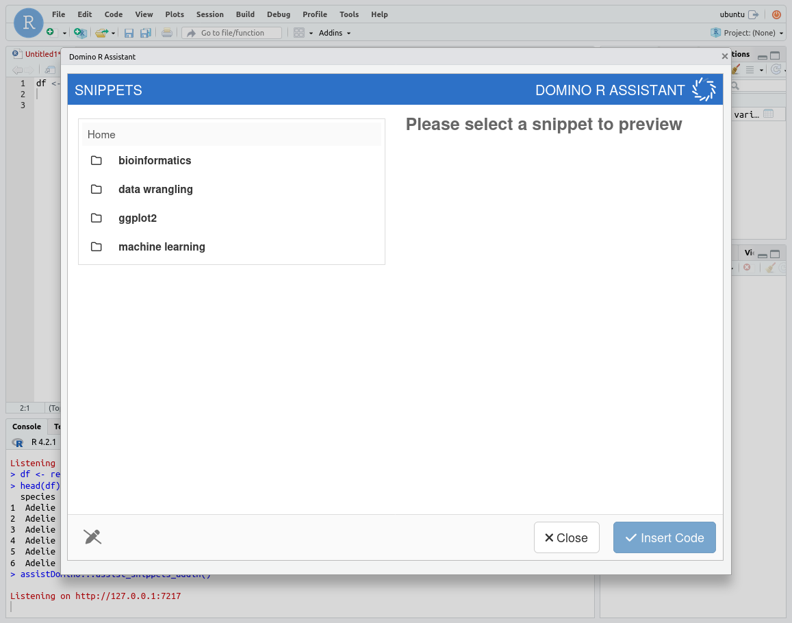
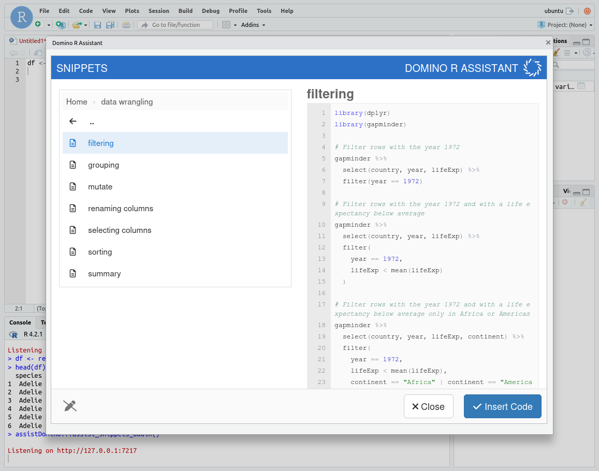
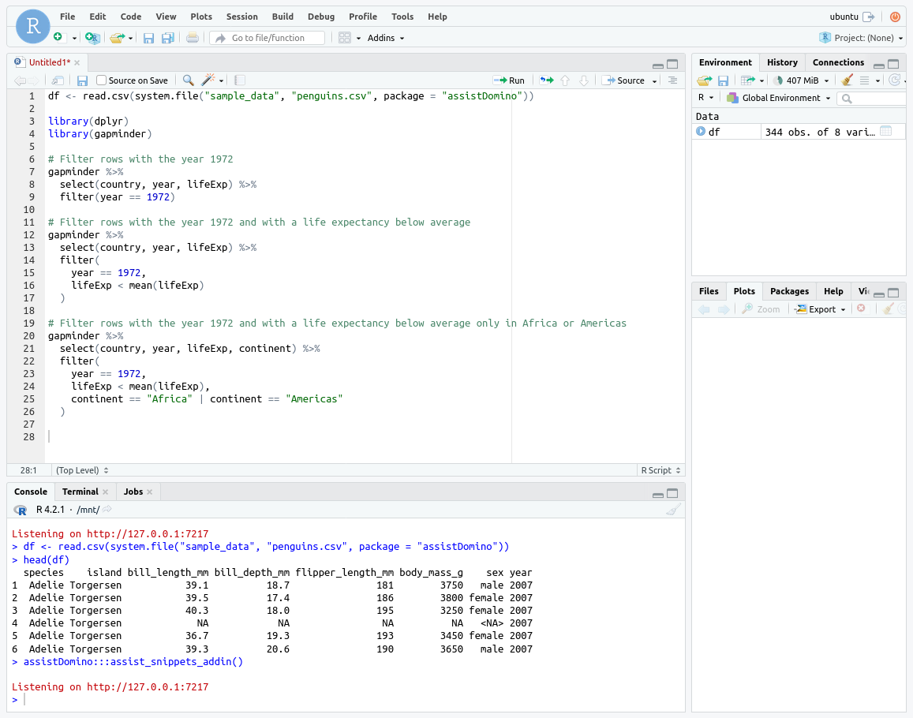
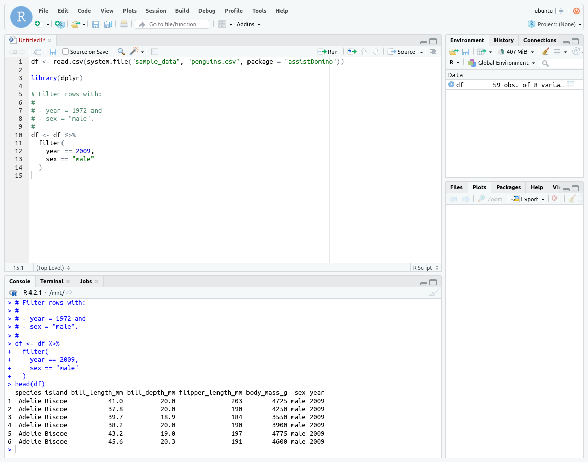

# Using Snippets

There are many bits of code which are used often but not often enough to be committed to memory. Even the most experienced developers will inevitably need to search to find the code fragment. The resulting context switching negatively impacts productivity.

Snippets to the rescue! Snippets are useful bits of code which are readily accessible via Code Assist. A number of handy snippets are included with the Code Assist distribution. You can add your own snippets and share them with your team.

## What are Snippets?

A _snippet_ is a small chunk of reusable text or code. Snippets are generally used to capture frequently used content. This content can then easily be inserted into a project.
## Selecting a Snippet

Before inserting a snippet you first need to find and select it.

=== "Python"

    Hover over the  icon, it will show a popup menu. Select the _Insert snippet_ item from the menu.

    

    Snippets are stored in a hierarchy. Navigate through the folders until you find the snippet you're looking for.

    

    Selecting a snippet will show you its content.

    

    When you have found the right snippet, press the INSERT CODE button. The content of the snippet will be inserted into the active cell in the notebook.

    

=== "R"

    Suppose that you have loaded some data and want to filter a specific subset of rows. You could do this using Code Assist, but you could also do it directly in code. Snippets can help you get started with appropriate code which can easily be adapted to your use case.

    
    
    Click on the Addins button and choose the _Snippets_ option.

    

    The snippets dialog will appear. Navigate through the folder hierarchy to find a snippet which suits your use case.

    

    Select the appropriate snippet. A preview of the code will be displayed. Press the Insert Code button.

    

    The snippet code will be inserted into the script.

    

    Trim down and edit the snippet according to your requirements. Run the code.

    