# Working with Snippets

## Adding Snippets from GitHub

A snippet library can be added by linking a Git repository with snippets to your Domino project. See [these instructions](../../project/files) for linking a Git repository. If credentials are required to access the repository, they can be set up by following [these instructions](../../settings#git-credentials).

An example snippet library can be found [here](https://github.com/dominodatalab/low-code-assistant-snippets).

## Snippet Format

Code Assist looks for snippets in a `snippets/` folder in the root of the repository or project. Any `.py` (Python) or `.R` files below this folder will be loaded as snippets. The sub-folder structure will be maintained in the Code Assist menu. See, for example, the folder structure illustrated below.

<pre>
 ├── .git
 ├── snippets
      ├── create_list.py
      ├── create_dictionary.py
      ├── sklearn
           ├── model_regression.py
           ├── model_classification.py
</pre>

## Editing snippets

Snippets can be edited:

   - In the git repository with your regular git workflow for this repo.
   - In the notebook using Code Assist.
   - With VSCode by opening a workspace with VSCode for this project in Domino.

### Enable Editing

The capability to edit snippets is not enabled by default. It has to be explicity enabled.

=== "Python"

     The last item in the Code Assist menu is _Insert snippet_. The icon to the right of this item will be greyed out by default. Click on the icon to enable editing.

     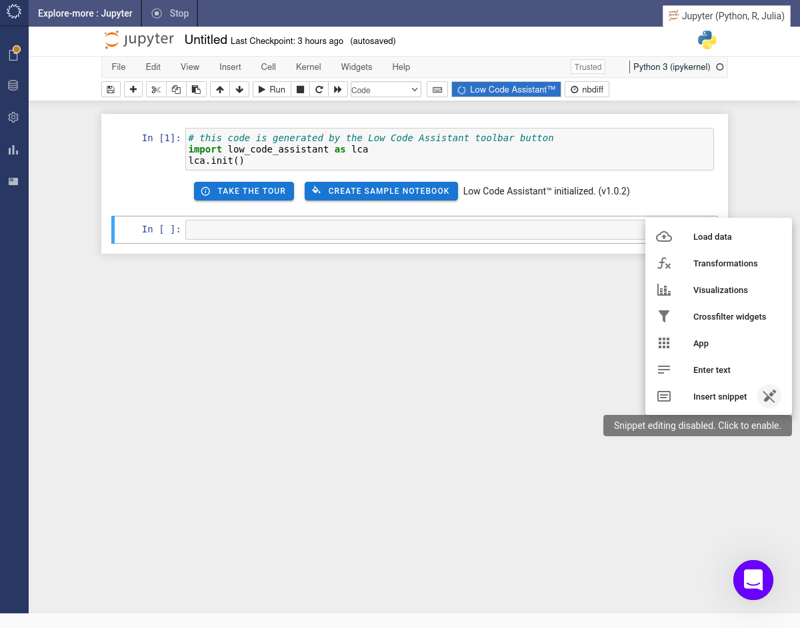

     When editing is enabled a + SAVE AS SNIPPET button will be visible on the active cell.

     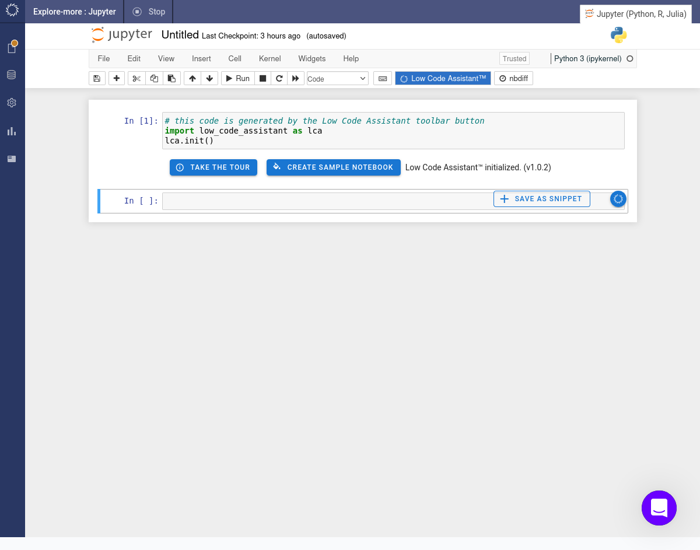

=== "R"

     When editing is disabled the edit icon at the bottom/left of the _Snippets_ will be greyed and crossed out. Click on the icon to enable editing.

     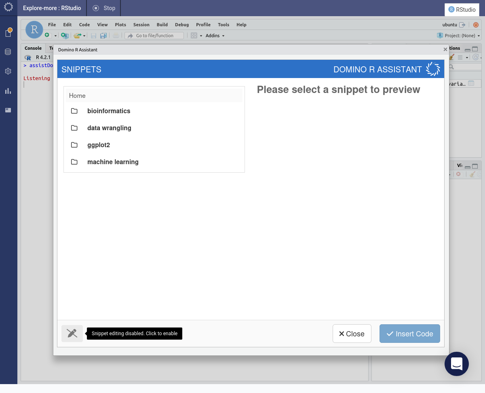

     The editing icon will then be enabled and an Add button will appear.

     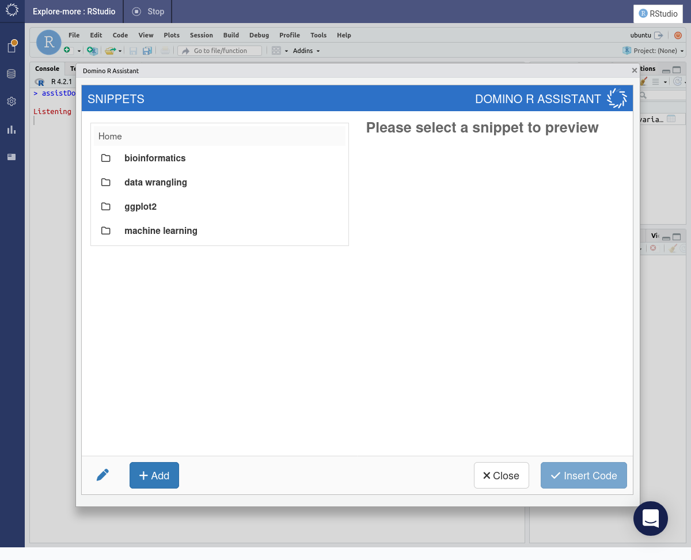

### Add

=== "Python"

     
Enable snippet edit mode by clicking the pen icon in the context menu:

     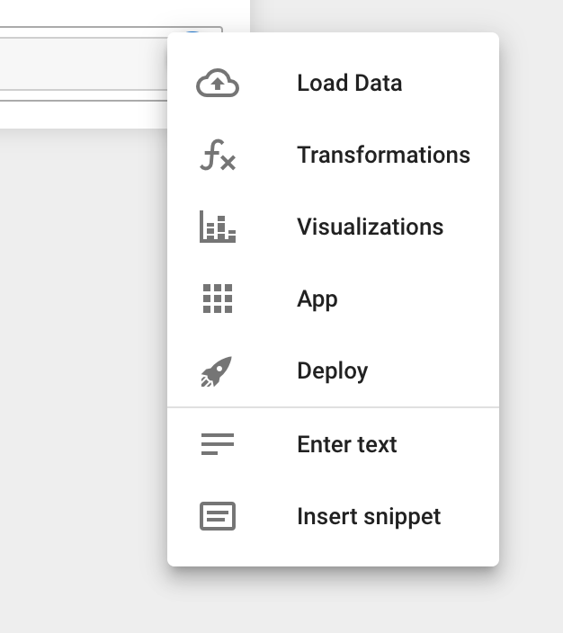{: style="width: 299px"}
     {: style="width: 251px"}

     
Enter the snippet code and click on "SAVE AS SNIPPET"

     {: style="width: 1024px"}

     
Enter the name of the snippet and select the repository to store the snippet

     {: style="width: 413px"}

     
After this you can keep editing the snippet if needed and save by clicking "SAVE"

     {: style="width: 1024px"}

     
After the enabling the snippet edit mode, controls for editing snippets are also displayed in the snippets panel.

     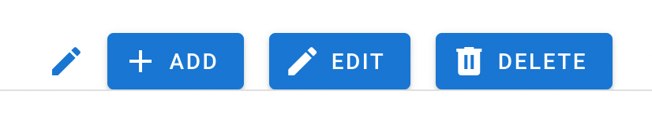{: style="width: 413px"}

     
To sync the snippet back to git, open "File Changes" in the left-hand sidebar and click "Select and sync"
     on the "Imported Repositories" section

     {: style="width: 588px"}

=== "R"

     Press the Add button. The _Add snippet_ dialog will appear.
     
     Insert a name for the snippet. It makes sense to give some thought to an appropriate naming scheme which will make snippets easier to find. Choose a project. Insert the body of the snippet into the text box. Press the Add button.

     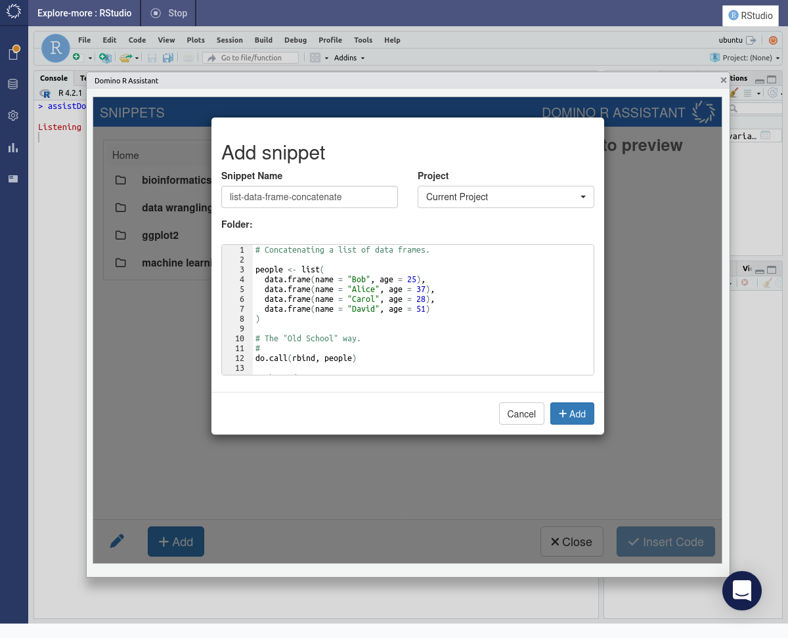

     A dialog will confirm that the snippet has been added. Press OK button.

     

     The newly added snippet will appear in the list of available snippets.

     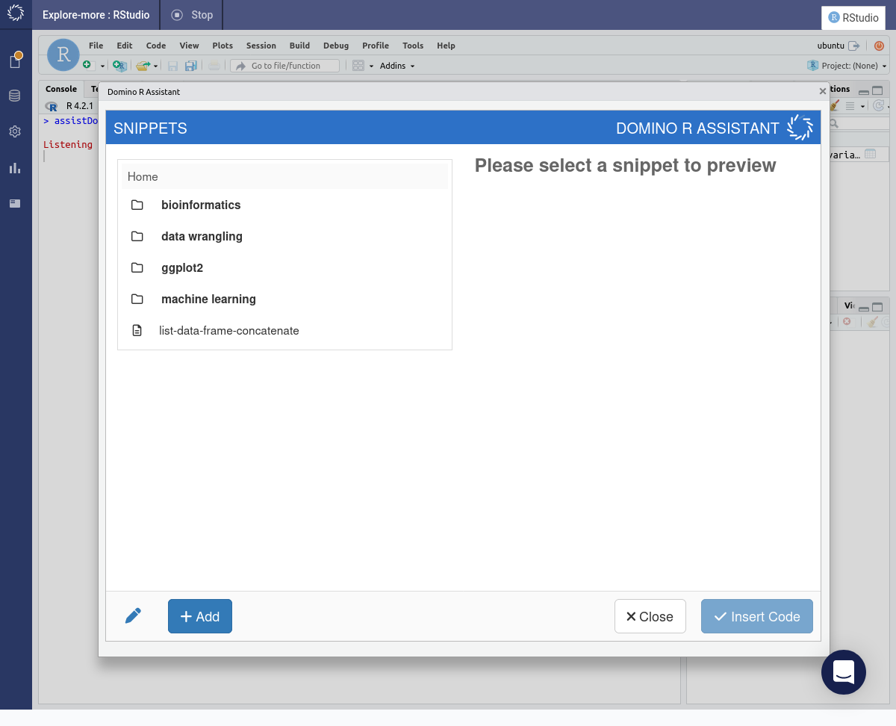

     Select the snippet. The content of the snippet will appear in the preview window. The Insert Code button will be activated. The Edit and Delete buttons will also appear.

     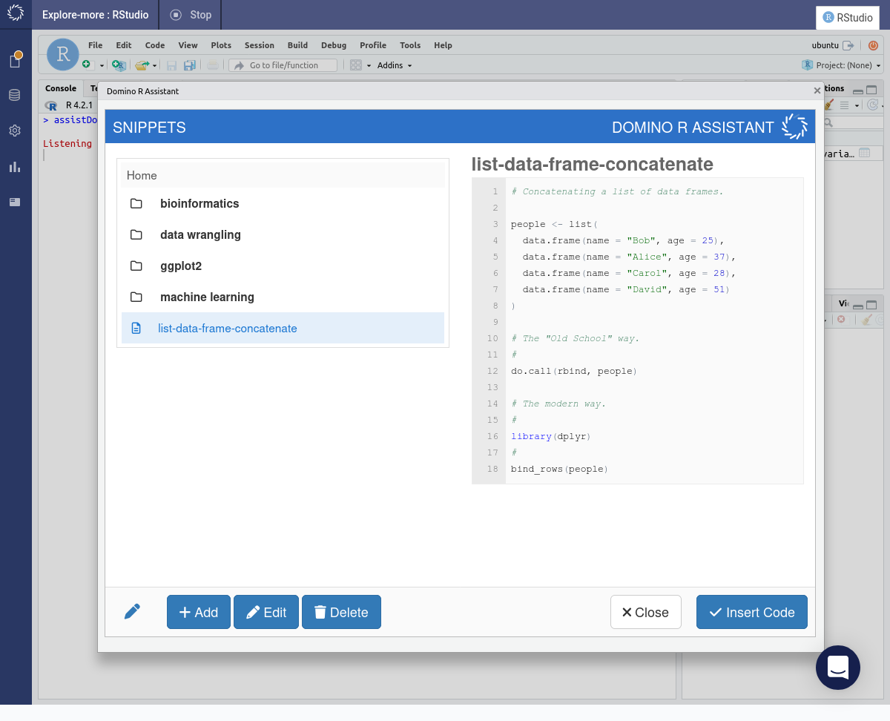

### Edit

Inevitably you'll need to change a snippet, either to correct or enhance it.

=== "Python"

     Documentation pending.

=== "R"

     Select the snippet you want to edit and then press the Edit button. A dialog will appear that allows you to edit the content of the snippet. When you are finished editing, press the Edit button.

     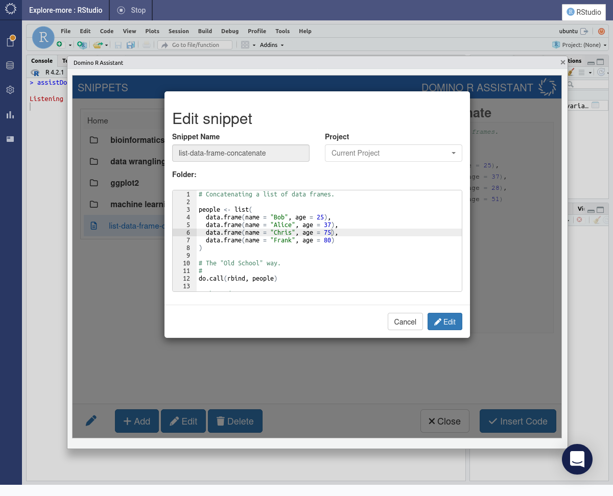

     A dialog will confirm that the snippet has been edited. Press OK button.

     

### Delete

If you no longer need a specific snippet then you might want to delete it.

=== "Python"

     Documentation pending.

=== "R"

     Select the snippet you want to delete and then press the Delete button. A dialog will appear that asks you to confirm that you want to delete the snippet. Press the Delete button.

     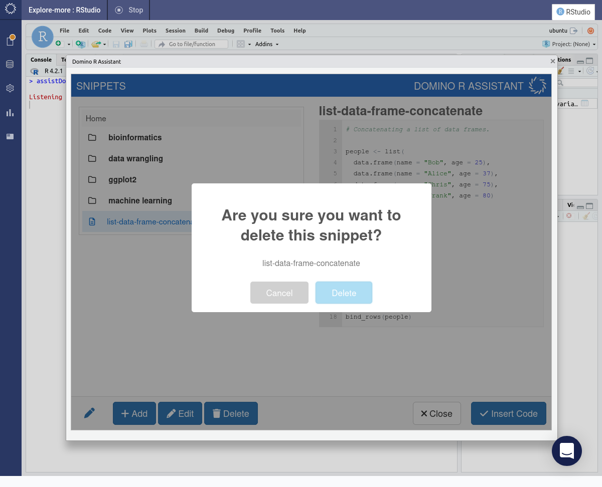

     A dialog will confirm that the snippet has been deleted. Press OK button.

     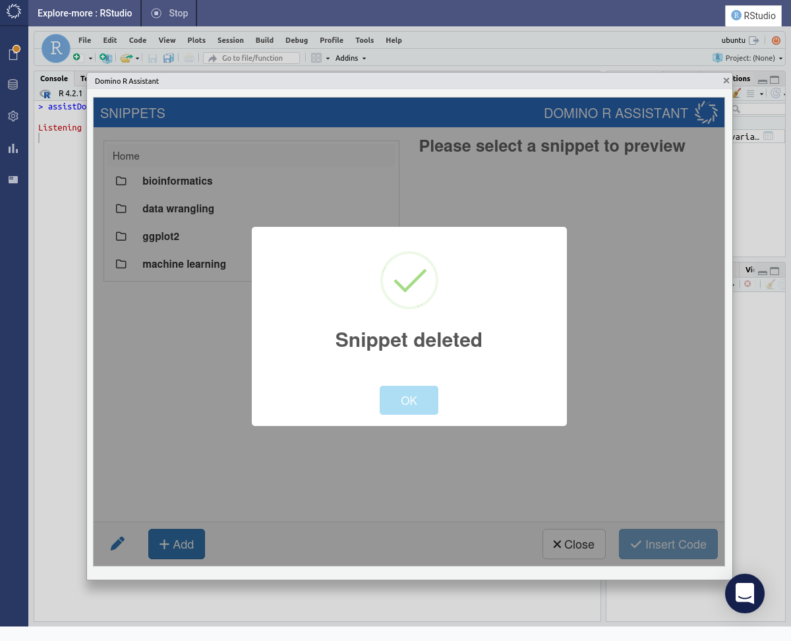

## Editing with a VSCode workspace

Click on  "Open Folder" in VSCode

{: style="width: 526px"}

Imported git repo's are available at "/repo"

{: style="width: 632px"}

Create a new snippet

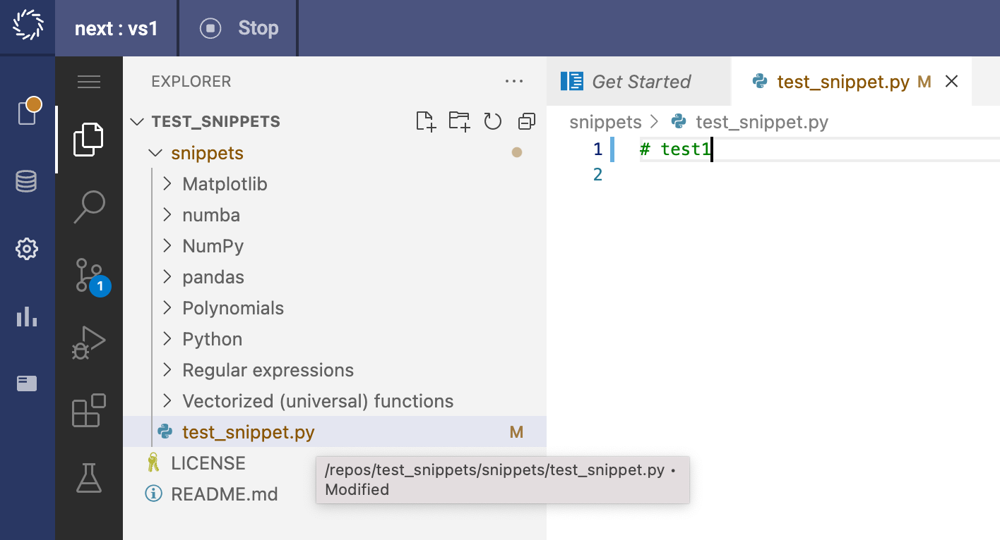{: style="width: 708px"}

Sync changes in the "Imported Repositories" section:

{: style="width: 593px"}

## Updating snippets in Notebook workspace

When snippets are updated in the git repository, the change is only visible in the notebook workspace after pulling the changes and reloading the snippets.

Click on "pull" in the "Imported Repositories" section

{: style="width: 430px"}

Reload snippets

{: style="width: 325px"}
