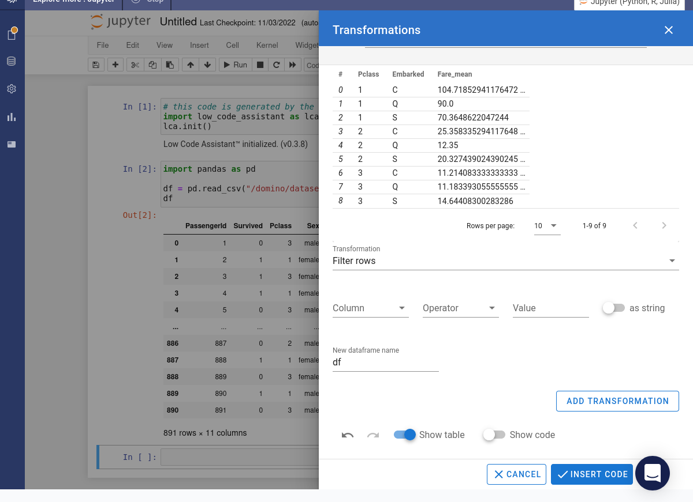
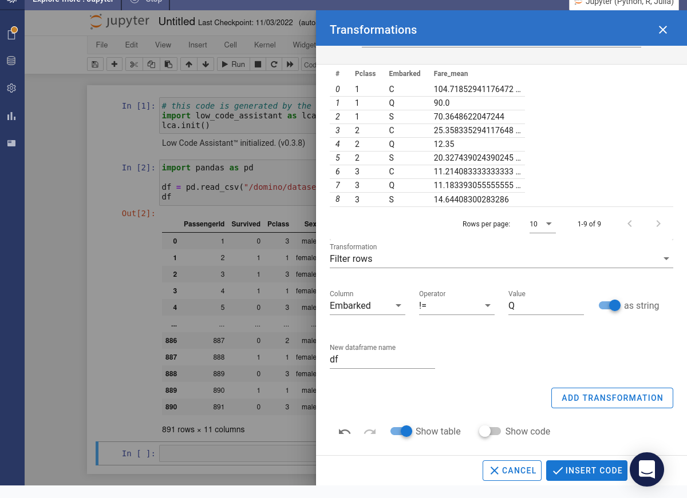
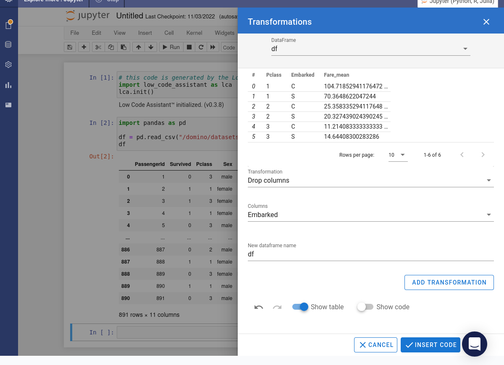
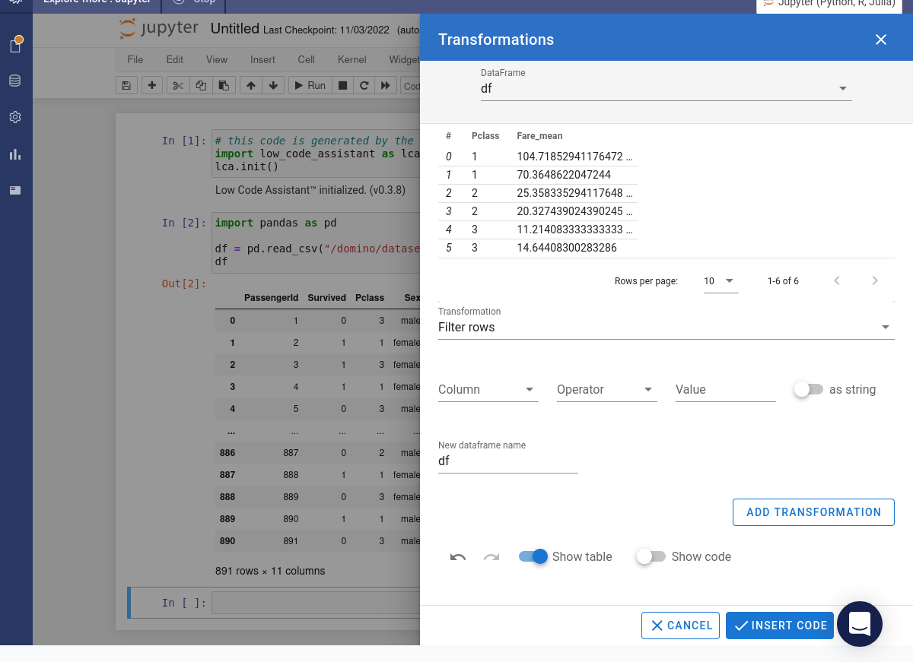
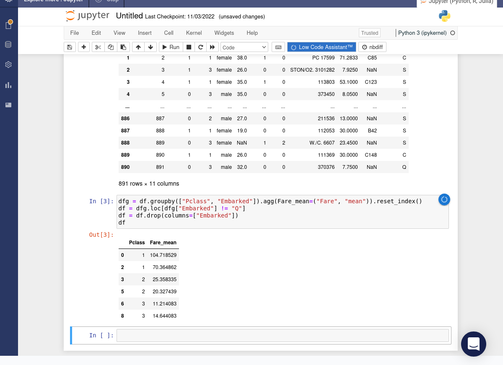

# Chaining Transformations

For this tutorial we'll use the _Titanic_ data.

We have [already seen](filter.md#manual-filter) how multiple filtering operations can be applied. Now we'll see how different operations can be chained together.

=== "Python"

    Hover over the assistant icon . Select the _Transformations_ item from the popup menu. Select the _Groupby and aggregate_ option.

    Specify `Pclass` and `Embarked` as the columns to group by. Choose `Fare` as the column to aggregate. Select `mean` as the aggregator function. Press the Add Transformation button.

    

    The preview will be updated with the summary data.

    

    Next we're going to filter the rows. Specify `Embarked` as the columns to filter by. Choose `!=` as the operator and `Q` as the value.. Turn the `as string` toggle on. Press the Add Transformation button.

    

    The preview will be updated with the filtered data. Finally select the _Drop columns_ option and specify `Embarked` as the column to drop. Press the Add Transformation button.

    

    The preview will be updated. Press the Insert Code button.

    

    The required code will be inserted into the notebook and immediately executed.

    

=== "R"