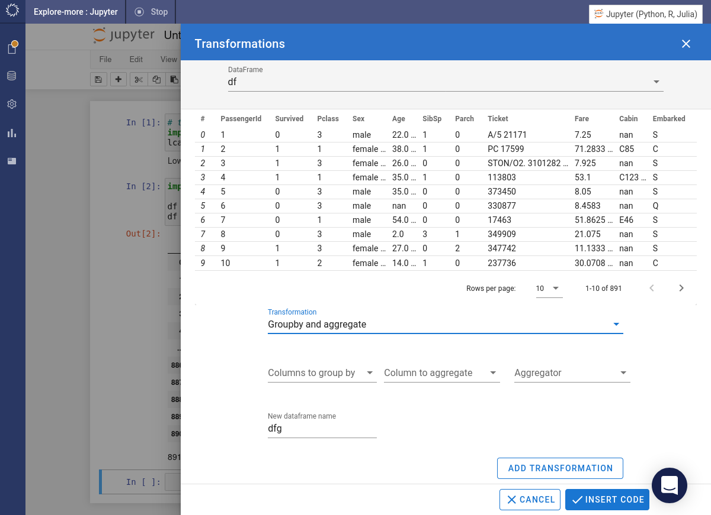
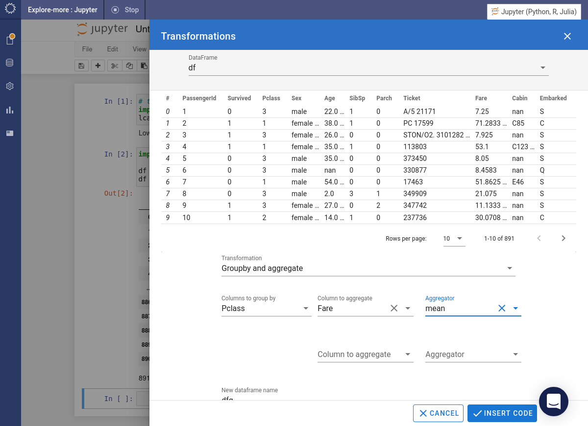
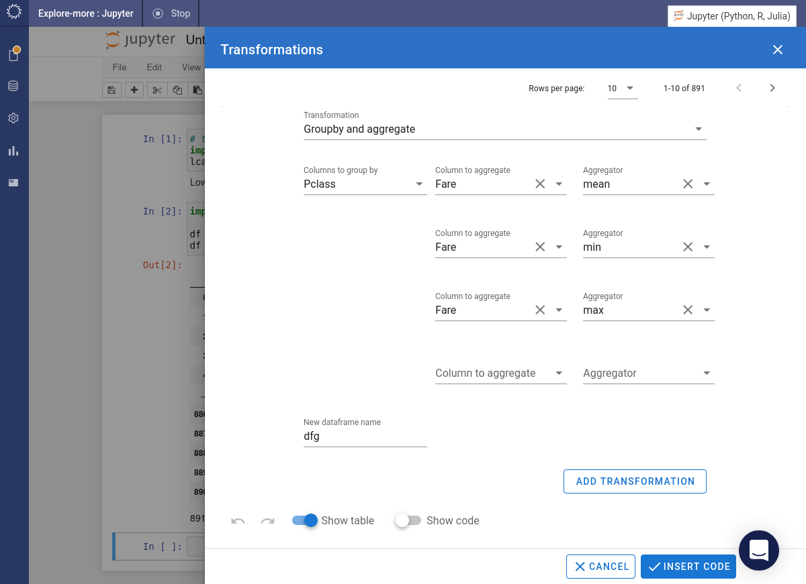

# Grouping & Aggregating

For this tutorial we'll use the _Titanic_ data.

=== "Python"

    Hover over the  icon. Select the _Transformations_ item from the popup menu. Select the _Groupby and aggregate_ option.

    

    We are going to calculate some summary statistics for the `Fare` column broken down by `Pclass`. Specify `Pclass` as the column to group by. Choose `Fare` as the column to aggregate. Select `mean` as the aggregator function.

    

    You can include more aggregations. We'll add in `min` and `max`. Press the Add Transformation button.

    

    The preview will be updated with the summary data. Press the Insert Code button.

    

    The required code will be inserted into the notebook and immediately executed.

    

=== "R"