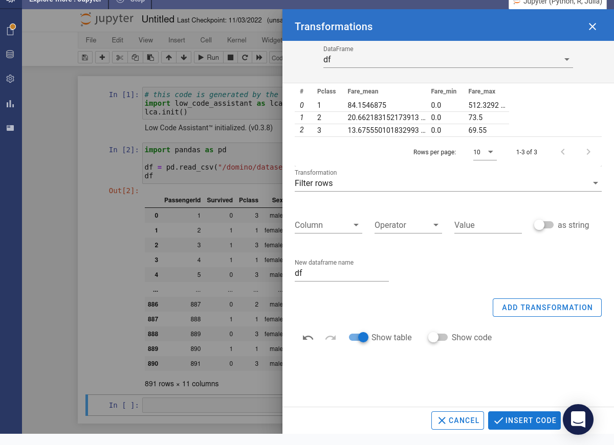
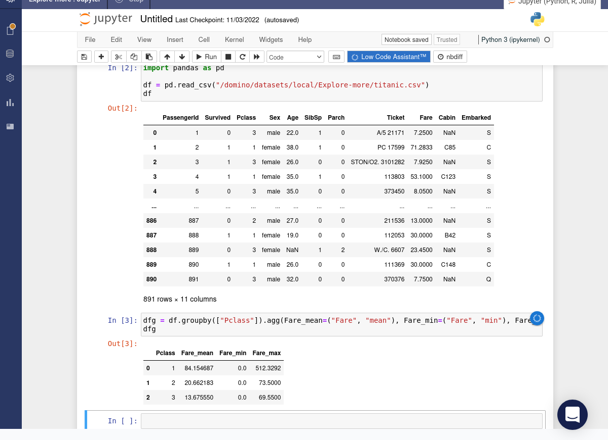

# Grouping & Aggregating

For this tutorial we'll use the _Palmer Penguins_ data. We have already filtered out some records wih missing data and selected a subset of columns.

=== "Python"

    This is what the data currently looks like.

    

    Hover over the  icon. Select the _Transformations_ item from the popup menu.

    

    The transformations widget will open.

    

    Select the _Groupby and aggregate_ transformation option.

    

    Choose one or more columns to group by. These will determine the buckets that the results are allocated to. Generally you'll want to select columns with discrete values.
    
    

    Choose the column to aggregate. Generally you'll want to select a column with numeric values.

    

    Select an aggregation function.

    

    You can add more aggregations. It's not necessary to choose the same column to aggregate.
    
    

    Preview the results. Press the RUN button.

    

    The required code will be inserted into the notebook and immediately executed.

    

=== "R"

    This is what the data currently looks like.

    

    Press the _Addin_ button. Select _DCA Transformations_ from the menu to launch the transformations wizard.

    

    Choose the data that you want to work on.

    

    A preview of the data will be shown. Press the ADD TRANSFORMATION button.

    

    Select _Group & Aggregate_ from the dropdown menu.

    

    Now choose the columns that the results will be grouped by. We'll group by `species`, `island` and `sex`.

    

    Next choose the column which will be aggregated and the aggregation operation. You can select multiple columns for aggregation. We'll calculate the minimu, maximum and mean values of `body_mass_g` for each group. Press the Apply button.

    

    The data preview in the transformations wizard will be updated with the aggregated results. Press the Insert Code button.

    

    The required code will be inserted into the script and the aggregated results stored in a new variable.

    <!--  -->