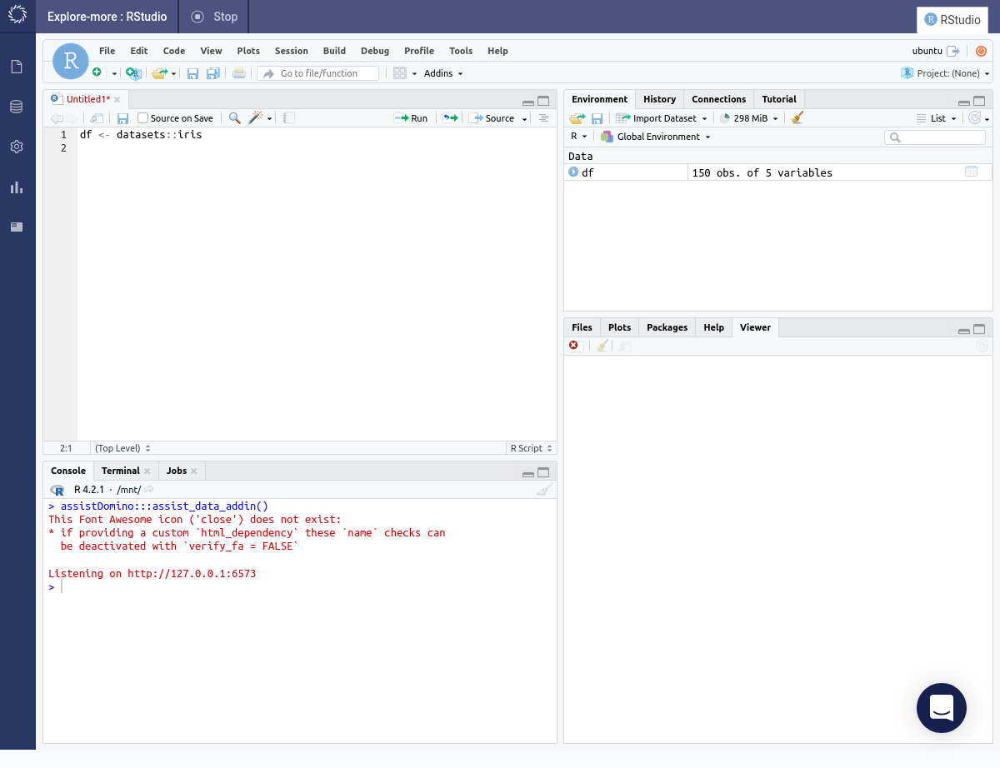

# Plots with Plotly

=== "Python"

    ``` c
    #include <stdio.h>

    int main(void) {
      printf("Hello world!\n");
      return 0;
    }
    ```

=== "R"

    Open an RStudio workspace.

    

    Click on the <span class="white-button">Addins</span> button and choose the _LCA Data Selector_ option.

    

    The _LCA Data Selector_ dialog will open.

    

    Click on the _Demo Data_ tab.

    

    Choose a dataset from the dropdown selector. Optionally specify a custom variable name.

    

    A sample of the data will be displayed in the dialog along with the code required to load the data. Press the <span class="blue-button">Apply</span> button.

    

    The required code with be inserted into the script.

    

    Click on the <span class="white-button">Addins</span> button and choose the _LCA Data Visualization_ option.

    

    The _LCA Data Visualization_ dialog will open.

    

    Select a data frame from the dropdown selector.

    

    Choose a plot type.

    

    Specify the parameters for the plot. Press the <span class="blue-button">Apply</span> button.

    

    The required code with be inserted into the script.

    

<video controls>
    <source src="https://user-images.githubusercontent.com/1765949/185933193-8d75e882-0192-4aa1-8b85-ce2ba56670ce.mp4" type="video/mp4">
</video>
